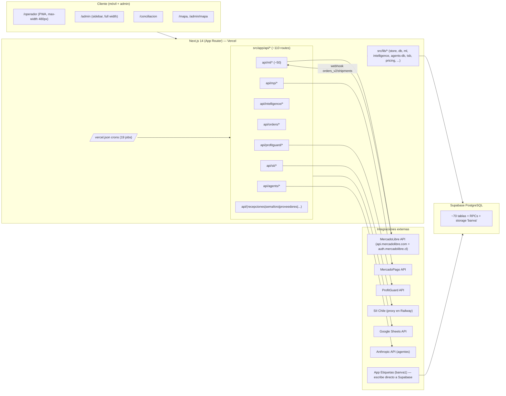

# Fase 3 — Arquitectura de la app

## Diagrama de alto nivel

## Páginas (App Router)

> Todas las páginas del cliente son `"use client"` (no Server Components). La app usa la convención `app/(seg)/page.tsx`. No hay middleware de Next (sin `middleware.ts`).

| Ruta | Archivo | Propósito | Auth requerida |
|---|---|---|---|
| `/` | `src/app/page.tsx` | Landing 23-line: selector de rol Operador / Administrador. | No |
| `/operador` | `src/app/operador/page.tsx` | Vista mobile-first (max-width 480px). Menú 2x2: Ingreso, Salida, Traspaso, Stock. | No (operario se identifica por acción contra tabla `operarios`) |
| `/operador/picking` | `src/app/operador/picking/page.tsx` | Picking de pedidos Flex MercadoLibre. | No (operario login dinámico) |
| `/operador/recepciones` | `src/app/operador/recepciones/page.tsx` | Conteo y etiquetado de recepciones. | No |
| `/operador/conteos` | `src/app/operador/conteos/page.tsx` | Conteos cíclicos. | No |
| `/operador/facturas` | `src/app/operador/facturas/page.tsx` | Manejo de facturas en operación. | No |
| `/admin` | `src/app/admin/page.tsx` (~12k líneas) | Panel admin con 13+ tabs (Dashboard, Inventario, Productos, Posiciones, Pedidos ML, Etiquetas, Recepciones, Conteos, Movimientos, Carga Stock, Compras, Comercial, etc.). | Sí — PIN client-side (`ADMIN_PIN = "1234"`) en `sessionStorage`. |
| `/admin/mapa` | `src/app/admin/mapa/page.tsx` | Editor visual del mapa de bodega. | Sí (mismo PIN) |
| `/admin/qr-codes` | `src/app/admin/qr-codes/page.tsx` | Generador/impresión de QRs. | Sí |
| `/conciliacion` | `src/app/conciliacion/page.tsx` (~2700 líneas) | Vista financiera: conciliación bancaria, estado de resultados, flujo de caja. | Sí — mismo PIN `1234` en sessionStorage. |
| `/mapa` | `src/app/mapa/page.tsx` | Vista pública del mapa de bodega. | No |

> **Hallazgo**: la "auth" del admin y la conciliación es un PIN hardcodeado `1234` validado client-side. No hay protección server-side en ninguna API route. Esto está documentado en `.claude/rules/security.md` como limitación conocida.

## API Routes (~110)

> Detalle exhaustivo (descripción, métodos, tablas, RPCs, integraciones) generado por subagente. Las tablas a continuación son tabla guía. Para cualquier endpoint específico, leer el archivo correspondiente bajo `src/app/api/`.

### Admin — regularización y diccionario

| Ruta | Métodos | Descripción | Tablas | Integraciones |
|---|---|---|---|---|
| `admin/costo-batch` | POST | Regulariza lote de costos unitarios (modos auto/override_wac). | movimientos, productos | — |
| `admin/dedup-rcv-compras` | POST | Detecta y elimina facturas duplicadas preservando conciliaciones. | rcv_compras, conciliaciones, conciliacion_items | — |
| `admin/diccionario.csv` | GET | Exporta diccionario de composición a CSV (consumido por App Etiquetas). | composicion_venta, productos | — |
| `admin/sync-diccionario-final` | GET | Sincroniza Sheet "Diccionario" final hacia BANVA. | productos, composicion_venta | googleapis (CSV) |

### Agentes IA (multi-agente)

| Ruta | Métodos | Descripción | Tablas | Integraciones |
|---|---|---|---|---|
| `agents/chat` | POST | Chat orquestador con insights recientes. | agent_config, agent_rules, agent_insights | Anthropic |
| `agents/cron` | GET | Cron diario 8am: dispara triggers daily/weekly/monthly. | agent_triggers, agent_runs | — |
| `agents/feedback` | POST | Registra feedback admin → genera reglas aprendidas. | agent_insights, agent_rules | Anthropic |
| `agents/run` | POST | Ejecuta agente IA manual con snapshots. | agent_runs, agent_insights, sku_intelligence | Anthropic |
| `agents/rules` | GET, POST, PUT, DELETE | CRUD reglas de agentes. | agent_rules | — |
| `agents/status` | GET | Estado: configs, insights 7d, runs, rules, triggers. | agent_config, agent_insights, agent_runs, agent_rules, agent_triggers | — |

### Costos y debug

| Ruta | Métodos | Descripción | Tablas | Integraciones |
|---|---|---|---|---|
| `costos/traza` | GET | Traza viva de cálculo de costo: composición, WAC, recepciones. | productos, composicion_venta, recepcion_lineas | — |
| `debug-fix` | GET | Correcciones one-time para bugs históricos. | movimientos, stock | — |
| `debug-query` | GET | Query genérica para admin (filtros/orden/limit). | * | — |
| `debug/composicion` | GET | Inspecciona composición por SKU. | composicion_venta, productos | — |
| `diagnostico-recepcion` | GET | Diagnóstico detallado por recepción. | recepciones, recepcion_lineas, productos | — |

### Inteligencia

| Ruta | Métodos | Descripción | Tablas | Integraciones |
|---|---|---|---|---|
| `intelligence/actualizar-lead-times` | GET | Cron lunes 12pm: lead times reales. | proveedores | — |
| `intelligence/envio-full-historial` | GET | Historial envíos a Full. | envios_full_historial, envios_full_lineas | — |
| `intelligence/envio-full-log` | POST | Registra envío Full + admin_actions_log. | envios_full_historial, envios_full_lineas, admin_actions_log | — |
| `intelligence/forecast-accuracy` | GET, POST | Cron lunes 12:30pm: accuracy de forecasts. | forecast_accuracy, sku_intelligence | — |
| `intelligence/pendientes` | GET | Detección de productos sin costo / sin producto / etc. | stock_full_cache, productos, stock, composicion_venta, ml_items_map | — |
| `intelligence/recalcular` | GET, POST | Cron 11am: recálculo full + snapshot. | sku_intelligence | — |
| `intelligence/sku-venta` | GET | Snapshot integral por SKU venta. | sku_intelligence, composicion_venta, productos, orders_history, stock_full_cache | — |
| `intelligence/sku/[sku_origen]` | GET, PATCH | Detalle + ajuste de velocidad objetivo. | sku_intelligence, vel_objetivo_historial, admin_actions_log | — |
| `intelligence/sku/_bulk` | POST | Operaciones masivas. | sku_intelligence | — |
| `intelligence/vista-venta` | GET | Vista analítica SKUs vendidos vs no vendidos. | (idem sku-venta) | — |

### MercadoLibre — autenticación, sync, stock, ads, billing

> 50+ rutas. Las críticas son `webhook`, `stock-sync`, `sync-stock-full`, `sync`, `auth`, `items-sync`. El detalle completo está en `.claude/rules/meli-api.md` y `src/lib/ml.ts`.

| Ruta | Métodos | Descripción | Tablas | Integraciones |
|---|---|---|---|---|
| `ml/auth` | GET | OAuth callback ML. Intercambia code por tokens. | ml_config | MercadoLibre |
| `ml/webhook` | GET, POST | **Webhook receiver** ML (orders_v2, shipments, claims, stock-locations, fbm_stock_operations, marketplace_fbm_stock, items, items_prices). | ml_webhook_log, ml_shipments | — |
| `ml/sync` | GET, POST | Cron cada minuto: polling de órdenes recientes. | (varias ML) | MercadoLibre |
| `ml/stock-sync` | GET, POST | Cron cada minuto: push WMS→ML stock Flex (`selling_address`). | ml_items_map, composicion_venta, stock_sync_queue | MercadoLibre |
| `ml/sync-stock-full` | GET, POST | Cron cada 30 min: lectura ML→WMS stock Full (`meli_facility`). | stock_full_cache, ml_items_map, composicion_venta | MercadoLibre |
| `ml/items-sync` | GET | Cron cada 30 min: sync de ítems activos. | ml_items_map | MercadoLibre |
| `ml/metrics-sync` | GET, POST | Cron cada 4h: métricas vendedor. | (varias) | MercadoLibre |
| `ml/ads-daily-sync` | GET | Cron cada 6h: gastos publicidad últimos 35d. | — | MercadoLibre |
| `ml/ads-rebalance` | GET | Cron cada 6h (offset +30m): rebalance presupuesto. | ml_items_map | MercadoLibre |
| `ml/billing-cfwa-sync` | GET | Cron diario 13h: facturación cfwa. | ml_billing_cfwa | MercadoLibre |
| `ml/attr-watch` | GET | Cron cada 6h: detecta cambios de atributos. | ml_items_map, ml_item_attr_snapshot | — |
| `ml/attr-changes` | GET | Lectura del log de cambios. | ml_item_changes | — |
| `ml/activate-warehouse-all` | GET | Cron cada hora `:15`: activa items en bodega Flex en lote. | ml_items_map, stock_sync_queue, audit_log | MercadoLibre |
| `ml/activate-warehouse` | POST | Activa un ítem individual. | (idem) | MercadoLibre |
| `ml/activate-with-stock` | POST | Activación con validación de stock. | ml_items_map, composicion_venta, productos | — |
| `ml/audit-mappings` | GET | Audita consistencia ml_items_map ↔ productos ↔ stock. | ml_items_map, productos, composicion_venta, audit_log | — |
| `ml/auto-postular` | POST | Auto-postula a promociones. | auto_postulacion_log, ml_items_map | MercadoLibre |
| `ml/billing-probe` | GET | Probe de la API billing (rate-limited 5/min). | — | MercadoLibre |
| `ml/bulk-attr-sync` | POST | Sincroniza atributos masivos a ítems ML. | ml_items_map | MercadoLibre |
| `ml/categories`, `ml/category-attributes` | GET | Discovery de categorías ML. | — | MercadoLibre |
| `ml/debug` | GET | GET raw a la API. | — | MercadoLibre |
| `ml/diagnostico`, `ml/diagnostico/stock` | GET | Estado general / stock. | varias | — |
| `ml/flex`, `ml/flex-orphans` | GET, POST | Flex services / órdenes huérfanas. | — | MercadoLibre |
| `ml/investigate` | GET | Helper de investigación de un ítem. | — | MercadoLibre |
| `ml/item-history` | GET | Historial admin_actions_log de un ítem. | admin_actions_log | — |
| `ml/item-promotions`, `ml/promotions` | GET, POST | Promociones (ítem y catálogo). | ml_items_map, composicion_venta | MercadoLibre |
| `ml/item-update` | POST | Update genérico ítem. | ml_items_map | MercadoLibre |
| `ml/items-details` | GET | Detalles desde caché. | ml_items_map | — |
| `ml/labels` | POST | Descarga etiquetas envío (ZPL→PDF). | — | MercadoLibre |
| `ml/link-missing` | POST | Linkea ítems sin mapping. | ml_items_map, composicion_venta, ml_config | MercadoLibre |
| `ml/margin-cache`, `ml/margin-cache/refresh` | GET, POST | Cron cada 2 min: refresca caché de margen. | ml_margin_cache | MercadoLibre |
| `ml/orders-history` | GET | Costos de envío con caché. | shipment_costs_cache | MercadoLibre |
| `ml/publish` | POST | Publica nuevo ítem ML. | ml_items_map | MercadoLibre |
| `ml/refresh-shipments` | POST | Refresca shipments en caché. | ml_shipments, ml_shipment_items | MercadoLibre |
| `ml/scan-promos` | GET | Scan de promociones disponibles. | promos_postulables | MercadoLibre |
| `ml/search-by-sku` | GET | Búsqueda local en ml_items_map. | ml_items_map | — |
| `ml/setup-tables`, `ml/setup-ventas-cache` | GET | Setup DB. **Usa `SUPABASE_SERVICE_ROLE_KEY` con fallback a anon**. | varias | — |
| `ml/stock-full` | GET | Stock desde meli_facility. | — | MercadoLibre |
| `ml/stock-health` | GET | Validación stock ↔ webhooks. | stock_full_cache, ml_webhook_log | — |
| `ml/subscribe-topic` | POST | Suscribe topic webhook. | — | MercadoLibre |
| `ml/ticket-promedio` | GET | RPC ticket promedio por SKU. | — | — (RPC) |
| `ml/variations` | POST | Crea variantes (color/talle). | ml_items_map | MercadoLibre |
| `ml/ventas-cache`, `ml/ventas-stats`, `ml/ventas-sync`, `ml/ventas-reconcile` | varios | Caché y reconciliación de ventas. | ventas_ml_cache | MercadoLibre |
| `ml/verify` | GET | Verificación conexión. | — | MercadoLibre |

### MercadoPago

| Ruta | Métodos | Descripción | Tablas | Integraciones |
|---|---|---|---|---|
| `mp/check-report` | POST | Verifica estado reporte MP. | — | MercadoPago |
| `mp/cleanup-live` | POST | Limpia movimientos banco pendientes. | movimientos_banco | — |
| `mp/request-report` | POST | Solicita reporte transacciones. | — | MercadoPago |
| `mp/sync` | POST | Sync transacciones MP → movimientos_banco. | movimientos_banco | MercadoPago |
| `mp/sync-live` | POST | Sync de cuentas/empresas vinculadas. | cuentas_bancarias, empresas | MercadoPago |

### Órdenes

| Ruta | Métodos | Descripción | Tablas | Integraciones |
|---|---|---|---|---|
| `orders/backfill-from-ml` | GET | Importa órdenes desde ventas_ml_cache. | orders_history, ventas_ml_cache | — |
| `orders/import` | POST | Import manual. | orders_history | — |
| `orders/query` | GET | Query genérica con filtros. | orders_history, orders_imports | — |
| `orders/sku-velocity` | GET | Velocidad de venta por SKU. | orders_history, ventas_ml_cache, composicion_venta | — |
| `orders/stats` | GET | Estadísticas globales. | orders_history | — |

### Picking

| Ruta | Métodos | Descripción | Tablas | Integraciones |
|---|---|---|---|---|
| `picking/scan-errors` | GET | Errores de escaneo. | audit_log | — |

### ProfitGuard

| Ruta | Métodos | Descripción | Tablas | Integraciones |
|---|---|---|---|---|
| `profitguard/orders` | GET | Análisis rentabilidad por orden. | — | ProfitGuard |
| `profitguard/sync` | GET | Cron cada 5 min: sync. | — | ProfitGuard |

### Proveedores y catálogo

| Ruta | Métodos | Descripción | Tablas | Integraciones |
|---|---|---|---|---|
| `proveedores/backfill` | POST | Backfill FK proveedor_id. | proveedores, recepciones, ordenes_compra, productos, proveedor_catalogo, rcv_compras | — |
| `proveedores/inferir-por-skus` | POST | Inferencia desde lista de SKUs. | productos, proveedor_catalogo | — |
| `proveedores/resolve` | POST | Match/crea proveedor (rut > alias > nombre normalizado). | proveedores | — |
| `proveedor-catalogo/bulk-update` | POST | Update masivo precio pactado. | proveedor_catalogo, productos | — |
| `proveedor-catalogo/faltantes` | GET | Productos sin oferta de proveedor. | proveedor_catalogo, productos, sku_intelligence | — |
| `proveedor-catalogo/import-template` | POST | Importa Excel template. | productos, proveedor_catalogo | — |

### Recepciones / stock

| Ruta | Métodos | Descripción | Tablas | Integraciones | RPCs |
|---|---|---|---|---|---|
| `recepciones/recalcular-discrepancias` | GET | Recalcula costos y diferencias. | recepciones, recepcion_lineas, discrepancias_costo, productos | — | — |
| `reclasificar-stock` | POST | Reclasifica stock entre sku_venta/sku_origen. | composicion_venta, stock | — | `registrar_movimiento_stock` |

### Semáforo

| Ruta | Métodos | Descripción | Tablas | Integraciones |
|---|---|---|---|---|
| `semaforo/current` | GET | Estado actual. | semaforo_semanal | — |
| `semaforo/cubeta`, `semaforo/cubeta/[nombre]` | GET | Detalle por cubeta. | (idem) | — |
| `semaforo/historial`, `semaforo/historial/[sku]` | GET | Historial. | (idem) | — |
| `semaforo/refresh` | GET, POST | Cron lunes 9am: recalcula alertas. | semaforo_semanal | — |
| `semaforo/revisar` | POST | Marca alerta revisada. | semaforo_semanal, sku_revision_log | — |

### Sheets

| Ruta | Métodos | Descripción | Tablas | Integraciones |
|---|---|---|---|---|
| `sheet/update-cost` | GET, POST | Actualiza costo unitario en Google Sheet. | productos | Google Sheets |

### SII Chile

| Ruta | Métodos | Descripción | Tablas | Integraciones |
|---|---|---|---|---|
| `sii/bhe`, `sii/bhe-rec` | POST | BHE / recibos. | bhe* | SII (proxy Railway) |
| `sii/export` | GET | Exporta RCV. | rcv_compras, rcv_ventas | — |
| `sii/rcv` | POST | Descarga RCV de un período. | rcv_compras, rcv_ventas | SII |
| `sii/sync`, `sii/sync-anual` | POST | Sync mensual / anual. | varias | SII |

## Server Actions

No se detectaron Server Actions (`'use server'`) en el repo. Toda la lógica server vive en `src/app/api/*/route.ts`.

## Cron jobs (Vercel Cron — `vercel.json`)

| Path | Schedule | Frecuencia humana |
|---|---|---|
| `/api/ml/sync` | `* * * * *` | Cada minuto — polling de órdenes ML. |
| `/api/ml/stock-sync` | `* * * * *` | Cada minuto — push stock WMS→ML Flex. |
| `/api/ml/margin-cache/refresh?stale=true&limit=50` | `*/2 * * * *` | Cada 2 min — refresca caché de margen. |
| `/api/profitguard/sync` | `*/5 * * * *` | Cada 5 min — sync ProfitGuard. |
| `/api/ml/items-sync` | `*/30 * * * *` | Cada 30 min — sync ítems ML. |
| `/api/ml/sync-stock-full` | `*/30 * * * *` | Cada 30 min — lectura stock Full. |
| `/api/ml/activate-warehouse-all` | `15 * * * *` | Cada hora `:15` — activa ítems Flex en lote. |
| `/api/ml/metrics-sync` | `0 */4 * * *` | Cada 4 horas. |
| `/api/ml/ads-daily-sync` | `0 */6 * * *` | Cada 6 horas. |
| `/api/ml/attr-watch` | `0 */6 * * *` | Cada 6 horas. |
| `/api/ml/ads-rebalance` | `30 */6 * * *` | Cada 6 horas (offset +30m). |
| `/api/agents/cron` | `0 8 * * *` | Diario 08:00 — triggers IA. |
| `/api/ml/ventas-reconcile` | `0 8 * * *` | Diario 08:00. |
| `/api/ml/ventas-sync?days=7` | `0 10 * * *` | Diario 10:00. |
| `/api/intelligence/recalcular?full=true&snapshot=true` | `0 11 * * *` | Diario 11:00. |
| `/api/ml/billing-cfwa-sync` | `0 13 * * *` | Diario 13:00. |
| `/api/intelligence/actualizar-lead-times` | `0 12 * * 1` | Lunes 12:00. |
| `/api/intelligence/forecast-accuracy` | `30 12 * * 1` | Lunes 12:30. |
| `/api/semaforo/refresh` | `0 9 * * 1` | Lunes 09:00. |

> No hay otros mecanismos de scheduling (no Inngest, no Trigger.dev, no Vercel Queues). El droplet (`Viki`) tiene crons Linux propios para alertas WhatsApp (ver `.claude/rules/agents.md`).

## Webhooks recibidos

| Origen | Path | Tópicos | Handler |
|---|---|---|---|
| MercadoLibre | `POST /api/ml/webhook` | `orders_v2`, `shipments`, `claims`, `stock-locations`, `fbm_stock_operations`, `marketplace_fbm_stock`, `items`, `items_prices` | `src/app/api/ml/webhook/route.ts` |

> El webhook ML registra cada hit en `ml_webhook_log` para auditoría y detección de duplicados. **No verifica firma/secret** — limitación documentada en `.claude/rules/security.md`.

> No se detectaron otros webhooks entrantes (MercadoPago, SII, ProfitGuard no reciben — todos son polling outbound).

## Ingreso externo de datos (no webhook)

- **App Etiquetas (`banva1`)** escribe directo a Supabase (no pasa por API REST). Es la **única fuente de recepciones en producción**. Inserta en `recepciones`, `recepcion_lineas` + sube imagen a storage `banva` bucket. Detalle: `.claude/rules/app-etiquetas.md`.

## Hallazgos arquitectónicos

1. **Dos rutas paralelas para ML stock-sync**: `process-next` y `regenerateJob` en `process-next` y `regenerateJob` están sincronizadas a mano (memoria `feedback_dual_route_sync.md`). Confirmar si esto sigue así.
2. **Un único `/api/ml/sync` corre cada minuto** — alta tasa de invocaciones. Verificar si el modo Fluid Compute está activo en Vercel para evitar cold starts.
3. **`/api/agents/cron` corre diario 08:00** y dispara hasta tres familias de triggers (daily/weekly/monthly).
4. **No existe middleware Next.js** ni edge functions custom. Todo es Node.js Functions.
5. La ruta más sensible (`/api/ml/setup-tables`) usa `SUPABASE_SERVICE_ROLE_KEY` con fallback a anon — anomalía respecto al resto del repo.
