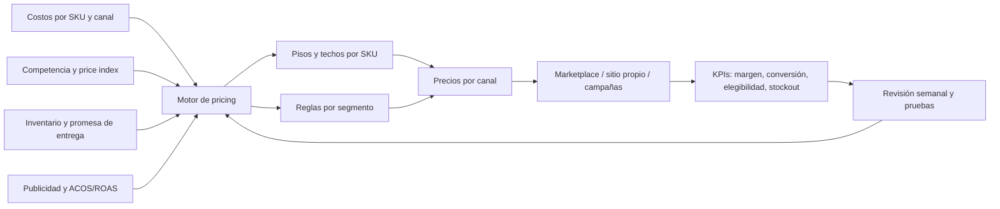
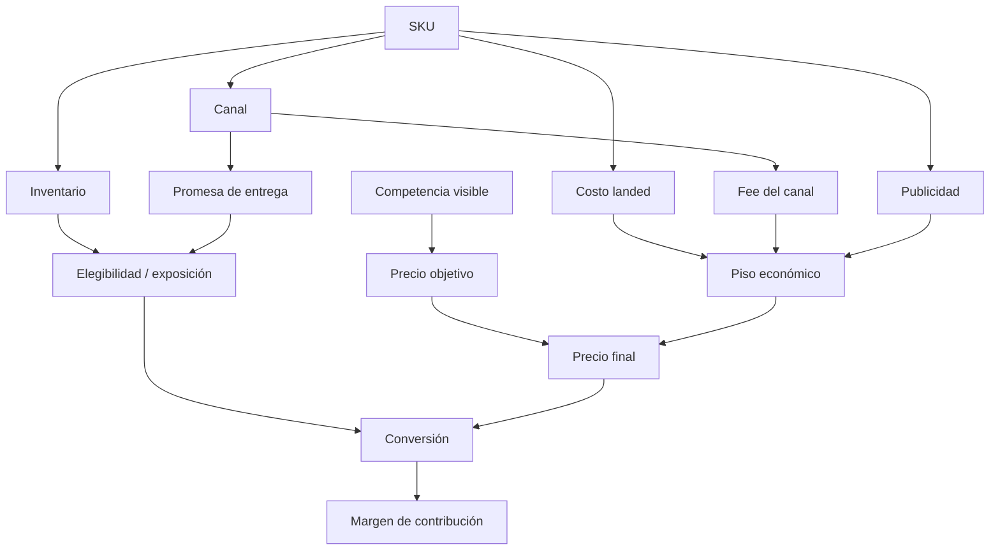
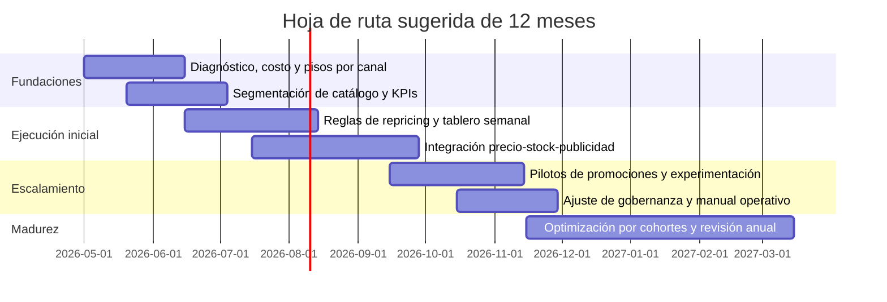

# Gestión de pricing en e-commerce multi-SKU

## Resumen ejecutivo

Aunque el texto inicial decía “todo esto” sin especificar tema, el brief adjunto permite inferir con claridad que el objeto de estudio es la gestión de pricing para una empresa objetivo similar a BANVA: un retailer digital de hogar/textil con aproximadamente 425 SKU, fuerte dependencia de marketplaces y necesidad de decidir entre un modelo de pricing tipo “brand owner / seller marketplace” y uno más cercano al de retailers omnicanal. Con base en esa definición operativa, la conclusión principal de este informe es que la mejor alternativa no es elegir un modelo puro, sino implantar un **modelo híbrido**: usar el enfoque marketplace-native como columna vertebral de ejecución diaria y sumar, de forma selectiva, capacidades de pricing más maduras propias de retailers complejos. citeturn35view0turn35view1turn37view0turn39view0

La razón es estructural. En marketplaces como entity["company","Mercado Libre","ecommerce platform buenos aires, argentina"] y entity["company","Amazon","technology company seattle, wa, us"], el precio importa mucho, pero no decide solo: la visibilidad y la elegibilidad también dependen de reputación, servicio, velocidad de despacho, inventario, costo total entregado y consistencia operativa. En Amazon, la elegibilidad para la Featured Offer depende de precio competitivo, envío, experiencia de pedido y stock; en Mercado Libre, la reputación afecta exposición y la propia plataforma ya ofrece ajustes automáticos de precio con límites definidos por el vendedor. citeturn35view0turn35view1turn37view0turn22search0turn12search0

Para una operación de 425 SKU, intentar saltar directamente a un “pricing tower” completo, al estilo de un gran retailer omnicanal, probablemente produciría sobrecostos, mucha complejidad analítica y una velocidad de decisión inferior a la exigida por los marketplaces. Al mismo tiempo, quedarse en correcciones manuales o en reglas simples de repricing también es insuficiente, porque deja dinero sobre la mesa en márgenes, promociones, inversión publicitaria, surtido y estacionalidad. La evidencia académica y de plataformas sugiere que los mejores resultados provienen de separar los SKU por rol económico, experimentar con disciplina y coordinar precio, inventario y publicidad en un mismo circuito de decisión. citeturn40view0turn40view1turn40view3turn41view0turn38view0

La recomendación concreta es implantar una arquitectura en tres capas. La primera es una **capa transaccional** con pisos y techos por SKU/canal, más automatización de repricing para los SKU de alta comparación. La segunda es una **capa de gobierno económico** con margen de contribución por canal, reserva explícita para fees, logística, devoluciones y publicidad, y reglas diferenciadas por estacionalidad y profundidad promocional. La tercera es una **capa de aprendizaje** con experimentación controlada, tableros de price index y revisión semanal de excepciones. Esa secuencia equilibra rapidez competitiva con defensa de margen y es la ruta con mejor relación riesgo-retorno para una empresa de este tamaño. citeturn38view1turn38view3turn39view0turn35view1turn40view1

En términos de implementación, la recomendación es avanzar durante doce meses en cuatro etapas: diagnóstico y modelo de costos; segmentación de catálogo y reglas; integración de inventario-publicidad-precio; y, finalmente, experimentación y optimización continua. Sin datos internos históricos de margen por SKU, devoluciones, stockouts y ACOS/TACOS por producto, el presupuesto sólo puede estimarse en rangos. Aun así, la magnitud del proyecto es manejable: no exige una organización de gran retailer, pero sí un owner claro de pricing, soporte analítico y una disciplina operativa semanal. La parte crítica no es el algoritmo; es la calidad de las reglas, la gobernanza y la capacidad de ejecutar rápido sin entrar en guerras de precio improductivas. citeturn40view0turn40view2turn24view0turn26view0

## Alcance, objetivos y supuestos

Este informe asume que la empresa objetivo opera principalmente en entity["country","Chile","south america"], vende una mezcla de productos de hogar/textil o categorías comparables, administra un catálogo de alrededor de 425 SKU y tiene una dependencia importante de marketplaces, en particular Mercado Libre Chile y potencialmente Amazon u otros canales digitales. También asume que la decisión relevante no es “qué software comprar” en abstracto, sino **qué modelo operativo de pricing** conviene adoptar, con qué profundidad y en qué secuencia. Esta interpretación es coherente con el brief adjunto y con la manera en que las grandes plataformas estructuran la competencia por visibilidad y conversión. citeturn35view0turn35view1turn37view0turn39view0

Los objetivos de investigación, por tanto, son cuatro. Primero, identificar cómo están resolviendo el pricing los actores comparables de marketplaces y los retailers digitales más complejos. Segundo, evaluar si una empresa de 425 SKU necesita un modelo full omnicanal o si debe empezar por un modelo más liviano. Tercero, proponer una arquitectura de pricing, promociones y gobernanza económicamente defendible. Cuarto, traducir esa arquitectura a una hoja de ruta con riesgos, recursos y presupuesto estimado. citeturn24view0turn25view0turn29view1turn16search3

Hay varias limitaciones importantes. No se contó con datos internos de costo landed por SKU, fee real por publicación/canal, subsidio logístico, tasa de devolución, rotación, ventas por listing, ranking orgánico, ACOS/TACOS por producto, elasticidades propias ni calendario comercial interno. Tampoco se entregaron restricciones definitivas de presupuesto, equipo disponible, integraciones tecnológicas existentes ni peso relativo del canal propio frente a marketplaces. Por eso, los tramos de impacto y presupuesto incluidos aquí deben leerse como **estimaciones analíticas**, no como casos financieros cerrados. citeturn38view1turn38view3turn39view0turn30search1

Las preguntas que siguen abiertas y que deberían resolverse antes de ejecutar son: qué porcentaje del GMV proviene de los 20, 50 y 100 SKU principales; cuál es el margen de contribución pre-publicidad por canal; cuál es la tasa de stockout y cancelación por listing; qué tan concentrada está la inversión publicitaria y cuántos productos realmente compiten por Featured Offer o por precio competitivo; y qué parte del catálogo es verdaderamente comparable con competencia directa. Sin esa información, el diseño puede ser correcto, pero la calibración seguirá siendo aproximada. citeturn35view0turn37view0turn38view1turn40view0

## Contexto y evidencia comparada

El contexto de mercado justifica tratar pricing como una capacidad estratégica y no como una tarea administrativa. La entity["organization","Cámara de Comercio de Santiago","trade group santiago, chile"] estimó que el comercio electrónico chileno bordeó los US$10 mil millones en 2025, con crecimiento real superior al 9%, y proyectó otro avance para 2026. En otras palabras, la empresa objetivo compite en un entorno digital que volvió a crecer y donde velocidad de ajuste, promociones y disciplina comercial pesan más que en un mercado estancado. citeturn30search1turn30search4

En paralelo, Mercado Libre ya opera como un ecosistema de enorme escala en la región: reporta 94 millones de compradores únicos LTM en su página principal de inversionistas, 12 millones de sellers activos mensuales y una oferta publicitaria respaldada por first-party data donde Product Ads se asocia a +33% de ventas tras adopción. Además, la compañía subraya que su logística y su experiencia de usuario están diseñadas para elevar tráfico, conversión y ventas de los vendedores. Eso significa que competir allí exige ver precio, publicidad y fulfilment como un sistema integrado, no como silos. citeturn39view0turn37view2

Amazon muestra la misma lógica, pero con reglas más explícitas. Su documentación pública indica que la competitividad de precio, el costo total incluyendo envío, la velocidad de despacho, la experiencia de pedido y el nivel de stock afectan la posibilidad de ganar la Featured Offer. También ofrece Pricing Health para detectar listings inactivos o poco competitivos y Automate Pricing para ajustar precios “en tiempo real” y sostener competitividad 24/7. En otras palabras, el estándar competitivo de marketplace ya incorpora automatización, monitoreo y gestión de excepciones. citeturn35view0turn35view1

Los grandes retailers complejos aportan una segunda lección. entity["company","Walmart","retailer bentonville, ar, us"] define formalmente EDLP como su filosofía de precio y la articula con un modelo people-led, technology-powered omnichannel que integra tiendas, e-commerce, marketplace, logística, membresía y advertising; en su 10-K fiscal 2026 reporta US$713,2 mil millones de ingresos y 280 millones de clientes semanales. entity["company","Target","retailer minneapolis, mn, us"], por su parte, comunica que en 2024 construyó un negocio digital first-party de US$20 mil millones, un marketplace Target Plus de más de US$1 mil millón y redujo precios en más de 10.000 productos; además, su política pública de price match permite igualar precios propios durante 14 días para ciertos casos. Estas empresas no usan pricing sólo para reaccionar a la competencia, sino también para construir confianza, frecuencia y economics de largo plazo. citeturn24view0turn26view0turn25view0turn25view1

El caso de entity["company","Wayfair","retailer boston, ma, us"] es especialmente útil por cercanía de categoría. Wayfair reportó US$12,457 mil millones de revenue en 2025 con un gross margin ajustado de 30,3%, y su propio equipo de data science ha explicado públicamente que diseñó enfoques de modelación y experimentación para medir “price effects”. Esto importa porque muestra que, en categorías de hogar y decoración, pricing serio no significa sólo repricing competitivo: requiere medir causalmente el efecto del precio y separar señal de ruido. citeturn29view1turn29view0

El caso marketplace-native más ilustrativo es entity["company","Packable","ecommerce platform new york, ny, us"], antes conocida por Pharmapacks. En documentación oficial presentada ante la SEC, la compañía se describió como el mayor seller 3P de Amazon en Norteamérica por número de reviews, con data-driven pricing algorithms, forecasting, bundling multi-SKU y más de 75 millones de transacciones de consumidores. Ese caso confirma que un seller intensivo en marketplaces puede operar pricing sofisticado sin convertirse en un retailer omnicanal tradicional; pero también sugiere el riesgo de complejidad operativa y dependencia de plataforma cuando la disciplina económica no está totalmente resuelta. citeturn16search1turn16search3

## Hallazgos clave y análisis detallado

El hallazgo principal es que **el modelo A y el modelo B optimizan problemas distintos**. El modelo A —seller marketplace-native— está diseñado para competir por visibilidad transaccional: Buy Box/Featured Offer, precio competitivo, velocidad de reacción, cobertura de catálogo y protección de margen unitario en listings comparables. El modelo B —retailer/omnichannel— está diseñado para arbitrar un sistema más amplio: coherencia entre canales, arquitectura promocional, elasticidades, surtido, finanzas comerciales y posicionamiento de marca. Para una empresa de 425 SKU dominada por marketplaces, el problema más urgente se parece más al del modelo A; el problema más valioso a mediano plazo ya empieza a parecerse al del modelo B. Por eso la decisión correcta es secuencial e híbrida, no binaria. citeturn35view0turn35view1turn24view0turn26view0

La evidencia académica refuerza esa conclusión. Un artículo de *Management Science* sobre competition-based dynamic pricing muestra que un retailer que sigue a competidores debe responder cuatro preguntas: si conviene reaccionar, a quién, cuánto y en qué productos. En su experimento de campo, una estrategia de best response elevó los ingresos 11% manteniendo el margen por encima de un objetivo predefinido. La lección práctica es crucial: **no todos los SKU ni todos los movimientos de competidor merecen respuesta**. El pricing bueno no es “bajar primero”, sino “reaccionar selectivamente”. citeturn40view0

Una segunda conclusión es que **la experimentación sí es factible, pero debe adaptarse al contexto de marketplace**. Amazon incluso recomienda en su contenido para sellers probar dos precios competitivos por un periodo y comparar resultados. La literatura académica va más allá y muestra que, cuando la información de demanda es incompleta, políticas de aprendizaje tipo multi-armed bandit pueden mejorar beneficios durante el test y anualmente respecto de experimentos balanceados tradicionales. Para la empresa objetivo, esto implica que las pruebas de pricing no deben empezar con grandes tests aleatorios sobre todo el catálogo, sino con cohorts acotados de SKU comparables, ventanas temporales cortas y control estricto de variables como inversión publicitaria y stock. citeturn35view1turn40view1

Una tercera conclusión, muy relevante para hogar y textil, es que **inventario y disponibilidad suelen mover ventas tanto o más que pequeños cambios de precio**. Un estudio reciente en *Management Science* sobre online retail encontró un aumento promedio de 65% en ventas asociado a tener el producto en stock, con diferencias por tipo de producto y menor sensibilidad en artículos más caros. Para una empresa con surtido relativamente largo, esto cambia la lógica de pricing: hay SKU donde la prioridad debe ser evitar quiebres, mejorar promesa de entrega o usar fulfilment más fuerte; en ellos, perseguir al competidor por centavos puede ser menos rentable que sostener disponibilidad y velocidad. citeturn41view0

Una cuarta conclusión es que **promocionar sin gobernanza puede dañar margen hoy y disciplina del cliente mañana**. En un experimento aleatorizado enorme junto a Alibaba, las promociones duplicaron ventas el día del descuento, pero también generaron efectos posteriores no deseados: más comportamiento estratégico del consumidor y un menor precio pagado a futuro. Para la empresa objetivo, esto sugiere evitar una política de cupones o descuentos excesivamente frecuente, especialmente en SKU donde la demanda ya es orgánica o donde el listing compite principalmente por confianza, reputación o stock. Las promociones deben reservarse para liquidación, lanzamiento, estacionalidad y defensa táctica muy concreta. citeturn40view2

La quinta conclusión es que **precio y publicidad no deben optimizarse por separado**. La teoría y la práctica coinciden en que mayor puja publicitaria puede alterar tráfico, intención y willingness to pay, y que la respuesta óptima de precio depende de cómo cambia la visibilidad. Amazon Ads define ACOS como inversión publicitaria dividida por ventas atribuidas, y señala explícitamente que el ACOS de equilibrio debe ser inferior al margen de ganancia para mantener beneficios. Además, Amazon Marketing Stream entrega métricas horarias y cambios de campaña casi en tiempo real, precisamente para optimizar campañas intra-día y coordinar pujas, presupuestos y ASIN objetivo. En términos operativos, esto obliga a trabajar con una métrica más fuerte que “venta con ads”: **margen de contribución después de ads por SKU/canal**. citeturn40view3turn38view1turn38view0

Sobre esa base, el catálogo de 425 SKU no debería tratarse como un bloque homogéneo. La recomendación es segmentarlo en al menos cuatro familias económicas. La primera son **SKU de tráfico**: altamente comparables, con alta elasticidad y relevancia para reputación competitiva; aquí sí conviene repricing automatizado con reglas agresivas pero con piso firme. La segunda son **SKU de margen**: productos diferenciados, bundles, sets o referencias con menor comparabilidad directa; aquí el pricing debe defender valor y usar promociones de forma más selectiva. La tercera son **SKU estacionales o de evento**: requieren calendario, elasticidad temporal y coordinación con presupuesto publicitario. La cuarta son **SKU de cola larga**: deben priorizar margen, disponibilidad razonable y gobierno de surtido antes que reacción continua. Es exactamente la lógica implícita detrás de la literatura de dynamic pricing, publicidad e inventory availability. citeturn40view0turn40view3turn41view0

La siguiente tabla resume por qué la alternativa recomendada es híbrida.

| Dimensión | Modelo marketplace-native | Modelo retailer/omnichannel | Modelo híbrido recomendado |
|---|---|---|---|
| Problema que resuelve mejor | Competitividad diaria por listing, Featured Offer, precio competitivo, reacción táctica | Arquitectura de precio, promociones, coherencia entre canales, finanzas comerciales | Competitividad rápida en marketplaces con disciplina económica y promocional |
| Datos mínimos | Competidores, fees, shipping, stock, reputación, ventas por listing | Todo lo anterior más elasticidades, canastas, surtido, canal propio, promociones, finanzas comerciales | Empieza con datos transaccionales y agrega capas analíticas por prioridad |
| Complejidad organizacional | Media | Alta | Media-alta, escalable |
| Riesgo principal | Carrera al fondo y miopía de margen | Sobrediseño y lentitud ejecutiva | Requiere gobierno claro para no duplicar procesos |
| Encaje para 425 SKU | Bueno | Bajo-medio como punto de partida | Muy bueno |
| Recomendación | Insuficiente si se usa solo | Excesivo si se implanta de entrada | **Sí** |

**Nota:** la comparación combina reglas y señales operativas observables en Amazon y Mercado Libre con lecciones de Walmart, Target y Wayfair sobre pricing como sistema, no sólo como repricing. citeturn35view0turn35view1turn37view0turn24view0turn26view0turn29view0

El sistema recomendado puede visualizarse así:

El diagrama sintetiza una idea central del informe: precio, inventario y publicidad deben entrar al mismo circuito de decisión, con revisión humana, no en workflows separados. citeturn38view0turn38view1turn35view0turn39view0

También conviene aterrizar la evidencia comparada en casos concretos.

| Caso | Señal observable | Lección útil para la empresa objetivo |
|---|---|---|
| Mercado Libre | Ajustes automáticos con precio mínimo definido por el vendedor; Product Ads ligados a mayor venta | Usar automatización nativa o interoperable para SKU muy comparables, pero siempre con piso económico explícito |
| Amazon | Pricing Health, Featured Offer, reglas automáticas en tiempo real | La visibilidad depende del “total offer”, no sólo del precio nominal |
| Walmart | EDLP integrado a omnicanalidad, marketplace y advertising | La confianza de precio puede ser un activo, pero requiere escala y operación consistente |
| Target | Price match acotado y fuerte ecosistema promocional y digital | Una “promesa de confianza” puede ayudar más que descuentos improvisados |
| Wayfair | Home category a gran escala con experimentación de price effects | En hogar, medir causalmente es más importante que perseguir cada movimiento de mercado |
| Packable/Pharmapacks | Pricing algorítmico, bundling y operación marketplace intensiva | Un seller marketplace puede sofisticarse mucho; la clave es no perder control de economics y complejidad |

**Nota:** la tabla mezcla fuentes oficiales corporativas, documentación de plataformas y literatura académica; no pretende igualar negocios de distinto tamaño, sino extraer patrones operativos transferibles. citeturn39view0turn35view0turn35view1turn24view0turn26view0turn29view0turn16search3

## Recomendaciones e implementación

La recomendación principal es crear un **modelo híbrido de pricing con foco marketplace-first**. En la práctica, eso significa que la empresa objetivo debería gobernar precio con la lógica de un seller avanzado, no con la complejidad total de un gran retailer, pero sí incorporar cuatro disciplinas que normalmente faltan en sellers medianos: margen de contribución por canal, segmentación económica de surtido, gobierno promocional y experimentación. Esta arquitectura es la que mejor responde al estándar competitivo de Amazon y Mercado Libre sin sobrecargar a una operación de 425 SKU. citeturn35view1turn37view0turn39view0

La primera recomendación operativa es definir un **piso económico real por SKU y por canal**. Ese piso no debe ser “costo + margen deseado” en abstracto, sino: costo landed + fee del canal + subsidio logístico esperado + empaque + reserva por devolución/reclamo + reserva de publicidad + margen mínimo de contribución. Amazon remite explícitamente a Revenue Calculator y Fee Preview para estimar economics por fulfillment method, y Mercado Libre recuerda que los costos de vender varían por publicación y que reputación/envíos afectan economics. Sin ese piso, cualquier automatización repricing termina optimizando ventas brutas en vez de utilidad. citeturn38view3turn31search1turn31search2turn32search2

La segunda recomendación es separar el catálogo por **cadencia de revisión**. Los SKU de tráfico deberían entrar en automatización o revisión diaria, con reglas como “igualar hasta X% por encima del piso” o “quedar dentro de una banda competitiva si el competidor relevante tiene stock y buena reputación”. Los SKU de margen deberían revisarse semanalmente, priorizando bundles, packs y mejoras de contenido antes que descuentos. Los SKU estacionales deberían manejarse con calendario y preajustes de presupuesto y puja, siguiendo prácticas de eventos donde Amazon recomienda subir presupuestos 20%-30% entre tres y cinco días antes y preparar keywords al menos dos semanas antes. Los SKU de cola larga deberían moverse con menor frecuencia y ser evaluados también por rentabilidad de inventario, no sólo por conversión. citeturn38view2turn21search4turn41view0

La tercera recomendación es implantar una **regla de ACOS de equilibrio por SKU**. Amazon Ads explica que el ACOS de equilibrio debe ser inferior al margen de ganancia. Operativamente, esto significa que, si el margen de contribución antes de publicidad de un SKU es 18%, el ACOS objetivo no debería acercarse a 18% salvo que el objetivo explícito sea lanzamiento, ranking o liquidación estratégica. En régimen normal, el target debe ser más bajo porque todavía existen incertidumbres por devoluciones, halo orgánico y elasticidad. La implicancia es contundente: si un listing “vende bien” pero lo hace con ACOS o TACOS superiores a su margen económico real, el pricing y la pauta están mal coordinados. citeturn38view1

La cuarta recomendación es **rebajar el peso de promociones generalizadas** y subir el peso de promociones quirúrgicas. La evidencia de Alibaba muestra que el descuento puede duplicar ventas el día del evento, pero también educar al consumidor a esperar rebajas y a pagar menos en el período siguiente. Por eso conviene reservar promociones para cuatro usos: lanzamiento, liquidación, protección de ranking en evento, y aceleración de inventario alto. En todo lo demás, la empresa debería preferir precio estable con mensajes de valor, bundles y mejoras de contenido. Esta combinación es más compatible con salud de margen y con confianza de cliente. citeturn40view2turn24view0turn25view1

La quinta recomendación es construir una **mesa semanal de pricing** con sólo cinco decisiones: qué SKU deben defender share; qué SKU deben defender margen; qué promociones corren o se frenan; qué campañas publicitarias están fuera de economics; y qué excepciones de stock/servicio están distorsionando el pricing. Esto parece simple, pero es la disciplina que separa pricing como “corrección de planilla” de pricing como capability. Walmart, Target y Wayfair muestran que el pricing maduro se apoya en rituales de coordinación, no únicamente en algoritmos. citeturn24view0turn26view0turn29view0

La sexta recomendación es formalizar una **ruta de pruebas**. En lugar de prometer “IA de pricing” desde el día uno, conviene arrancar con tres tipos de test: bandas de precio para 20-30 SKU comparables; niveles de descuento por evento; y coordinación puja/precio sobre un subconjunto de ASIN/SKU con alta inversión publicitaria. La propia literatura de pricing experimental y las guías de sellers respaldan esa aproximación incremental. citeturn40view0turn40view1turn35view1

La arquitectura recomendada puede representarse también como relación entre entidades económicas del sistema:

Este esquema ayuda a evitar el error más común en empresas medianas: mirar el precio final sin reconstruir de qué economía sale ni qué variables lo sostienen. citeturn35view0turn38view1turn38view3turn37view0

## Riesgos, cronograma, recursos y presupuesto

El riesgo más evidente es la **guerra de precios**. Amazon advierte que prácticas de precio que dañen la confianza del cliente pueden terminar en pérdida de Featured Offer o incluso sanciones de vendedor; y la literatura académica recuerda que la pregunta correcta no es si reaccionar siempre, sino en qué productos vale la pena hacerlo. La mitigación es simple en concepto y exigente en ejecución: pisos duros, techos razonables, selección de competidores relevantes y exclusión explícita de sellers con reputación o servicio inferiores cuando se define referencia competitiva. citeturn35view1turn40view0

El segundo riesgo es la **miopía de listing**, es decir, optimizar precio sin mirar stock, fulfillment o servicio. Mercado Libre deja claro que reputación afecta exposición; Amazon también deja claro que envío, order experience e inventario afectan elegibilidad. Si el equipo de pricing ignora esos drivers, puede bajar precios para compensar problemas que en realidad son logísticos u operativos. La mitigación es que pricing no opere separado de catálogo, customer service y operaciones. citeturn37view0turn35view0

El tercer riesgo es la **subestimación del costo publicitario**. Amazon Ads define ACOS y advierte que el ACOS de equilibrio debe ser inferior al margen. Además, su Marketing Stream existe precisamente porque decisiones intra-día de presupuesto y puja cambian el rendimiento económico. La mitigación es exigir que todo tablero de pricing incluya un margen de contribución después de publicidad y una separación clara entre objetivos de ventas, visibilidad y rentabilidad. citeturn38view1turn38view0

El cuarto riesgo es de **cumplimiento regulatorio y confianza del consumidor**. En Chile, el entity["organization","SERNAC","consumer agency santiago, chile"] ha aclarado y fiscalizado la obligación de informar Precio por Unidad de Medida en supermercados, tiendas y marketplaces desde septiembre de 2025, y recuerda además derechos del consumidor en comercio electrónico como retracto en ciertos casos y confirmación escrita de condiciones. Cualquier estrategia de pricing o empaquetado en categorías sujetas a PPUM debe revisar la dimensión regulatoria antes de desplegarse masivamente. citeturn34search0turn34search6turn34search17

El quinto riesgo es organizacional: **comprar software antes de tener reglas**. Muchas empresas medianas sobredimensionan la herramienta y subdimensionan la gobernanza. La mitigación recomendada es implantar primero un modelo económico por SKU/canal, luego segmentar el catálogo y sólo después automatizar donde el caso de negocio sea claro. La tecnología correcta amplifica una política buena; no reemplaza una política inexistente. citeturn35view1turn39view0turn24view0

El cronograma sugerido de doce meses es el siguiente:

La lógica del cronograma es empezar por economics y reglas, no por inteligencia artificial ni por experimentos ambiciosos. Primero se estabiliza la caja; luego se acelera. citeturn40view1turn38view0turn38view2

En recursos, la estructura mínima recomendable es la siguiente: un **owner de pricing** con autoridad comercial; un analista marketplace con foco diario en listings, competitividad y excepciones; un analista BI o revenue operations que sostenga el modelo económico y los tableros; una contraparte de publicidad/performance con responsabilidad compartida sobre ACOS/TACOS; y soporte parcial de operaciones/logística y de ingeniería o integraciones. Para 425 SKU, esto no requiere un “departamento” grande, pero sí un responsable claro, una disciplina semanal y criterios formales de escalamiento. citeturn24view0turn26view0turn29view0

En presupuesto, el rango razonable para el primer año —como estimación analítica propia y sujeta a confirmación con proveedores y estructura interna— puede pensarse en tres escenarios:

| Escenario | Alcance | Recursos y herramientas | Presupuesto estimado año 1 |
|---|---|---|---|
| Lean | Modelo A reforzado, dashboards, reglas por SKU crítico, poca automatización | 1 owner + 1 analista + soporte parcial | CLP 35M–55M |
| Core recomendado | Modelo híbrido, segmentación completa, automatización parcial, integración con ads e inventario, pruebas | 1 owner + 2 analistas + soporte parcial de performance e integración | CLP 55M–85M |
| Advanced | Motor más sofisticado, mayor automatización, más pruebas, mayor cobertura de canales y promociones | Equipo ampliado + implementación más intensiva | CLP 90M–150M |

Si la empresa quisiera moverse cerca de un techo de CLP 60M, la mejor decisión sería ejecutar el escenario **Core recortado**: priorizar floors/ceilings, catálogo segmentado, automatización sólo para SKU de tráfico, y gobierno precio-publicidad sin intentar un pricing omnicanal completo desde el inicio. Ese diseño conserva la mayor parte del upside con bastante menos riesgo de sobrediseño. 

Como limitación final, esta sección no incluye remuneraciones de mercado por rol ni cotizaciones de software, porque no se proporcionaron vendors objetivo, stack actual ni políticas internas de contratación. Esos números deben validarse en una fase posterior de procurement. Aun así, el orden de magnitud estimado es suficiente para decidir si el proyecto es abordable y qué versión conviene financiar primero.

## Referencias

**Fuentes oficiales de plataformas y empresas**

- Mercado Libre Investor Relations, escala del ecosistema, retail media, compradores, sellers y Product Ads. citeturn39view0turn37view2
- Mercado Libre Chile, reputación del vendedor y su efecto en exposición. citeturn37view0
- Mercado Libre Chile, automatización de precios y costos de vender. citeturn12search0turn22search0turn31search2
- Amazon Sell, pricing strategies, Pricing Health, Automate Pricing y Featured Offer. citeturn35view0turn35view1
- Amazon Sell y Amazon Ads, Revenue Calculator, ACOS, ROAS, Marketing Stream y optimización de campañas en eventos. citeturn38view0turn38view1turn38view2turn38view3
- Walmart 10-K fiscal 2026, EDLP, omnicanalidad, tamaño y estrategia. citeturn24view0
- Target Annual Report 2024, earnings FY2025 y política de price match. citeturn26view0turn25view0turn25view1
- Wayfair earnings FY2025 y publicación oficial sobre medición de efectos de precio. citeturn29view1turn29view0
- Packable/Pharmapacks, filings SEC y materiales públicos sobre pricing algorítmico, bundling y operación marketplace. citeturn16search1turn16search3

**Fuentes chilenas y regulatorias**

- Cámara de Comercio de Santiago, evolución y proyecciones del e-commerce en Chile 2025-2026. citeturn30search1turn30search4
- SERNAC y Ministerio de Economía, régimen de Precio por Unidad de Medida y fiscalización. citeturn34search0turn34search2turn34search6
- SERNAC, derechos del consumidor en comercio electrónico. citeturn34search17

**Literatura académica y evidencia analítica**

- *Management Science*, “Competition-Based Dynamic Pricing in Online Retailing: A Methodology Validated with Field Experiments.” citeturn40view0
- *Marketing Science*, “Dynamic Online Pricing with Incomplete Information Using Multiarmed Bandit Experiments.” citeturn40view1
- *Management Science*, “The Long-term and Spillover Effects of Price Promotions on Retailing Platforms: Evidence from a Large Randomized Experiment on Alibaba.” citeturn40view2
- *Management Science*, “Sponsored Search Marketing: Dynamic Pricing and Advertising for an Online Retailer.” citeturn40view3
- *Management Science*, “Where to Cut the Long Tail? The Value of Carrying Inventory in Online Retail.” citeturn41view0

**Pregunta abierta más importante**

La variable crítica no resuelta es empírica, no conceptual: dónde está hoy el verdadero pool de beneficio de la empresa objetivo. Antes de activar software o automatización amplia, conviene responder con datos internos qué porcentaje del margen total proviene de los 20, 50 y 100 SKU principales; qué listings están fuera de equilibrio publicitario; y cuánto GMV se pierde hoy por precio, por stock o por servicio. Esa respuesta definirá el orden fino de implementación.