# BANVA Bodega — Schema & Data Audit

**Fecha:** 2026-05-01
**DB:** Supabase prod (`qaircihuiafgnnrwcjls`)
**Total tablas/vistas:** 116 tablas + 12 vistas
**FKs declaradas:** 55

_Read-only. Generado para análisis de gap del modelo de reposición multi-bodega._

---

## 1. Inventario de tablas

Por tabla: propósito • columnas (tipo, NULL) • FKs out • filas • última actividad.

### `_backup_sku_intelligence_dias_quiebre_20260416`  

_Backup snapshot dias_quiebre 2026-04-16._  

**Tipo:** `log` • **Filas:** 24 • **Última actividad:** 2026-04-16 18:52:53

| Columna | Tipo | NULL | Default |
|---|---|---|---|
| `sku_origen` | `text` | ✓ | `` |
| `dias_en_quiebre` | `integer` | ✓ | `` |
| `updated_at` | `timestamp with time zone` | ✓ | `` |

### `_backup_test_vinculacion_20260416`  

_Backup test vinculación SKU↔ML._  

**Tipo:** `log` • **Filas:** 117 • **Última actividad:** —

| Columna | Tipo | NULL | Default |
|---|---|---|---|
| `tipo` | `text` | ✓ | `` |
| `entity_id` | `text` | ✓ | `` |
| `snapshot` | `text` | ✓ | `` |

### `_deprecated_ml_velocidad_semanal_2026_05_09`  

_Tabla deprecada (DROP planeado 2026-05-09). Reemplazada por agregados sobre orders_history._  

**Tipo:** `log` • **Filas:** 1633 • **Última actividad:** 2026-04-06 14:28:33

| Columna | Tipo | NULL | Default |
|---|---|---|---|
| `id` | `uuid` | ✗ | `gen_random_uuid()` |
| `item_id` | `text` | ✗ | `` |
| `sku_venta` | `text` | ✓ | `` |
| `semana_inicio` | `date` | ✗ | `` |
| `unidades` | `integer` | ✓ | `0` |
| `ingreso` | `integer` | ✓ | `0` |
| `created_at` | `timestamp with time zone` | ✓ | `now()` |

> Quarantine 2026-04-25. DROP planeado 2026-05-09.

### `admin_actions_log`  

_Auditoría de acciones admin (panel Inteligencia)._  

**Tipo:** `log` • **Filas:** 405 • **Última actividad:** 2026-05-01 22:02:35

| Columna | Tipo | NULL | Default |
|---|---|---|---|
| `id` | `uuid` | ✗ | `gen_random_uuid()` |
| `accion` | `text` | ✗ | `` |
| `entidad` | `text` | ✓ | `` |
| `entidad_id` | `text` | ✓ | `` |
| `detalle` | `jsonb` | ✓ | `` |
| `created_at` | `timestamp with time zone` | ✓ | `now()` |

### `admin_users`  

_Usuarios admin del panel banvabodega (UI-level only)._  

**Tipo:** `master_data` • **Filas:** 3 • **Última actividad:** 2026-04-23 19:39:19

| Columna | Tipo | NULL | Default |
|---|---|---|---|
| `id` | `uuid` | ✗ | `gen_random_uuid()` |
| `email` | `text` | ✓ | `` |
| `nombre` | `text` | ✗ | `` |
| `pin` | `text` | ✗ | `` |
| `rol` | `text` | ✗ | `'custom'::text` |
| `permisos` | `jsonb` | ✓ | `'[]'::jsonb` |
| `activo` | `boolean` | ✓ | `true` |
| `created_at` | `timestamp with time zone` | ✓ | `now()` |
| `updated_at` | `timestamp with time zone` | ✓ | `now()` |

### `agent_config`  

_Configuración por agente IA (sonnet/haiku, system prompts)._  

**Tipo:** `config` • **Filas:** 5 • **Última actividad:** 2026-03-13 13:36:38

| Columna | Tipo | NULL | Default |
|---|---|---|---|
| `id` | `text` | ✗ | `` |
| `nombre_display` | `text` | ✗ | `` |
| `descripcion` | `text` | ✓ | `` |
| `model` | `text` | ✓ | `'claude-sonnet-4-20250514'::te…` |
| `system_prompt_base` | `text` | ✓ | `` |
| `activo` | `boolean` | ✓ | `true` |
| `max_tokens_input` | `integer` | ✓ | `50000` |
| `max_tokens_output` | `integer` | ✓ | `4000` |
| `schedule` | `text` | ✓ | `` |
| `last_run_at` | `timestamp with time zone` | ✓ | `` |
| `last_run_tokens` | `integer` | ✓ | `` |
| `last_run_cost_usd` | `numeric` | ✓ | `` |
| `config_extra` | `jsonb` | ✓ | `'{}'::jsonb` |
| `updated_at` | `timestamp with time zone` | ✓ | `now()` |

### `agent_conversations`  

_Conversaciones del chat multi-agente._  

**Tipo:** `transactional` • **Filas:** 6 • **Última actividad:** 2026-03-11 16:58:58

| Columna | Tipo | NULL | Default |
|---|---|---|---|
| `id` | `uuid` | ✗ | `gen_random_uuid()` |
| `session_id` | `uuid` | ✗ | `` |
| `role` | `text` | ✓ | `` |
| `contenido` | `text` | ✗ | `` |
| `agentes_invocados` | `ARRAY` | ✓ | `` |
| `tokens_usados` | `integer` | ✓ | `` |
| `created_at` | `timestamp with time zone` | ✓ | `now()` |

### `agent_data_snapshots`  

_Snapshots de datos crudos enviados al agente (hash dedup)._  

**Tipo:** `derived` • **Filas:** 7 • **Última actividad:** 2026-03-13 13:36:38

| Columna | Tipo | NULL | Default |
|---|---|---|---|
| `id` | `uuid` | ✗ | `gen_random_uuid()` |
| `tipo` | `text` | ✗ | `` |
| `hash` | `text` | ✗ | `` |
| `datos` | `jsonb` | ✓ | `` |
| `created_at` | `timestamp with time zone` | ✓ | `now()` |

### `agent_insights`  

_Insights generados por agentes IA._  

**Tipo:** `transactional` • **Filas:** 30 • **Última actividad:** 2026-03-13 13:36:38

| Columna | Tipo | NULL | Default |
|---|---|---|---|
| `id` | `uuid` | ✗ | `gen_random_uuid()` |
| `agente` | `text` | ✓ | `` |
| `run_id` | `uuid` | ✓ | `` |
| `tipo` | `text` | ✓ | `` |
| `severidad` | `text` | ✓ | `` |
| `categoria` | `text` | ✓ | `` |
| `titulo` | `text` | ✗ | `` |
| `contenido` | `text` | ✓ | `` |
| `datos` | `jsonb` | ✓ | `` |
| `skus_relacionados` | `ARRAY` | ✓ | `` |
| `estado` | `text` | ✓ | `'nuevo'::text` |
| `feedback_texto` | `text` | ✓ | `` |
| `feedback_at` | `timestamp with time zone` | ✓ | `` |
| `created_at` | `timestamp with time zone` | ✓ | `now()` |
| `expires_at` | `timestamp with time zone` | ✓ | `` |

**FKs out:**
- `agente` → `agent_config.id`

### `agent_rules`  

_Reglas custom escritas por agentes (heurísticas auto-aprendidas)._  

**Tipo:** `config` • **Filas:** 15 • **Última actividad:** 2026-03-12 01:15:04

| Columna | Tipo | NULL | Default |
|---|---|---|---|
| `id` | `uuid` | ✗ | `gen_random_uuid()` |
| `agente` | `text` | ✓ | `` |
| `regla` | `text` | ✗ | `` |
| `contexto` | `text` | ✓ | `` |
| `origen` | `text` | ✓ | `` |
| `origen_insight_id` | `uuid` | ✓ | `` |
| `prioridad` | `integer` | ✓ | `5` |
| `veces_aplicada` | `integer` | ✓ | `0` |
| `activa` | `boolean` | ✓ | `true` |
| `created_at` | `timestamp with time zone` | ✓ | `now()` |
| `updated_at` | `timestamp with time zone` | ✓ | `now()` |

**FKs out:**
- `agente` → `agent_config.id`
- `origen_insight_id` → `agent_insights.id`

### `agent_runs`  

_Log de ejecuciones de cada agente IA._  

**Tipo:** `log` • **Filas:** 46135 • **Última actividad:** 2026-05-01 22:01:51

| Columna | Tipo | NULL | Default |
|---|---|---|---|
| `id` | `uuid` | ✗ | `gen_random_uuid()` |
| `agente` | `text` | ✓ | `` |
| `trigger` | `text` | ✓ | `` |
| `estado` | `text` | ✓ | `'corriendo'::text` |
| `tokens_input` | `integer` | ✓ | `` |
| `tokens_output` | `integer` | ✓ | `` |
| `costo_usd` | `numeric` | ✓ | `` |
| `duracion_ms` | `integer` | ✓ | `` |
| `insights_generados` | `integer` | ✓ | `` |
| `error_mensaje` | `text` | ✓ | `` |
| `datos_snapshot_hash` | `text` | ✓ | `` |
| `created_at` | `timestamp with time zone` | ✓ | `now()` |
| `completed_at` | `timestamp with time zone` | ✓ | `` |

**FKs out:**
- `agente` → `agent_config.id`

### `agent_triggers`  

_Triggers (cron + eventos) que disparan agentes._  

**Tipo:** `config` • **Filas:** 16 • **Última actividad:** 2026-03-12 01:02:06

| Columna | Tipo | NULL | Default |
|---|---|---|---|
| `id` | `uuid` | ✗ | `gen_random_uuid()` |
| `agente` | `text` | ✗ | `` |
| `nombre` | `text` | ✗ | `` |
| `tipo` | `text` | ✗ | `` |
| `configuracion` | `jsonb` | ✗ | `'{}'::jsonb` |
| `activo` | `boolean` | ✓ | `true` |
| `ultima_ejecucion` | `timestamp with time zone` | ✓ | `` |
| `created_at` | `timestamp with time zone` | ✓ | `now()` |

### `alertas`  

_Alertas operativas (vacía hoy)._  

**Tipo:** `transactional` • **Filas:** 0 • **Última actividad:** —

| Columna | Tipo | NULL | Default |
|---|---|---|---|
| `id` | `uuid` | ✗ | `gen_random_uuid()` |
| `empresa_id` | `uuid` | ✓ | `` |
| `tipo` | `text` | ✗ | `` |
| `titulo` | `text` | ✗ | `` |
| `descripcion` | `text` | ✓ | `` |
| `referencia_id` | `uuid` | ✓ | `` |
| `estado` | `text` | ✓ | `'activa'::text` |
| `prioridad` | `text` | ✓ | `'media'::text` |
| `created_at` | `timestamp with time zone` | ✓ | `now()` |

**FKs out:**
- `empresa_id` → `empresas.id`

### `audit_log`  

_Audit log universal (acción + entidad + params)._  

**Tipo:** `log` • **Filas:** 23509 • **Última actividad:** 2026-05-01 22:00:03

| Columna | Tipo | NULL | Default |
|---|---|---|---|
| `id` | `uuid` | ✗ | `gen_random_uuid()` |
| `accion` | `text` | ✗ | `` |
| `entidad` | `text` | ✓ | `` |
| `entidad_id` | `text` | ✓ | `` |
| `params` | `jsonb` | ✓ | `` |
| `resultado` | `jsonb` | ✓ | `` |
| `operario` | `text` | ✓ | `''::text` |
| `error` | `text` | ✓ | `` |
| `created_at` | `timestamp with time zone` | ✓ | `now()` |

### `auto_postulacion_log`  

_Auditoría motor postulación promos auto._  

**Tipo:** `log` • **Filas:** 3210 • **Última actividad:** 2026-05-01 11:30:22

| Columna | Tipo | NULL | Default |
|---|---|---|---|
| `id` | `uuid` | ✗ | `gen_random_uuid()` |
| `fecha` | `timestamp with time zone` | ✗ | `now()` |
| `sku` | `text` | ✗ | `` |
| `item_id` | `text` | ✓ | `` |
| `promo_id` | `text` | ✓ | `` |
| `promo_type` | `text` | ✓ | `` |
| `promo_name` | `text` | ✓ | `` |
| `decision` | `text` | ✗ | `` |
| `motivo` | `text` | ✗ | `` |
| `precio_objetivo` | `integer` | ✓ | `` |
| `precio_actual` | `integer` | ✓ | `` |
| `floor_calculado` | `integer` | ✓ | `` |
| `margen_proyectado_pct` | `numeric` | ✓ | `` |
| `modo` | `text` | ✗ | `'dry_run'::text` |
| `contexto` | `jsonb` | ✓ | `'{}'::jsonb` |
| `canal` | `text` | ✗ | `'ml'::text` |

> Auditoría motor postulación.

### `cobranza_acciones`  

_Acciones de cobranza (vacía hoy)._  

**Tipo:** `transactional` • **Filas:** 0 • **Última actividad:** —

| Columna | Tipo | NULL | Default |
|---|---|---|---|
| `id` | `uuid` | ✗ | `gen_random_uuid()` |
| `documento_id` | `uuid` | ✗ | `` |
| `tipo_accion` | `text` | ✗ | `` |
| `fecha` | `date` | ✗ | `CURRENT_DATE` |
| `destinatario` | `text` | ✓ | `` |
| `contenido` | `text` | ✓ | `` |
| `resultado` | `text` | ✓ | `` |
| `proximo_seguimiento` | `date` | ✓ | `` |
| `created_at` | `timestamp with time zone` | ✓ | `now()` |

### `composicion_venta`  

_Bundles/packs: mapping sku_venta→sku_origen×unidades._  

**Tipo:** `master_data` • **Filas:** 507 • **Última actividad:** 2026-04-28 16:10:03

| Columna | Tipo | NULL | Default |
|---|---|---|---|
| `id` | `uuid` | ✗ | `gen_random_uuid()` |
| `sku_venta` | `text` | ✗ | `` |
| `codigo_ml` | `text` | ✓ | `''::text` |
| `sku_origen` | `text` | ✗ | `` |
| `unidades` | `integer` | ✗ | `1` |
| `created_at` | `timestamp with time zone` | ✓ | `now()` |
| `updated_at` | `timestamp with time zone` | ✓ | `now()` |
| `tipo_relacion` | `text` | ✓ | `'componente'::text` |
| `nota_operativa` | `text` | ✓ | `` |

### `conciliacion_items`  

_Items de cada conciliación (rcv↔banco↔pasarela)._  

**Tipo:** `transactional` • **Filas:** 111 • **Última actividad:** 2026-04-29 16:27:45

| Columna | Tipo | NULL | Default |
|---|---|---|---|
| `id` | `uuid` | ✗ | `gen_random_uuid()` |
| `conciliacion_id` | `uuid` | ✗ | `` |
| `documento_tipo` | `text` | ✗ | `` |
| `documento_id` | `uuid` | ✗ | `` |
| `monto_aplicado` | `numeric` | ✗ | `0` |
| `created_at` | `timestamp with time zone` | ✓ | `now()` |

**FKs out:**
- `conciliacion_id` → `conciliaciones.id`

### `conciliaciones`  

_Hechos de conciliación financiera._  

**Tipo:** `transactional` • **Filas:** 319 • **Última actividad:** 2026-04-30 12:30:36

| Columna | Tipo | NULL | Default |
|---|---|---|---|
| `id` | `uuid` | ✗ | `gen_random_uuid()` |
| `empresa_id` | `uuid` | ✓ | `` |
| `movimiento_banco_id` | `uuid` | ✓ | `` |
| `rcv_compra_id` | `uuid` | ✓ | `` |
| `rcv_venta_id` | `uuid` | ✓ | `` |
| `confianza` | `numeric` | ✓ | `` |
| `estado` | `text` | ✓ | `'pendiente'::text` |
| `tipo_partida` | `text` | ✓ | `` |
| `metodo` | `text` | ✓ | `` |
| `notas` | `text` | ✓ | `` |
| `created_by` | `text` | ✓ | `` |
| `created_at` | `timestamp with time zone` | ✓ | `now()` |
| `regla_id` | `uuid` | ✓ | `` |
| `monto_aplicado` | `numeric` | ✓ | `` |
| `metadata` | `jsonb` | ✓ | `` |
| `archivo_url` | `text` | ✓ | `` |

**FKs out:**
- `empresa_id` → `empresas.id`
- `movimiento_banco_id` → `movimientos_banco.id`
- `rcv_compra_id` → `rcv_compras.id`
- `rcv_venta_id` → `rcv_ventas.id`
- `regla_id` → `reglas_conciliacion.id`

### `config_historial`  

_Historial de cambios de configuración (vacía)._  

**Tipo:** `log` • **Filas:** 0 • **Última actividad:** —

| Columna | Tipo | NULL | Default |
|---|---|---|---|
| `id` | `uuid` | ✗ | `gen_random_uuid()` |
| `parametro` | `text` | ✗ | `` |
| `valor_anterior` | `text` | ✓ | `` |
| `valor_nuevo` | `text` | ✓ | `` |
| `created_at` | `timestamp with time zone` | ✓ | `now()` |

### `conteos`  

_Conteos cíclicos (jsonb líneas)._  

**Tipo:** `transactional` • **Filas:** 10 • **Última actividad:** 2026-05-01 11:35:09

| Columna | Tipo | NULL | Default |
|---|---|---|---|
| `id` | `uuid` | ✗ | `gen_random_uuid()` |
| `fecha` | `text` | ✗ | `` |
| `tipo` | `text` | ✗ | `` |
| `estado` | `text` | ✗ | `'ABIERTA'::text` |
| `lineas` | `jsonb` | ✗ | `'[]'::jsonb` |
| `posiciones` | `ARRAY` | ✗ | `'{}'::text[]` |
| `posiciones_contadas` | `ARRAY` | ✗ | `'{}'::text[]` |
| `created_by` | `text` | ✗ | `''::text` |
| `closed_at` | `timestamp with time zone` | ✓ | `` |
| `closed_by` | `text` | ✓ | `` |
| `created_at` | `timestamp with time zone` | ✓ | `now()` |
| `lineas_total` | `integer` | ✓ | `` |
| `lineas_ok` | `integer` | ✓ | `` |
| `lineas_diff` | `integer` | ✓ | `` |
| `ira_pct` | `numeric` | ✓ | `` |
| `origen` | `text` | ✓ | `` |
| `skus_disparadores` | `jsonb` | ✓ | `` |

### `costos_historial`  

_Histórico de cambios de costo por SKU._  

**Tipo:** `log` • **Filas:** 11 • **Última actividad:** 2026-04-24 18:13:23

| Columna | Tipo | NULL | Default |
|---|---|---|---|
| `id` | `uuid` | ✗ | `gen_random_uuid()` |
| `sku_origen` | `text` | ✗ | `` |
| `costo_anterior` | `numeric` | ✓ | `0` |
| `costo_nuevo` | `numeric` | ✓ | `0` |
| `diferencia_pct` | `numeric` | ✓ | `0` |
| `fuente` | `text` | ✓ | `'lista_proveedor'::text` |
| `created_at` | `timestamp with time zone` | ✓ | `now()` |

### `cuentas_bancarias`  

_Cuentas bancarias por empresa._  

**Tipo:** `master_data` • **Filas:** 7 • **Última actividad:** 2026-03-08 23:36:43

| Columna | Tipo | NULL | Default |
|---|---|---|---|
| `id` | `uuid` | ✗ | `gen_random_uuid()` |
| `empresa_id` | `uuid` | ✗ | `` |
| `banco` | `text` | ✗ | `` |
| `tipo_cuenta` | `text` | ✓ | `` |
| `numero_cuenta` | `text` | ✓ | `` |
| `alias` | `text` | ✓ | `` |
| `saldo_actual` | `numeric` | ✗ | `0` |
| `moneda` | `text` | ✗ | `'CLP'::text` |
| `activa` | `boolean` | ✗ | `true` |
| `created_at` | `timestamp with time zone` | ✓ | `now()` |

**FKs out:**
- `empresa_id` → `empresas.id`

### `deploy_pr1_pre_snapshot`  

_Snapshot pre-deploy PR1 (frozen)._  

**Tipo:** `log` • **Filas:** 533 • **Última actividad:** 2026-04-21 20:17:33

| Columna | Tipo | NULL | Default |
|---|---|---|---|
| `sku_origen` | `text` | ✓ | `` |
| `pedir_proveedor` | `numeric` | ✓ | `` |
| `necesita_pedir` | `boolean` | ✓ | `` |
| `alertas` | `ARRAY` | ✓ | `` |
| `accion` | `text` | ✓ | `` |
| `safety_stock_completo` | `numeric` | ✓ | `` |
| `snapshot_updated_at` | `timestamp with time zone` | ✓ | `` |

### `deploy_pr3_pre_snapshot`  

_Snapshot pre-deploy PR3 (frozen)._  

**Tipo:** `log` • **Filas:** 533 • **Última actividad:** —

| Columna | Tipo | NULL | Default |
|---|---|---|---|
| `sku_origen` | `text` | ✓ | `` |
| `stock_bodega` | `integer` | ✓ | `` |
| `mandar_full` | `numeric` | ✓ | `` |
| `pct_flex` | `numeric` | ✓ | `` |
| `accion` | `text` | ✓ | `` |
| `alertas` | `ARRAY` | ✓ | `` |
| `pedir_proveedor` | `numeric` | ✓ | `` |

### `deploy_rollback_flex_pre`  

_Snapshot pre-rollback Flex (frozen)._  

**Tipo:** `log` • **Filas:** 533 • **Última actividad:** —

| Columna | Tipo | NULL | Default |
|---|---|---|---|
| `sku_origen` | `text` | ✓ | `` |
| `stock_bodega` | `integer` | ✓ | `` |
| `mandar_full` | `numeric` | ✓ | `` |
| `alertas` | `ARRAY` | ✓ | `` |
| `accion` | `text` | ✓ | `` |

### `discrepancias_costo`  

_Discrepancias detectadas costo factura vs catálogo._  

**Tipo:** `transactional` • **Filas:** 190 • **Última actividad:** 2026-04-30 22:04:41

| Columna | Tipo | NULL | Default |
|---|---|---|---|
| `id` | `uuid` | ✗ | `gen_random_uuid()` |
| `recepcion_id` | `uuid` | ✓ | `` |
| `linea_id` | `uuid` | ✓ | `` |
| `sku` | `text` | ✗ | `` |
| `costo_diccionario` | `numeric` | ✓ | `0` |
| `costo_factura` | `numeric` | ✓ | `0` |
| `diferencia` | `numeric` | ✓ | `0` |
| `porcentaje` | `numeric` | ✓ | `0` |
| `estado` | `text` | ✓ | `'PENDIENTE'::text` |
| `resuelto_por` | `text` | ✓ | `` |
| `resuelto_at` | `timestamp with time zone` | ✓ | `` |
| `notas` | `text` | ✓ | `` |
| `created_at` | `timestamp with time zone` | ✓ | `now()` |
| `costo_esperado_post_nc` | `numeric` | ✓ | `` |

**FKs out:**
- `linea_id` → `recepcion_lineas.id`
- `recepcion_id` → `recepciones.id`

### `discrepancias_qty`  

_Discrepancias cantidad factura vs recepción._  

**Tipo:** `transactional` • **Filas:** 15 • **Última actividad:** 2026-04-30 00:22:09

| Columna | Tipo | NULL | Default |
|---|---|---|---|
| `id` | `uuid` | ✗ | `gen_random_uuid()` |
| `recepcion_id` | `text` | ✗ | `` |
| `linea_id` | `text` | ✓ | `` |
| `sku` | `text` | ✗ | `` |
| `tipo` | `text` | ✗ | `` |
| `qty_factura` | `integer` | ✗ | `0` |
| `qty_recibida` | `integer` | ✗ | `0` |
| `diferencia` | `integer` | ✗ | `0` |
| `estado` | `text` | ✗ | `'PENDIENTE'::text` |
| `resuelto_por` | `text` | ✓ | `` |
| `resuelto_at` | `timestamp with time zone` | ✓ | `` |
| `notas` | `text` | ✓ | `''::text` |
| `created_at` | `timestamp with time zone` | ✓ | `now()` |

### `empresas`  

_Empresas (multi-tenant, hoy 1 fila)._  

**Tipo:** `master_data` • **Filas:** 1 • **Última actividad:** 2026-03-08 11:43:42

| Columna | Tipo | NULL | Default |
|---|---|---|---|
| `id` | `uuid` | ✗ | `gen_random_uuid()` |
| `rut` | `text` | ✗ | `` |
| `razon_social` | `text` | ✗ | `` |
| `created_at` | `timestamp with time zone` | ✓ | `now()` |

### `envio_full_pendiente`  

_Cola de envíos a Full pendientes de etiquetado._  

**Tipo:** `transactional` • **Filas:** 5 • **Última actividad:** 2026-04-14 01:17:30

| Columna | Tipo | NULL | Default |
|---|---|---|---|
| `id` | `uuid` | ✗ | `gen_random_uuid()` |
| `sku` | `text` | ✗ | `` |
| `sku_venta` | `text` | ✗ | `` |
| `cantidad` | `integer` | ✗ | `` |
| `cantidad_agregada` | `integer` | ✗ | `0` |
| `picking_session_id` | `uuid` | ✓ | `` |
| `created_at` | `timestamp with time zone` | ✓ | `now()` |

### `envios_full_historial`  

_Cabecera de envíos Bodega→Full._  

**Tipo:** `transactional` • **Filas:** 12 • **Última actividad:** 2026-04-28 00:00:00

| Columna | Tipo | NULL | Default |
|---|---|---|---|
| `id` | `uuid` | ✗ | `gen_random_uuid()` |
| `picking_session_id` | `uuid` | ✓ | `` |
| `fecha` | `date` | ✗ | `CURRENT_DATE` |
| `total_skus` | `integer` | ✗ | `` |
| `total_uds_venta` | `integer` | ✗ | `` |
| `total_uds_fisicas` | `integer` | ✗ | `` |
| `total_bultos` | `integer` | ✗ | `` |
| `evento_activo` | `text` | ✓ | `` |
| `multiplicador_evento` | `numeric` | ✓ | `1.0` |
| `created_at` | `timestamp with time zone` | ✓ | `now()` |

### `envios_full_lineas`  

_Líneas de cada envío a Full._  

**Tipo:** `transactional` • **Filas:** 489 • **Última actividad:** 2026-04-28 22:10:34

| Columna | Tipo | NULL | Default |
|---|---|---|---|
| `id` | `uuid` | ✗ | `gen_random_uuid()` |
| `envio_id` | `uuid` | ✗ | `` |
| `sku_venta` | `text` | ✗ | `` |
| `sku_origen` | `text` | ✗ | `` |
| `cantidad_sugerida` | `integer` | ✗ | `` |
| `cantidad_enviada` | `integer` | ✗ | `` |
| `fue_editada` | `boolean` | ✓ | `false` |
| `abc` | `text` | ✓ | `` |
| `vel_ponderada` | `numeric` | ✓ | `` |
| `vel_objetivo` | `numeric` | ✓ | `` |
| `stock_full_antes` | `integer` | ✓ | `` |
| `stock_bodega_antes` | `integer` | ✓ | `` |
| `cob_full_antes` | `numeric` | ✓ | `` |
| `target_dias` | `numeric` | ✓ | `` |
| `margen_full` | `numeric` | ✓ | `` |
| `inner_pack` | `integer` | ✓ | `` |
| `redondeo` | `text` | ✓ | `` |
| `alertas` | `ARRAY` | ✓ | `` |
| `nota` | `text` | ✓ | `` |
| `created_at` | `timestamp with time zone` | ✓ | `now()` |
| `bultos` | `integer` | ✓ | `0` |

**FKs out:**
- `envio_id` → `envios_full_historial.id`

### `eventos_demanda`  

_Eventos comerciales (cyber, navidad) con multiplicador demanda._  

**Tipo:** `config` • **Filas:** 7 • **Última actividad:** 2026-03-13 00:45:28

| Columna | Tipo | NULL | Default |
|---|---|---|---|
| `id` | `uuid` | ✗ | `gen_random_uuid()` |
| `nombre` | `text` | ✗ | `` |
| `fecha_inicio` | `date` | ✗ | `` |
| `fecha_fin` | `date` | ✗ | `` |
| `fecha_prep_desde` | `date` | ✗ | `` |
| `multiplicador` | `numeric` | ✓ | `2.0` |
| `categorias` | `ARRAY` | ✓ | `'{}'::text[]` |
| `notas` | `text` | ✓ | `` |
| `activo` | `boolean` | ✓ | `true` |
| `multiplicador_real` | `numeric` | ✓ | `` |
| `evaluado` | `boolean` | ✓ | `false` |
| `created_at` | `timestamp with time zone` | ✓ | `now()` |

### `feedback_agentes`  

_Feedback humano sobre output de agentes IA._  

**Tipo:** `transactional` • **Filas:** 43 • **Última actividad:** 2026-03-25 12:50:29

| Columna | Tipo | NULL | Default |
|---|---|---|---|
| `id` | `uuid` | ✗ | `gen_random_uuid()` |
| `empresa_id` | `uuid` | ✓ | `` |
| `agente` | `text` | ✗ | `` |
| `accion_sugerida` | `jsonb` | ✓ | `` |
| `accion_correcta` | `jsonb` | ✓ | `` |
| `contexto` | `jsonb` | ✓ | `` |
| `created_at` | `timestamp with time zone` | ✓ | `now()` |

**FKs out:**
- `empresa_id` → `empresas.id`

### `forecast_accuracy`  

_Métricas wMAPE/bias por sku_origen y ventana._  

**Tipo:** `derived` • **Filas:** 1512 • **Última actividad:** 2026-04-17 13:03:48

| Columna | Tipo | NULL | Default |
|---|---|---|---|
| `sku_origen` | `text` | ✗ | `` |
| `ventana_semanas` | `integer` | ✗ | `` |
| `calculado_at` | `timestamp with time zone` | ✗ | `now()` |
| `semanas_evaluadas` | `integer` | ✗ | `` |
| `semanas_excluidas` | `integer` | ✗ | `0` |
| `wmape` | `numeric` | ✓ | `` |
| `bias` | `numeric` | ✓ | `` |
| `mad` | `numeric` | ✓ | `` |
| `tracking_signal` | `numeric` | ✓ | `` |
| `forecast_total` | `numeric` | ✗ | `` |
| `actual_total` | `numeric` | ✗ | `` |
| `es_confiable` | `boolean` | ✗ | `false` |

**FKs out:**
- `sku_origen` → `sku_intelligence.sku_origen`

### `forecast_snapshots_semanales`  

_Snapshot semanal de pronósticos vs real (T-8)._  

**Tipo:** `derived` • **Filas:** 6929 • **Última actividad:** 2026-04-17 13:02:39

| Columna | Tipo | NULL | Default |
|---|---|---|---|
| `sku_origen` | `text` | ✗ | `` |
| `semana_inicio` | `date` | ✗ | `` |
| `vel_ponderada` | `numeric` | ✗ | `` |
| `vel_7d` | `numeric` | ✗ | `` |
| `vel_30d` | `numeric` | ✗ | `` |
| `vel_60d` | `numeric` | ✗ | `` |
| `abc` | `text` | ✓ | `` |
| `xyz` | `text` | ✓ | `` |
| `en_quiebre` | `boolean` | ✓ | `` |
| `origen` | `text` | ✗ | `` |
| `creado_at` | `timestamp with time zone` | ✗ | `now()` |

### `intel_config`  

_Config motor inteligencia (single row)._  

**Tipo:** `config` • **Filas:** 1 • **Última actividad:** 2026-03-16 22:43:40

| Columna | Tipo | NULL | Default |
|---|---|---|---|
| `id` | `text` | ✗ | `'main'::text` |
| `target_dias_a` | `integer` | ✗ | `42` |
| `target_dias_b` | `integer` | ✗ | `28` |
| `target_dias_c` | `integer` | ✗ | `14` |
| `updated_at` | `timestamp with time zone` | ✓ | `now()` |

### `mapa_config`  

_Config visual del mapa de bodega._  

**Tipo:** `config` • **Filas:** 1 • **Última actividad:** 2026-04-06 21:02:08

| Columna | Tipo | NULL | Default |
|---|---|---|---|
| `id` | `text` | ✗ | `'main'::text` |
| `config` | `jsonb` | ✓ | `'[]'::jsonb` |
| `grid_w` | `integer` | ✓ | `20` |
| `grid_h` | `integer` | ✓ | `14` |
| `updated_at` | `timestamp with time zone` | ✓ | `now()` |

### `ml_acciones`  

_Log de acciones tomadas sobre items ML._  

**Tipo:** `log` • **Filas:** 0 • **Última actividad:** —

| Columna | Tipo | NULL | Default |
|---|---|---|---|
| `id` | `uuid` | ✗ | `gen_random_uuid()` |
| `item_id` | `text` | ✗ | `` |
| `sku_venta` | `text` | ✓ | `` |
| `periodo` | `text` | ✗ | `` |
| `tipo_accion` | `text` | ✗ | `` |
| `campo` | `text` | ✓ | `` |
| `valor_antes` | `text` | ✓ | `` |
| `valor_despues` | `text` | ✓ | `` |
| `notas` | `text` | ✓ | `` |
| `ejecutado_por` | `text` | ✓ | `'manual'::text` |
| `fecha` | `timestamp with time zone` | ✓ | `now()` |
| `created_at` | `timestamp with time zone` | ✓ | `now()` |

### `ml_ads_daily_cache`  

_Cache diaria de ads ML por item._  

**Tipo:** `derived` • **Filas:** 45874 • **Última actividad:** 2026-05-01 00:00:00

| Columna | Tipo | NULL | Default |
|---|---|---|---|
| `item_id` | `text` | ✗ | `` |
| `date` | `date` | ✗ | `` |
| `cost_neto` | `integer` | ✗ | `0` |
| `clicks` | `integer` | ✗ | `0` |
| `prints` | `integer` | ✗ | `0` |
| `direct_amount` | `integer` | ✗ | `0` |
| `direct_units` | `integer` | ✗ | `0` |
| `indirect_amount` | `integer` | ✗ | `0` |
| `indirect_units` | `integer` | ✗ | `0` |
| `organic_amount` | `integer` | ✗ | `0` |
| `organic_units` | `integer` | ✗ | `0` |
| `total_amount` | `integer` | ✗ | `0` |
| `acos` | `numeric` | ✗ | `0` |
| `synced_at` | `timestamp with time zone` | ✗ | `now()` |

### `ml_benchmarks`  

_Benchmarks por categoría (CTR, CVR, ACOS objetivo)._  

**Tipo:** `config` • **Filas:** 20 • **Última actividad:** 2026-05-01 08:04:27

| Columna | Tipo | NULL | Default |
|---|---|---|---|
| `id` | `uuid` | ✗ | `gen_random_uuid()` |
| `periodo` | `text` | ✗ | `` |
| `categoria` | `text` | ✗ | `` |
| `items_count` | `integer` | ✓ | `0` |
| `avg_visitas` | `numeric` | ✓ | `0` |
| `avg_cvr` | `numeric` | ✓ | `0` |
| `avg_unidades` | `numeric` | ✓ | `0` |
| `avg_ingreso` | `numeric` | ✓ | `0` |
| `avg_review_score` | `numeric` | ✓ | `` |
| `avg_quality_score` | `numeric` | ✓ | `` |
| `pct_con_ads` | `numeric` | ✓ | `0` |
| `created_at` | `timestamp with time zone` | ✓ | `now()` |

### `ml_billing_cfwa`  

_Cache de facturación ML CFwA (Custos Full)._  

**Tipo:** `derived` • **Filas:** 376 • **Última actividad:** 2026-05-01 13:00:17

| Columna | Tipo | NULL | Default |
|---|---|---|---|
| `detail_id` | `bigint` | ✗ | `` |
| `day` | `date` | ✗ | `` |
| `amount` | `numeric` | ✗ | `` |
| `gross` | `numeric` | ✓ | `` |
| `discount` | `numeric` | ✓ | `` |
| `creation_date_time` | `timestamp with time zone` | ✓ | `` |
| `document_id` | `bigint` | ✓ | `` |
| `legal_document_number` | `text` | ✓ | `` |
| `legal_document_status` | `text` | ✓ | `` |
| `period_key` | `date` | ✗ | `` |
| `marketplace` | `text` | ✓ | `` |
| `transaction_detail` | `text` | ✓ | `` |
| `created_at` | `timestamp with time zone` | ✓ | `now()` |
| `updated_at` | `timestamp with time zone` | ✓ | `now()` |

### `ml_billing_cfwa_sync_log`  

_Log sync billing CFwA._  

**Tipo:** `log` • **Filas:** 18 • **Última actividad:** 2026-05-01 13:00:17

| Columna | Tipo | NULL | Default |
|---|---|---|---|
| `id` | `uuid` | ✗ | `gen_random_uuid()` |
| `ran_at` | `timestamp with time zone` | ✓ | `now()` |
| `periods_scanned` | `ARRAY` | ✓ | `` |
| `rows_upserted` | `integer` | ✓ | `` |
| `rows_unchanged` | `integer` | ✓ | `` |
| `errors` | `text` | ✓ | `` |
| `ms` | `bigint` | ✓ | `` |

### `ml_campaigns_config_history`  

_Histórico cambios config campañas ML._  

**Tipo:** `log` • **Filas:** 8 • **Última actividad:** 2026-04-25 12:49:29

| Columna | Tipo | NULL | Default |
|---|---|---|---|
| `id` | `bigint` | ✗ | `nextval('ml_campaigns_config_h…` |
| `campaign_id` | `bigint` | ✗ | `` |
| `changed_at` | `timestamp with time zone` | ✗ | `now()` |
| `field` | `text` | ✗ | `` |
| `old_value` | `text` | ✓ | `` |
| `new_value` | `text` | ✓ | `` |
| `source` | `text` | ✗ | `'sync'::text` |

### `ml_campaigns_daily_cache`  

_Cache diaria por campaign_id._  

**Tipo:** `derived` • **Filas:** 194 • **Última actividad:** 2026-04-30 00:00:00

| Columna | Tipo | NULL | Default |
|---|---|---|---|
| `campaign_id` | `bigint` | ✗ | `` |
| `date` | `date` | ✗ | `` |
| `prints` | `integer` | ✓ | `` |
| `clicks` | `integer` | ✓ | `` |
| `cpc` | `numeric` | ✓ | `` |
| `ctr` | `numeric` | ✓ | `` |
| `cvr` | `numeric` | ✓ | `` |
| `sov` | `numeric` | ✓ | `` |
| `impression_share` | `numeric` | ✓ | `` |
| `top_impression_share` | `numeric` | ✓ | `` |
| `lost_by_budget` | `numeric` | ✓ | `` |
| `lost_by_rank` | `numeric` | ✓ | `` |
| `cost` | `numeric` | ✓ | `` |
| `direct_amount` | `numeric` | ✓ | `` |
| `indirect_amount` | `numeric` | ✓ | `` |
| `total_amount` | `numeric` | ✓ | `` |
| `acos_real` | `numeric` | ✓ | `` |
| `acos_benchmark` | `numeric` | ✓ | `` |
| `roas_real` | `numeric` | ✓ | `` |
| `direct_units` | `integer` | ✓ | `` |
| `indirect_units` | `integer` | ✓ | `` |
| `organic_units` | `integer` | ✓ | `` |
| `direct_items` | `integer` | ✓ | `` |
| `indirect_items` | `integer` | ✓ | `` |
| `organic_items` | `integer` | ✓ | `` |
| `organic_amount` | `numeric` | ✓ | `` |
| `acos_target` | `numeric` | ✓ | `` |
| `budget` | `numeric` | ✓ | `` |
| `strategy` | `text` | ✓ | `` |
| `status` | `text` | ✓ | `` |
| `synced_at` | `timestamp with time zone` | ✗ | `now()` |
| `config_is_historical` | `boolean` | ✗ | `true` |

### `ml_campaigns_mensual`  

_Agregado mensual por campaign_id._  

**Tipo:** `derived` • **Filas:** 9 • **Última actividad:** 2026-05-01 08:04:20

| Columna | Tipo | NULL | Default |
|---|---|---|---|
| `id` | `uuid` | ✗ | `gen_random_uuid()` |
| `periodo` | `text` | ✗ | `` |
| `campaign_id` | `text` | ✗ | `` |
| `campaign_name` | `text` | ✓ | `` |
| `campaign_status` | `text` | ✓ | `` |
| `budget` | `numeric` | ✓ | `0` |
| `strategy` | `text` | ✓ | `` |
| `acos_target` | `numeric` | ✓ | `0` |
| `roas_target` | `numeric` | ✓ | `0` |
| `clicks` | `integer` | ✓ | `0` |
| `prints` | `integer` | ✓ | `0` |
| `ctr` | `numeric` | ✓ | `0` |
| `cost` | `numeric` | ✓ | `0` |
| `cpc` | `numeric` | ✓ | `0` |
| `acos` | `numeric` | ✓ | `0` |
| `roas` | `numeric` | ✓ | `0` |
| `cvr` | `numeric` | ✓ | `0` |
| `sov` | `numeric` | ✓ | `0` |
| `impression_share` | `numeric` | ✓ | `0` |
| `top_impression_share` | `numeric` | ✓ | `0` |
| `lost_by_budget` | `numeric` | ✓ | `0` |
| `lost_by_rank` | `numeric` | ✓ | `0` |
| `acos_benchmark` | `numeric` | ✓ | `0` |
| `direct_amount` | `numeric` | ✓ | `0` |
| `indirect_amount` | `numeric` | ✓ | `0` |
| `total_amount` | `numeric` | ✓ | `0` |
| `direct_units` | `integer` | ✓ | `0` |
| `indirect_units` | `integer` | ✓ | `0` |
| `total_units` | `integer` | ✓ | `0` |
| `organic_units` | `integer` | ✓ | `0` |
| `organic_amount` | `numeric` | ✓ | `0` |
| `ads_count` | `integer` | ✓ | `0` |
| `created_at` | `timestamp with time zone` | ✓ | `now()` |

### `ml_config`  

_Tokens OAuth ML + config global (singleton)._  

**Tipo:** `config` • **Filas:** 1 • **Última actividad:** 2026-05-01 17:08:31

| Columna | Tipo | NULL | Default |
|---|---|---|---|
| `id` | `text` | ✗ | `'main'::text` |
| `seller_id` | `text` | ✓ | `''::text` |
| `client_id` | `text` | ✓ | `''::text` |
| `client_secret` | `text` | ✓ | `''::text` |
| `access_token` | `text` | ✓ | `''::text` |
| `refresh_token` | `text` | ✓ | `''::text` |
| `token_expires_at` | `timestamp with time zone` | ✓ | `now()` |
| `webhook_secret` | `text` | ✓ | `` |
| `hora_corte_lv` | `integer` | ✓ | `14` |
| `hora_corte_sab` | `integer` | ✓ | `11` |
| `updated_at` | `timestamp with time zone` | ✓ | `now()` |
| `flex_service_id` | `text` | ✓ | `''::text` |
| `hora_corte_dom` | `integer` | ✓ | `` |
| `advertiser_id` | `text` | ✓ | `` |
| `account_id` | `text` | ✓ | `` |

### `ml_item_attr_snapshot`  

_Snapshot atributos del ítem ML (drift detect)._  

**Tipo:** `derived` • **Filas:** 3126 • **Última actividad:** 2026-05-01 18:00:31

| Columna | Tipo | NULL | Default |
|---|---|---|---|
| `id` | `uuid` | ✗ | `gen_random_uuid()` |
| `item_id` | `text` | ✗ | `` |
| `attr_id` | `text` | ✗ | `` |
| `attr_value` | `text` | ✓ | `` |
| `snapshot_at` | `timestamp with time zone` | ✓ | `now()` |

### `ml_item_changes`  

_Diff detectado en ítems ML._  

**Tipo:** `log` • **Filas:** 3 • **Última actividad:** 2026-04-08 06:02:16

| Columna | Tipo | NULL | Default |
|---|---|---|---|
| `id` | `uuid` | ✗ | `gen_random_uuid()` |
| `item_id` | `text` | ✗ | `` |
| `titulo` | `text` | ✓ | `` |
| `attr_id` | `text` | ✗ | `` |
| `valor_anterior` | `text` | ✓ | `` |
| `valor_nuevo` | `text` | ✓ | `` |
| `detected_at` | `timestamp with time zone` | ✓ | `now()` |

### `ml_items_map`  

_Mapping SKU↔ítem ML (1 sku puede mapear a varios items)._  

**Tipo:** `master_data` • **Filas:** 664 • **Última actividad:** 2026-05-01 22:02:36

| Columna | Tipo | NULL | Default |
|---|---|---|---|
| `id` | `uuid` | ✗ | `gen_random_uuid()` |
| `sku` | `text` | ✗ | `` |
| `item_id` | `text` | ✗ | `` |
| `variation_id` | `bigint` | ✓ | `` |
| `activo` | `boolean` | ✓ | `true` |
| `ultimo_sync` | `timestamp with time zone` | ✓ | `` |
| `ultimo_stock_enviado` | `integer` | ✓ | `` |
| `user_product_id` | `text` | ✓ | `` |
| `stock_version` | `integer` | ✓ | `` |
| `inventory_id` | `text` | ✓ | `` |
| `sku_venta` | `text` | ✓ | `` |
| `titulo` | `text` | ✓ | `` |
| `available_quantity` | `integer` | ✓ | `0` |
| `sold_quantity` | `integer` | ✓ | `0` |
| `updated_at` | `timestamp with time zone` | ✓ | `now()` |
| `sku_origen` | `text` | ✓ | `` |
| `stock_flex_cache` | `integer` | ✓ | `0` |
| `stock_full_cache` | `integer` | ✓ | `0` |
| `cache_updated_at` | `timestamp with time zone` | ✓ | `` |
| `status_ml` | `text` | ✓ | `` |
| `price` | `numeric` | ✓ | `` |
| `thumbnail` | `text` | ✓ | `` |
| `permalink` | `text` | ✓ | `` |
| `listing_type` | `text` | ✓ | `` |
| `condition` | `text` | ✓ | `` |
| `category_id` | `text` | ✓ | `` |
| `created_via` | `text` | ✓ | `'sync'::text` |
| `date_created_ml` | `timestamp with time zone` | ✓ | `` |
| `start_time_ml` | `timestamp with time zone` | ✓ | `` |
| `family_name` | `text` | ✓ | `` |
| `bed_size` | `text` | ✓ | `` |
| `attributes` | `jsonb` | ✓ | `` |
| `family_id` | `text` | ✓ | `` |

### `ml_items_unmapped`  

_Ítems ML detectados sin mapping a SKU._  

**Tipo:** `transactional` • **Filas:** 125 • **Última actividad:** 2026-04-29 20:01:12

| Columna | Tipo | NULL | Default |
|---|---|---|---|
| `item_id` | `text` | ✗ | `` |
| `titulo` | `text` | ✓ | `` |
| `user_product_id` | `text` | ✓ | `` |
| `catalog_listing` | `boolean` | ✗ | `false` |
| `status_ml` | `text` | ✓ | `` |
| `primera_vez_visto` | `timestamp with time zone` | ✗ | `now()` |
| `ultima_vez_visto` | `timestamp with time zone` | ✗ | `now()` |
| `notificado` | `boolean` | ✗ | `false` |
| `created_at` | `timestamp with time zone` | ✗ | `now()` |

### `ml_margin_cache`  

_Cache de margen por ítem ML (precio−costo−comisión−envío)._  

**Tipo:** `derived` • **Filas:** 626 • **Última actividad:** 2026-05-01 22:02:51

| Columna | Tipo | NULL | Default |
|---|---|---|---|
| `item_id` | `text` | ✗ | `` |
| `sku` | `text` | ✗ | `` |
| `titulo` | `text` | ✗ | `''::text` |
| `category_id` | `text` | ✓ | `` |
| `listing_type` | `text` | ✓ | `` |
| `logistic_type` | `text` | ✓ | `` |
| `price_ml` | `integer` | ✗ | `0` |
| `precio_venta` | `integer` | ✗ | `0` |
| `tiene_promo` | `boolean` | ✗ | `false` |
| `promo_type` | `text` | ✓ | `` |
| `promo_pct` | `integer` | ✓ | `` |
| `costo_neto` | `integer` | ✗ | `0` |
| `costo_bruto` | `integer` | ✗ | `0` |
| `peso_fisico_gr` | `integer` | ✓ | `` |
| `peso_facturable` | `integer` | ✗ | `0` |
| `tramo_label` | `text` | ✓ | `` |
| `comision_pct` | `numeric` | ✗ | `0` |
| `comision_clp` | `integer` | ✗ | `0` |
| `envio_clp` | `integer` | ✗ | `0` |
| `margen_clp` | `integer` | ✗ | `0` |
| `margen_pct` | `numeric` | ✗ | `0` |
| `zona` | `text` | ✓ | `` |
| `synced_at` | `timestamp with time zone` | ✓ | `now()` |
| `sync_error` | `text` | ✓ | `` |
| `promo_name` | `text` | ✓ | `` |
| `status_ml` | `text` | ✓ | `` |
| `promos_postulables` | `jsonb` | ✓ | `'[]'::jsonb` |
| `stock_total` | `integer` | ✓ | `` |

### `ml_price_history`  

_Append-only: cambios precio publicado ML._  

**Tipo:** `log` • **Filas:** 318 • **Última actividad:** 2026-05-01 22:02:35

| Columna | Tipo | NULL | Default |
|---|---|---|---|
| `id` | `uuid` | ✗ | `gen_random_uuid()` |
| `item_id` | `text` | ✗ | `` |
| `sku` | `text` | ✓ | `` |
| `sku_origen` | `text` | ✓ | `` |
| `precio` | `numeric` | ✗ | `` |
| `precio_lista` | `numeric` | ✓ | `` |
| `promo_pct` | `numeric` | ✓ | `` |
| `promo_name` | `text` | ✓ | `` |
| `precio_anterior` | `numeric` | ✓ | `` |
| `delta_pct` | `numeric` | ✓ | `` |
| `fuente` | `text` | ✗ | `` |
| `ejecutado_por` | `text` | ✓ | `` |
| `contexto` | `jsonb` | ✓ | `` |
| `detected_at` | `timestamp with time zone` | ✗ | `now()` |
| `motivo` | `text` | ✓ | `` |
| `motivo_detalle` | `jsonb` | ✓ | `` |
| `actor` | `text` | ✓ | `` |
| `correlation_id` | `uuid` | ✓ | `` |

> Append-only: cambios de precio publicado en ML.

### `ml_resumen_mensual`  

_Agregado mensual global ML (KPIs cuenta)._  

**Tipo:** `derived` • **Filas:** 4 • **Última actividad:** 2026-05-01 08:04:27

| Columna | Tipo | NULL | Default |
|---|---|---|---|
| `id` | `uuid` | ✗ | `gen_random_uuid()` |
| `periodo` | `text` | ✗ | `` |
| `items_activos` | `integer` | ✓ | `0` |
| `items_inactivos` | `integer` | ✓ | `0` |
| `visitas_total` | `integer` | ✓ | `0` |
| `unidades_total` | `integer` | ✓ | `0` |
| `ingreso_bruto_total` | `integer` | ✓ | `0` |
| `ingreso_neto_total` | `integer` | ✓ | `0` |
| `comisiones_total` | `integer` | ✓ | `0` |
| `costo_envio_total` | `integer` | ✓ | `0` |
| `cvr_promedio` | `numeric` | ✓ | `0` |
| `review_promedio` | `numeric` | ✓ | `` |
| `quality_promedio` | `numeric` | ✓ | `` |
| `items_con_ads` | `integer` | ✓ | `0` |
| `ads_inversion_total` | `numeric` | ✓ | `0` |
| `ads_ingresos_total` | `numeric` | ✓ | `0` |
| `items_sin_stock` | `integer` | ✓ | `0` |
| `pri_pausar_ads` | `integer` | ✓ | `0` |
| `pri_reponer_stock` | `integer` | ✓ | `0` |
| `pri_opt_ficha_urgente` | `integer` | ✓ | `0` |
| `pri_opt_ficha` | `integer` | ✓ | `0` |
| `pri_proteger_stock` | `integer` | ✓ | `0` |
| `pri_proteger_winner` | `integer` | ✓ | `0` |
| `pri_monitorear` | `integer` | ✓ | `0` |
| `reputacion_level` | `text` | ✓ | `` |
| `reputacion_power_seller` | `text` | ✓ | `` |
| `reputacion_completadas` | `integer` | ✓ | `` |
| `reputacion_canceladas` | `integer` | ✓ | `` |
| `reputacion_pct_positivas` | `numeric` | ✓ | `` |
| `reputacion_pct_negativas` | `numeric` | ✓ | `` |
| `reputacion_reclamos` | `numeric` | ✓ | `` |
| `reputacion_demoras` | `numeric` | ✓ | `` |
| `reputacion_cancelaciones` | `numeric` | ✓ | `` |
| `created_at` | `timestamp with time zone` | ✓ | `now()` |
| `updated_at` | `timestamp with time zone` | ✗ | `now()` |

### `ml_shipment_items`  

_Items dentro de cada shipment ML._  

**Tipo:** `transactional` • **Filas:** 1296 • **Última actividad:** —

| Columna | Tipo | NULL | Default |
|---|---|---|---|
| `id` | `integer` | ✗ | `nextval('ml_shipment_items_id_…` |
| `shipment_id` | `bigint` | ✗ | `` |
| `order_id` | `bigint` | ✗ | `` |
| `item_id` | `text` | ✗ | `` |
| `title` | `text` | ✗ | `''::text` |
| `seller_sku` | `text` | ✗ | `''::text` |
| `variation_id` | `bigint` | ✓ | `` |
| `quantity` | `integer` | ✗ | `1` |
| `stock_deducted` | `boolean` | ✗ | `false` |

**FKs out:**
- `shipment_id` → `ml_shipments.shipment_id`

> Items dentro de cada envío ML.

### `ml_shipments`  

_Envíos ML shipment-centric (fuente de verdad pedidos)._  

**Tipo:** `transactional` • **Filas:** 1250 • **Última actividad:** 2026-05-01 22:02:48

| Columna | Tipo | NULL | Default |
|---|---|---|---|
| `shipment_id` | `bigint` | ✗ | `` |
| `order_ids` | `ARRAY` | ✗ | `'{}'::bigint[]` |
| `status` | `text` | ✗ | `'unknown'::text` |
| `substatus` | `text` | ✓ | `` |
| `logistic_type` | `text` | ✗ | `'unknown'::text` |
| `handling_limit` | `timestamp with time zone` | ✓ | `` |
| `buffering_date` | `timestamp with time zone` | ✓ | `` |
| `delivery_date` | `timestamp with time zone` | ✓ | `` |
| `origin_type` | `text` | ✓ | `` |
| `receiver_name` | `text` | ✓ | `` |
| `destination_city` | `text` | ✓ | `` |
| `updated_at` | `timestamp with time zone` | ✗ | `now()` |
| `store_id` | `bigint` | ✓ | `` |
| `is_flex` | `boolean` | ✗ | `false` |
| `is_fraud_risk` | `boolean` | ✗ | `false` |
| `sender_cost` | `integer` | ✓ | `` |
| `bonificacion` | `integer` | ✓ | `` |
| `costs_cached_at` | `timestamp with time zone` | ✓ | `` |
| `hidden_from_picking` | `boolean` | ✗ | `false` |

> Envíos ML (shipment-centric). Fuente de verdad.

### `ml_shipping_tariffs`  

_Tarifas oficiales envío ML por peso._  

**Tipo:** `master_data` • **Filas:** 34 • **Última actividad:** 2026-04-13 14:07:13

| Columna | Tipo | NULL | Default |
|---|---|---|---|
| `peso_hasta_gr` | `integer` | ✗ | `` |
| `peso_hasta_label` | `text` | ✗ | `` |
| `costo_barato` | `integer` | ✗ | `` |
| `costo_medio` | `integer` | ✗ | `` |
| `costo_caro` | `integer` | ✗ | `` |
| `vigente_desde` | `date` | ✗ | `'2026-04-13'::date` |
| `updated_at` | `timestamp with time zone` | ✗ | `now()` |

> Tarifas oficiales envío ML CL 2026-04-13.

### `ml_snapshot_mensual`  

_Snapshot mensual por ítem ML (KPIs+ads+stock+abc)._  

**Tipo:** `derived` • **Filas:** 2528 • **Última actividad:** 2026-05-01 08:04:27

| Columna | Tipo | NULL | Default |
|---|---|---|---|
| `id` | `uuid` | ✗ | `gen_random_uuid()` |
| `periodo` | `text` | ✗ | `` |
| `item_id` | `text` | ✗ | `` |
| `sku_venta` | `text` | ✓ | `` |
| `sku_origen` | `text` | ✓ | `` |
| `titulo` | `text` | ✓ | `` |
| `visitas` | `integer` | ✓ | `0` |
| `unidades_vendidas` | `integer` | ✓ | `0` |
| `ingreso_bruto` | `integer` | ✓ | `0` |
| `comisiones` | `integer` | ✓ | `0` |
| `costo_envio_total` | `integer` | ✓ | `0` |
| `ingreso_envio_total` | `integer` | ✓ | `0` |
| `ingreso_neto` | `integer` | ✓ | `0` |
| `cvr` | `numeric` | ✓ | `0` |
| `quality_score` | `numeric` | ✓ | `` |
| `quality_level` | `text` | ✓ | `` |
| `performance_data` | `jsonb` | ✓ | `` |
| `reviews_promedio` | `numeric` | ✓ | `` |
| `reviews_total` | `integer` | ✓ | `0` |
| `reviews_nuevas` | `integer` | ✓ | `0` |
| `preguntas_total` | `integer` | ✓ | `0` |
| `preguntas_sin_responder` | `integer` | ✓ | `0` |
| `ads_activo` | `boolean` | ✓ | `false` |
| `ads_campaign_id` | `text` | ✓ | `` |
| `ads_campaign_name` | `text` | ✓ | `` |
| `ads_status` | `text` | ✓ | `` |
| `ads_daily_budget` | `numeric` | ✓ | `` |
| `ads_strategy` | `text` | ✓ | `` |
| `ads_clicks` | `integer` | ✓ | `0` |
| `ads_prints` | `integer` | ✓ | `0` |
| `ads_cost` | `numeric` | ✓ | `0` |
| `ads_cpc` | `numeric` | ✓ | `0` |
| `ads_ctr` | `numeric` | ✓ | `0` |
| `ads_cvr` | `numeric` | ✓ | `0` |
| `ads_acos` | `numeric` | ✓ | `0` |
| `ads_roas` | `numeric` | ✓ | `0` |
| `ads_sov` | `numeric` | ✓ | `0` |
| `ads_impression_share` | `numeric` | ✓ | `0` |
| `ads_top_impression_share` | `numeric` | ✓ | `0` |
| `ads_lost_by_budget` | `numeric` | ✓ | `0` |
| `ads_lost_by_rank` | `numeric` | ✓ | `0` |
| `ads_acos_benchmark` | `numeric` | ✓ | `0` |
| `ads_direct_amount` | `numeric` | ✓ | `0` |
| `ads_indirect_amount` | `numeric` | ✓ | `0` |
| `ads_total_amount` | `numeric` | ✓ | `0` |
| `ads_direct_units` | `integer` | ✓ | `0` |
| `ads_indirect_units` | `integer` | ✓ | `0` |
| `ads_total_units` | `integer` | ✓ | `0` |
| `ads_organic_units` | `integer` | ✓ | `0` |
| `ads_organic_amount` | `numeric` | ✓ | `0` |
| `envios_flex` | `integer` | ✓ | `0` |
| `envios_full` | `integer` | ✓ | `0` |
| `costo_envio_promedio` | `numeric` | ✓ | `0` |
| `vel_semanal` | `numeric` | ✓ | `0` |
| `stock_al_cierre` | `integer` | ✓ | `` |
| `cobertura_dias` | `numeric` | ✓ | `` |
| `margen_unitario` | `numeric` | ✓ | `` |
| `abc` | `text` | ✓ | `` |
| `cuadrante` | `text` | ✓ | `` |
| `status` | `text` | ✓ | `` |
| `listing_type` | `text` | ✓ | `` |
| `logistic_type` | `text` | ✓ | `` |
| `catalog_listing` | `boolean` | ✓ | `false` |
| `precio` | `numeric` | ✓ | `` |
| `precio_original` | `numeric` | ✓ | `` |
| `prioridad` | `text` | ✓ | `` |
| `created_at` | `timestamp with time zone` | ✓ | `now()` |
| `updated_at` | `timestamp with time zone` | ✗ | `now()` |

### `ml_sync_config_history`  

_Historial cambios config sync ML._  

**Tipo:** `log` • **Filas:** 0 • **Última actividad:** —

| Columna | Tipo | NULL | Default |
|---|---|---|---|
| `id` | `bigint` | ✗ | `nextval('ml_sync_config_histor…` |
| `fase` | `text` | ✗ | `` |
| `field` | `text` | ✗ | `` |
| `old_value` | `text` | ✓ | `` |
| `new_value` | `text` | ✓ | `` |
| `changed_by` | `text` | ✓ | `` |
| `reason` | `text` | ✓ | `` |
| `changed_at` | `timestamp with time zone` | ✗ | `now()` |

### `ml_sync_estado`  

_Estado actual del sync ML (singleton)._  

**Tipo:** `config` • **Filas:** 1 • **Última actividad:** 2026-05-01 08:04:27

| Columna | Tipo | NULL | Default |
|---|---|---|---|
| `id` | `text` | ✗ | `'metrics'::text` |
| `periodo` | `text` | ✗ | `''::text` |
| `fase` | `text` | ✗ | `'idle'::text` |
| `items_procesados` | `integer` | ✓ | `0` |
| `items_total` | `integer` | ✓ | `0` |
| `ultimo_item_idx` | `integer` | ✓ | `0` |
| `error_msg` | `text` | ✓ | `` |
| `iniciado_at` | `timestamp with time zone` | ✓ | `` |
| `actualizado_at` | `timestamp with time zone` | ✓ | `now()` |
| `completado_at` | `timestamp with time zone` | ✓ | `` |

### `ml_sync_health`  

_Salud por job_name del sync ML._  

**Tipo:** `derived` • **Filas:** 7 • **Última actividad:** 2026-04-29 05:00:17

| Columna | Tipo | NULL | Default |
|---|---|---|---|
| `job_name` | `text` | ✗ | `` |
| `last_attempt_at` | `timestamp with time zone` | ✓ | `` |
| `last_success_at` | `timestamp with time zone` | ✓ | `` |
| `last_error` | `text` | ✓ | `` |
| `consecutive_failures` | `integer` | ✗ | `0` |
| `staleness_threshold_hours` | `numeric` | ✗ | `` |
| `alert_channel` | `text` | ✗ | `'whatsapp'::text` |
| `alert_destination` | `text` | ✓ | `` |
| `is_alerting` | `boolean` | ✗ | `false` |
| `last_alert_sent_at` | `timestamp with time zone` | ✓ | `` |
| `phase_status` | `jsonb` | ✗ | `'{}'::jsonb` |
| `threshold_reason` | `text` | ✓ | `` |

### `ml_sync_phases_config`  

_Config de fases del sync ML._  

**Tipo:** `config` • **Filas:** 6 • **Última actividad:** 2026-04-25 14:41:42

| Columna | Tipo | NULL | Default |
|---|---|---|---|
| `fase` | `text` | ✗ | `` |
| `cadencia_horas` | `integer` | ✗ | `` |
| `last_run_at` | `timestamp with time zone` | ✓ | `` |
| `next_run_at` | `timestamp with time zone` | ✓ | `` |
| `active` | `boolean` | ✗ | `true` |
| `cadencia_min_horas` | `integer` | ✗ | `24` |
| `cadencia_max_horas` | `integer` | ✗ | `720` |
| `notes` | `text` | ✓ | `` |
| `updated_by` | `text` | ✓ | `` |
| `updated_at` | `timestamp with time zone` | ✗ | `now()` |

### `ml_webhook_log`  

_Log webhooks ML para auditoría._  

**Tipo:** `log` • **Filas:** 66541 • **Última actividad:** 2026-05-01 22:02:36

| Columna | Tipo | NULL | Default |
|---|---|---|---|
| `id` | `uuid` | ✗ | `gen_random_uuid()` |
| `topic` | `text` | ✗ | `` |
| `resource` | `text` | ✓ | `` |
| `received_at` | `timestamp with time zone` | ✗ | `now()` |
| `processed_at` | `timestamp with time zone` | ✓ | `` |
| `latency_ms` | `integer` | ✓ | `` |
| `status` | `text` | ✗ | `'received'::text` |
| `result` | `jsonb` | ✓ | `` |
| `error` | `text` | ✓ | `` |
| `sku_afectado` | `text` | ✓ | `` |
| `inventory_id` | `text` | ✓ | `` |
| `created_at` | `timestamp with time zone` | ✓ | `now()` |

> Log webhooks ML.

### `movimientos`  

_Log canónico de cambios de stock (vía RPC)._  

**Tipo:** `transactional` • **Filas:** 3967 • **Última actividad:** 2026-04-30 22:16:14

| Columna | Tipo | NULL | Default |
|---|---|---|---|
| `id` | `uuid` | ✗ | `gen_random_uuid()` |
| `tipo` | `text` | ✗ | `` |
| `motivo` | `text` | ✗ | `` |
| `sku` | `text` | ✗ | `` |
| `posicion_id` | `text` | ✗ | `` |
| `cantidad` | `integer` | ✗ | `` |
| `recepcion_id` | `uuid` | ✓ | `` |
| `operario` | `text` | ✓ | `''::text` |
| `nota` | `text` | ✓ | `''::text` |
| `created_at` | `timestamp with time zone` | ✓ | `now()` |
| `costo_unitario` | `numeric` | ✓ | `` |
| `qty_after` | `integer` | ✓ | `` |
| `idempotency_key` | `text` | ✓ | `` |

**FKs out:**
- `recepcion_id` → `recepciones.id`

### `movimientos_banco`  

_Movimientos bancarios (cartolas + MP)._  

**Tipo:** `transactional` • **Filas:** 6115 • **Última actividad:** 2026-04-30 00:00:00

| Columna | Tipo | NULL | Default |
|---|---|---|---|
| `id` | `uuid` | ✗ | `gen_random_uuid()` |
| `empresa_id` | `uuid` | ✓ | `` |
| `banco` | `text` | ✗ | `` |
| `cuenta` | `text` | ✓ | `` |
| `fecha` | `date` | ✗ | `` |
| `descripcion` | `text` | ✓ | `` |
| `monto` | `numeric` | ✗ | `` |
| `saldo` | `numeric` | ✓ | `` |
| `referencia` | `text` | ✓ | `` |
| `origen` | `text` | ✓ | `'csv'::text` |
| `created_at` | `timestamp with time zone` | ✓ | `now()` |
| `cuenta_bancaria_id` | `uuid` | ✓ | `` |
| `estado_conciliacion` | `text` | ✓ | `'pendiente'::text` |
| `categoria_cuenta_id` | `uuid` | ✓ | `` |
| `referencia_unica` | `text` | ✓ | `` |
| `metadata` | `jsonb` | ✓ | `` |
| `requiere_reembolso` | `boolean` | ✓ | `false` |
| `reembolso_estado` | `text` | ✓ | `` |
| `reembolso_movimiento_id` | `uuid` | ✓ | `` |
| `notas` | `text` | ✓ | `` |
| `monto_conciliado` | `numeric` | ✗ | `0` |

**FKs out:**
- `categoria_cuenta_id` → `plan_cuentas.id`
- `cuenta_bancaria_id` → `cuentas_bancarias.id`
- `empresa_id` → `empresas.id`
- `reembolso_movimiento_id` → `movimientos_banco.id`

### `mp_liquidacion_detalle`  

_Detalle de liquidaciones MP (vacía)._  

**Tipo:** `derived` • **Filas:** 0 • **Última actividad:** —

| Columna | Tipo | NULL | Default |
|---|---|---|---|
| `id` | `uuid` | ✗ | `gen_random_uuid()` |
| `empresa_id` | `uuid` | ✓ | `` |
| `factura_folio` | `text` | ✗ | `` |
| `fecha_desde` | `date` | ✓ | `` |
| `fecha_hasta` | `date` | ✓ | `` |
| `fecha_operacion` | `timestamp with time zone` | ✓ | `` |
| `tipo_documento` | `text` | ✓ | `` |
| `dte` | `integer` | ✓ | `` |
| `folio_dte` | `text` | ✓ | `` |
| `venta_id` | `text` | ✓ | `` |
| `descripcion` | `text` | ✓ | `` |
| `cantidad` | `integer` | ✓ | `1` |
| `monto` | `numeric` | ✓ | `` |
| `iva` | `numeric` | ✓ | `` |
| `sku` | `text` | ✓ | `` |
| `codigo_producto` | `text` | ✓ | `` |
| `folio_asociado` | `text` | ✓ | `` |
| `tipo_devolucion` | `text` | ✓ | `` |
| `created_at` | `timestamp with time zone` | ✓ | `now()` |

**FKs out:**
- `empresa_id` → `empresas.id`

### `notifications_outbox`  

_Outbox notificaciones (WA, email)._  

**Tipo:** `transactional` • **Filas:** 12 • **Última actividad:** 2026-04-29 20:01:12

| Columna | Tipo | NULL | Default |
|---|---|---|---|
| `id` | `bigint` | ✗ | `nextval('notifications_outbox_…` |
| `channel` | `text` | ✗ | `` |
| `destination` | `text` | ✗ | `` |
| `payload` | `jsonb` | ✗ | `` |
| `status` | `text` | ✗ | `'pending'::text` |
| `attempts` | `integer` | ✗ | `0` |
| `created_at` | `timestamp with time zone` | ✗ | `now()` |
| `sent_at` | `timestamp with time zone` | ✓ | `` |
| `last_error` | `text` | ✓ | `` |

### `operarios`  

_Operarios bodega con PIN._  

**Tipo:** `master_data` • **Filas:** 1 • **Última actividad:** 2026-02-25 23:29:38

| Columna | Tipo | NULL | Default |
|---|---|---|---|
| `id` | `text` | ✗ | `` |
| `nombre` | `text` | ✗ | `` |
| `pin` | `text` | ✓ | `'1234'::text` |
| `activo` | `boolean` | ✓ | `true` |
| `rol` | `text` | ✓ | `'operario'::text` |
| `created_at` | `timestamp with time zone` | ✓ | `now()` |

### `ordenes_compra`  

_Cabecera OCs a proveedores._  

**Tipo:** `transactional` • **Filas:** 6 • **Última actividad:** 2026-04-28 17:10:36

| Columna | Tipo | NULL | Default |
|---|---|---|---|
| `id` | `uuid` | ✗ | `gen_random_uuid()` |
| `numero` | `text` | ✗ | `` |
| `proveedor` | `text` | ✗ | `` |
| `fecha_emision` | `date` | ✗ | `CURRENT_DATE` |
| `fecha_esperada` | `date` | ✓ | `` |
| `fecha_recepcion` | `date` | ✓ | `` |
| `estado` | `text` | ✓ | `'PENDIENTE'::text` |
| `notas` | `text` | ✓ | `` |
| `total_neto` | `numeric` | ✓ | `0` |
| `total_bruto` | `numeric` | ✓ | `0` |
| `recepcion_id` | `uuid` | ✓ | `` |
| `created_at` | `timestamp with time zone` | ✓ | `now()` |
| `lead_time_real` | `integer` | ✓ | `` |
| `total_recibido` | `integer` | ✓ | `` |
| `pct_cumplimiento` | `numeric` | ✓ | `` |
| `proveedor_id` | `uuid` | ✓ | `` |

**FKs out:**
- `proveedor_id` → `proveedores.id`

### `ordenes_compra_lineas`  

_Líneas de OC._  

**Tipo:** `transactional` • **Filas:** 386 • **Última actividad:** 2026-04-28 17:10:36

| Columna | Tipo | NULL | Default |
|---|---|---|---|
| `id` | `uuid` | ✗ | `gen_random_uuid()` |
| `orden_id` | `uuid` | ✗ | `` |
| `sku_origen` | `text` | ✗ | `` |
| `nombre` | `text` | ✓ | `` |
| `cantidad_pedida` | `integer` | ✗ | `` |
| `cantidad_recibida` | `integer` | ✓ | `0` |
| `costo_unitario` | `numeric` | ✗ | `` |
| `inner_pack` | `integer` | ✓ | `1` |
| `bultos` | `integer` | ✓ | `0` |
| `estado` | `text` | ✓ | `'PENDIENTE'::text` |
| `created_at` | `timestamp with time zone` | ✓ | `now()` |
| `abc` | `text` | ✓ | `` |
| `vel_ponderada` | `numeric` | ✓ | `` |
| `cob_total_al_pedir` | `numeric` | ✓ | `` |
| `stock_full_al_pedir` | `integer` | ✓ | `` |
| `stock_bodega_al_pedir` | `integer` | ✓ | `` |
| `accion_al_pedir` | `text` | ✓ | `` |
| `precio_acordado_neto` | `numeric` | ✓ | `` |
| `precio_acordado_at` | `timestamp with time zone` | ✓ | `` |
| `cantidad_facturada` | `integer` | ✓ | `0` |
| `estado_linea` | `text` | ✓ | `'pendiente'::text` |
| `precio_fuente` | `text` | ✓ | `` |

**FKs out:**
- `orden_id` → `ordenes_compra.id`

### `orders_history`  

_Histórico de órdenes de venta (1 fila por order×sku_venta)._  

**Tipo:** `transactional` • **Filas:** 10406 • **Última actividad:** 2026-04-30 23:43:09

| Columna | Tipo | NULL | Default |
|---|---|---|---|
| `id` | `uuid` | ✗ | `gen_random_uuid()` |
| `order_id` | `text` | ✗ | `` |
| `order_number` | `text` | ✓ | `` |
| `fecha` | `timestamp with time zone` | ✗ | `` |
| `sku_venta` | `text` | ✗ | `` |
| `nombre_producto` | `text` | ✓ | `` |
| `cantidad` | `integer` | ✗ | `` |
| `canal` | `text` | ✗ | `` |
| `precio_unitario` | `integer` | ✗ | `` |
| `subtotal` | `integer` | ✗ | `` |
| `comision_unitaria` | `integer` | ✗ | `` |
| `comision_total` | `integer` | ✗ | `` |
| `costo_envio` | `integer` | ✗ | `` |
| `ingreso_envio` | `integer` | ✓ | `0` |
| `ingreso_adicional_tc` | `integer` | ✓ | `0` |
| `total` | `integer` | ✗ | `` |
| `logistic_type` | `text` | ✗ | `` |
| `estado` | `text` | ✗ | `` |
| `fuente` | `text` | ✗ | `'manual'::text` |
| `importado_at` | `timestamp with time zone` | ✓ | `now()` |

### `orders_imports`  

_Imports masivos de órdenes._  

**Tipo:** `transactional` • **Filas:** 296 • **Última actividad:** 2026-05-01 00:04:50

| Columna | Tipo | NULL | Default |
|---|---|---|---|
| `id` | `uuid` | ✗ | `gen_random_uuid()` |
| `fuente` | `text` | ✗ | `` |
| `rango_desde` | `timestamp with time zone` | ✓ | `` |
| `rango_hasta` | `timestamp with time zone` | ✓ | `` |
| `ordenes_nuevas` | `integer` | ✓ | `0` |
| `ordenes_actualizadas` | `integer` | ✓ | `0` |
| `ordenes_sin_cambio` | `integer` | ✓ | `0` |
| `ordenes_total` | `integer` | ✓ | `0` |
| `created_at` | `timestamp with time zone` | ✓ | `now()` |

### `pasarelas_pago`  

_Cobros de pasarelas (MP, etc.)._  

**Tipo:** `transactional` • **Filas:** 3583 • **Última actividad:** 2026-03-08 23:39:32

| Columna | Tipo | NULL | Default |
|---|---|---|---|
| `id` | `uuid` | ✗ | `gen_random_uuid()` |
| `empresa_id` | `uuid` | ✗ | `` |
| `pasarela` | `text` | ✗ | `` |
| `fecha_operacion` | `date` | ✓ | `` |
| `fecha_liquidacion` | `date` | ✓ | `` |
| `referencia_externa` | `text` | ✓ | `` |
| `monto_bruto` | `numeric` | ✗ | `0` |
| `comision` | `numeric` | ✗ | `0` |
| `monto_neto` | `numeric` | ✗ | `0` |
| `estado` | `text` | ✗ | `'pendiente'::text` |
| `orden_ml_id` | `text` | ✓ | `` |
| `conciliacion_id` | `uuid` | ✓ | `` |
| `metadata` | `jsonb` | ✓ | `` |
| `created_at` | `timestamp with time zone` | ✓ | `now()` |

**FKs out:**
- `conciliacion_id` → `conciliaciones.id`
- `empresa_id` → `empresas.id`

### `pedidos_flex`  

_Pedidos Flex legacy (en migración a ml_shipments)._  

**Tipo:** `transactional` • **Filas:** 335 • **Última actividad:** 2026-03-19 21:20:15

| Columna | Tipo | NULL | Default |
|---|---|---|---|
| `id` | `uuid` | ✗ | `gen_random_uuid()` |
| `order_id` | `bigint` | ✗ | `` |
| `fecha_venta` | `timestamp with time zone` | ✗ | `` |
| `fecha_armado` | `text` | ✗ | `` |
| `estado` | `text` | ✓ | `'PENDIENTE'::text` |
| `sku_venta` | `text` | ✗ | `` |
| `nombre_producto` | `text` | ✗ | `` |
| `cantidad` | `integer` | ✗ | `1` |
| `shipping_id` | `bigint` | ✗ | `` |
| `pack_id` | `bigint` | ✓ | `` |
| `buyer_nickname` | `text` | ✓ | `''::text` |
| `raw_data` | `jsonb` | ✓ | `` |
| `picking_session_id` | `uuid` | ✓ | `` |
| `etiqueta_url` | `text` | ✓ | `` |
| `created_at` | `timestamp with time zone` | ✓ | `now()` |

**FKs out:**
- `picking_session_id` → `picking_sessions.id`

### `periodos_conciliacion`  

_Períodos de conciliación contable (vacía)._  

**Tipo:** `master_data` • **Filas:** 0 • **Última actividad:** —

| Columna | Tipo | NULL | Default |
|---|---|---|---|
| `id` | `uuid` | ✗ | `gen_random_uuid()` |
| `empresa_id` | `uuid` | ✓ | `` |
| `periodo` | `text` | ✗ | `` |
| `saldo_inicial_banco` | `numeric` | ✓ | `` |
| `saldo_final_banco` | `numeric` | ✓ | `` |
| `saldo_inicial_libro` | `numeric` | ✓ | `` |
| `saldo_final_libro` | `numeric` | ✓ | `` |
| `diferencia` | `numeric` | ✓ | `0` |
| `estado` | `text` | ✓ | `'abierto'::text` |
| `fecha_cierre` | `timestamp with time zone` | ✓ | `` |
| `reporte_url` | `text` | ✓ | `` |
| `created_at` | `timestamp with time zone` | ✓ | `now()` |

**FKs out:**
- `empresa_id` → `empresas.id`

### `picking_bultos`  

_Bultos de picking (consolidación de líneas)._  

**Tipo:** `transactional` • **Filas:** 5 • **Última actividad:** 2026-03-17 12:54:24

| Columna | Tipo | NULL | Default |
|---|---|---|---|
| `id` | `uuid` | ✗ | `gen_random_uuid()` |
| `picking_session_id` | `uuid` | ✗ | `` |
| `numero_bulto` | `integer` | ✗ | `` |
| `created_at` | `timestamp with time zone` | ✓ | `now()` |

**FKs out:**
- `picking_session_id` → `picking_sessions.id`

### `picking_bultos_lineas`  

_Líneas dentro de cada bulto._  

**Tipo:** `transactional` • **Filas:** 6 • **Última actividad:** 2026-03-17 13:59:58

| Columna | Tipo | NULL | Default |
|---|---|---|---|
| `id` | `uuid` | ✗ | `gen_random_uuid()` |
| `bulto_id` | `uuid` | ✗ | `` |
| `sku_venta` | `text` | ✗ | `` |
| `sku_origen` | `text` | ✓ | `` |
| `cantidad` | `integer` | ✗ | `` |
| `created_at` | `timestamp with time zone` | ✓ | `now()` |

**FKs out:**
- `bulto_id` → `picking_bultos.id`

### `picking_sessions`  

_Sesiones de picking Flex/Full (jsonb líneas)._  

**Tipo:** `transactional` • **Filas:** 52 • **Última actividad:** 2026-04-30 00:00:00

| Columna | Tipo | NULL | Default |
|---|---|---|---|
| `id` | `uuid` | ✗ | `gen_random_uuid()` |
| `fecha` | `date` | ✗ | `CURRENT_DATE` |
| `estado` | `text` | ✗ | `'ABIERTA'::text` |
| `lineas` | `jsonb` | ✗ | `'[]'::jsonb` |
| `created_at` | `timestamp with time zone` | ✓ | `now()` |
| `completed_at` | `timestamp with time zone` | ✓ | `` |
| `tipo` | `text` | ✓ | `'flex'::text` |
| `titulo` | `text` | ✓ | `` |

### `plan_cuentas`  

_Plan de cuentas contable jerárquico._  

**Tipo:** `master_data` • **Filas:** 32 • **Última actividad:** 2026-03-25 12:39:41

| Columna | Tipo | NULL | Default |
|---|---|---|---|
| `id` | `uuid` | ✗ | `gen_random_uuid()` |
| `codigo` | `text` | ✗ | `` |
| `nombre` | `text` | ✗ | `` |
| `tipo` | `text` | ✗ | `` |
| `parent_id` | `uuid` | ✓ | `` |
| `nivel` | `integer` | ✗ | `0` |
| `es_hoja` | `boolean` | ✗ | `true` |
| `activa` | `boolean` | ✗ | `true` |
| `created_at` | `timestamp with time zone` | ✓ | `now()` |

**FKs out:**
- `parent_id` → `plan_cuentas.id`

### `posiciones`  

_Slots físicos del mapa de bodega (PK text, ej 'A1')._  

**Tipo:** `master_data` • **Filas:** 27 • **Última actividad:** —

| Columna | Tipo | NULL | Default |
|---|---|---|---|
| `id` | `text` | ✗ | `` |
| `label` | `text` | ✗ | `` |
| `tipo` | `text` | ✓ | `'pallet'::text` |
| `activa` | `boolean` | ✓ | `true` |
| `mx` | `numeric` | ✓ | `0` |
| `my` | `numeric` | ✓ | `0` |
| `mw` | `numeric` | ✓ | `2` |
| `mh` | `numeric` | ✓ | `2` |
| `color` | `text` | ✓ | `'#3b82f6'::text` |

### `presupuesto`  

_Presupuesto por empresa+mes+cuenta (vacía)._  

**Tipo:** `master_data` • **Filas:** 0 • **Última actividad:** —

| Columna | Tipo | NULL | Default |
|---|---|---|---|
| `id` | `uuid` | ✗ | `gen_random_uuid()` |
| `empresa_id` | `uuid` | ✗ | `` |
| `anio` | `integer` | ✗ | `` |
| `mes` | `integer` | ✗ | `` |
| `categoria_cuenta_id` | `uuid` | ✗ | `` |
| `monto_presupuestado` | `numeric` | ✗ | `0` |
| `created_at` | `timestamp with time zone` | ✓ | `now()` |

**FKs out:**
- `categoria_cuenta_id` → `plan_cuentas.id`
- `empresa_id` → `empresas.id`

### `pricing_cuadrante_config`  

_Defaults pricing por cuadrante BANVA._  

**Tipo:** `config` • **Filas:** 5 • **Última actividad:** 2026-04-27 11:19:15

| Columna | Tipo | NULL | Default |
|---|---|---|---|
| `cuadrante` | `text` | ✗ | `` |
| `margen_min_pct` | `numeric` | ✗ | `` |
| `politica_default` | `text` | ✗ | `` |
| `acos_objetivo_pct` | `numeric` | ✓ | `` |
| `descuento_max_pct` | `numeric` | ✓ | `` |
| `descuento_max_kvi_pct` | `numeric` | ✓ | `` |
| `canal_preferido` | `text` | ✓ | `` |
| `notas` | `text` | ✓ | `` |
| `updated_at` | `timestamp with time zone` | ✗ | `now()` |

> Defaults pricing por cuadrante.

### `pricing_decision_log`  

_Append-only ledger decisiones pricing (parent particionado)._  

**Tipo:** `log` • **Filas:** 0 • **Última actividad:** 2026-05-01 22:02:35

| Columna | Tipo | NULL | Default |
|---|---|---|---|
| `id` | `bigint` | ✗ | `nextval('pricing_decision_log_…` |
| `ts` | `timestamp with time zone` | ✗ | `now()` |
| `sku_origen` | `text` | ✗ | `` |
| `domain` | `text` | ✗ | `` |
| `rule_set_hash` | `text` | ✗ | `` |
| `channel` | `text` | ✗ | `` |
| `inputs` | `jsonb` | ✗ | `` |
| `decision` | `jsonb` | ✗ | `` |
| `applied` | `boolean` | ✗ | `false` |
| `motivo` | `text` | ✓ | `` |
| `actor` | `text` | ✓ | `` |
| `request_id` | `uuid` | ✓ | `` |

> Append-only ledger pricing.

### `pricing_decision_log_2026_04`  

_Partition pricing 2026-04._  

**Tipo:** `log` • **Filas:** 30 • **Última actividad:** 2026-04-30 22:03:47

| Columna | Tipo | NULL | Default |
|---|---|---|---|
| `id` | `bigint` | ✗ | `nextval('pricing_decision_log_…` |
| `ts` | `timestamp with time zone` | ✗ | `now()` |
| `sku_origen` | `text` | ✗ | `` |
| `domain` | `text` | ✗ | `` |
| `rule_set_hash` | `text` | ✗ | `` |
| `channel` | `text` | ✗ | `` |
| `inputs` | `jsonb` | ✗ | `` |
| `decision` | `jsonb` | ✗ | `` |
| `applied` | `boolean` | ✗ | `false` |
| `motivo` | `text` | ✓ | `` |
| `actor` | `text` | ✓ | `` |
| `request_id` | `uuid` | ✓ | `` |

### `pricing_decision_log_2026_05`  

_Partition pricing 2026-05._  

**Tipo:** `log` • **Filas:** 4 • **Última actividad:** 2026-05-01 22:02:35

| Columna | Tipo | NULL | Default |
|---|---|---|---|
| `id` | `bigint` | ✗ | `nextval('pricing_decision_log_…` |
| `ts` | `timestamp with time zone` | ✗ | `now()` |
| `sku_origen` | `text` | ✗ | `` |
| `domain` | `text` | ✗ | `` |
| `rule_set_hash` | `text` | ✗ | `` |
| `channel` | `text` | ✗ | `` |
| `inputs` | `jsonb` | ✗ | `` |
| `decision` | `jsonb` | ✗ | `` |
| `applied` | `boolean` | ✗ | `false` |
| `motivo` | `text` | ✓ | `` |
| `actor` | `text` | ✓ | `` |
| `request_id` | `uuid` | ✓ | `` |

### `pricing_decision_log_2026_06`  

_Partition pricing 2026-06._  

**Tipo:** `log` • **Filas:** 0 • **Última actividad:** —

| Columna | Tipo | NULL | Default |
|---|---|---|---|
| `id` | `bigint` | ✗ | `nextval('pricing_decision_log_…` |
| `ts` | `timestamp with time zone` | ✗ | `now()` |
| `sku_origen` | `text` | ✗ | `` |
| `domain` | `text` | ✗ | `` |
| `rule_set_hash` | `text` | ✗ | `` |
| `channel` | `text` | ✗ | `` |
| `inputs` | `jsonb` | ✗ | `` |
| `decision` | `jsonb` | ✗ | `` |
| `applied` | `boolean` | ✗ | `false` |
| `motivo` | `text` | ✓ | `` |
| `actor` | `text` | ✓ | `` |
| `request_id` | `uuid` | ✓ | `` |

### `pricing_decision_log_2026_07`  

_Partition pricing 2026-07._  

**Tipo:** `log` • **Filas:** 0 • **Última actividad:** —

| Columna | Tipo | NULL | Default |
|---|---|---|---|
| `id` | `bigint` | ✗ | `nextval('pricing_decision_log_…` |
| `ts` | `timestamp with time zone` | ✗ | `now()` |
| `sku_origen` | `text` | ✗ | `` |
| `domain` | `text` | ✗ | `` |
| `rule_set_hash` | `text` | ✗ | `` |
| `channel` | `text` | ✗ | `` |
| `inputs` | `jsonb` | ✗ | `` |
| `decision` | `jsonb` | ✗ | `` |
| `applied` | `boolean` | ✗ | `false` |
| `motivo` | `text` | ✓ | `` |
| `actor` | `text` | ✓ | `` |
| `request_id` | `uuid` | ✓ | `` |

### `pricing_rule_set_pointers`  

_Punteros activos por canal+dominio._  

**Tipo:** `config` • **Filas:** 2 • **Última actividad:** 2026-04-28 01:18:02

| Columna | Tipo | NULL | Default |
|---|---|---|---|
| `id` | `uuid` | ✗ | `gen_random_uuid()` |
| `channel` | `text` | ✗ | `` |
| `domain` | `text` | ✗ | `` |
| `scope` | `jsonb` | ✗ | `'{}'::jsonb` |
| `rule_set_id` | `uuid` | ✗ | `` |
| `rollout_pct` | `integer` | ✗ | `100` |
| `activated_at` | `timestamp with time zone` | ✗ | `now()` |
| `activated_by` | `text` | ✗ | `` |
| `notes` | `text` | ✓ | `` |

**FKs out:**
- `rule_set_id` → `pricing_rule_sets.id`

### `pricing_rule_sets`  

_Versiones inmutables de rule sets pricing._  

**Tipo:** `config` • **Filas:** 6 • **Última actividad:** 2026-04-28 01:07:52

| Columna | Tipo | NULL | Default |
|---|---|---|---|
| `id` | `uuid` | ✗ | `gen_random_uuid()` |
| `domain` | `text` | ✗ | `` |
| `version_label` | `text` | ✗ | `` |
| `content_hash` | `text` | ✗ | `` |
| `parent_id` | `uuid` | ✓ | `` |
| `rules` | `jsonb` | ✗ | `` |
| `schema_version` | `integer` | ✗ | `1` |
| `status` | `text` | ✗ | `'draft'::text` |
| `created_by` | `text` | ✗ | `` |
| `approved_by` | `text` | ✓ | `` |
| `approved_at` | `timestamp with time zone` | ✓ | `` |
| `created_at` | `timestamp with time zone` | ✗ | `now()` |
| `notes` | `text` | ✓ | `` |

**FKs out:**
- `parent_id` → `pricing_rule_sets.id`

### `productos`  

_Catálogo SKU (master + atributos pricing/lead-time mezclados)._  

**Tipo:** `master_data` • **Filas:** 511 • **Última actividad:** 2026-04-30 22:08:54

| Columna | Tipo | NULL | Default |
|---|---|---|---|
| `id` | `uuid` | ✗ | `gen_random_uuid()` |
| `sku` | `text` | ✗ | `` |
| `nombre` | `text` | ✗ | `` |
| `categoria` | `text` | ✓ | `'Otros'::text` |
| `proveedor` | `text` | ✓ | `'Otro'::text` |
| `costo` | `numeric` | ✓ | `0` |
| `precio` | `numeric` | ✓ | `0` |
| `reorder` | `integer` | ✓ | `20` |
| `requiere_etiqueta` | `boolean` | ✓ | `true` |
| `created_at` | `timestamp with time zone` | ✓ | `now()` |
| `updated_at` | `timestamp with time zone` | ✓ | `now()` |
| `tamano` | `text` | ✓ | `''::text` |
| `color` | `text` | ✓ | `''::text` |
| `inner_pack` | `integer` | ✓ | `` |
| `lead_time_dias` | `integer` | ✓ | `7` |
| `moq` | `integer` | ✓ | `1` |
| `estado_sku` | `text` | ✓ | `'activo'::text` |
| `fecha_ultima_compra` | `timestamp with time zone` | ✓ | `` |
| `fecha_primera_venta` | `timestamp with time zone` | ✓ | `` |
| `notas_proveedor` | `text` | ✓ | `` |
| `costo_promedio` | `numeric` | ✗ | `0` |
| `es_kvi` | `boolean` | ✗ | `false` |
| `margen_minimo_pct` | `numeric` | ✗ | `15` |
| `politica_pricing` | `text` | ✗ | `'seguir'::text` |
| `precio_piso` | `numeric` | ✓ | `` |
| `auto_postular` | `boolean` | ✗ | `false` |
| `proveedor_id` | `uuid` | ✓ | `` |

**FKs out:**
- `proveedor_id` → `proveedores.id`

### `profitguard_cache`  

_Cache integración ProfitGuard._  

**Tipo:** `derived` • **Filas:** 1 • **Última actividad:** 2026-03-10 12:38:09

| Columna | Tipo | NULL | Default |
|---|---|---|---|
| `id` | `text` | ✗ | `'orders'::text` |
| `datos` | `jsonb` | ✗ | `'[]'::jsonb` |
| `rango_desde` | `text` | ✓ | `` |
| `rango_hasta` | `text` | ✓ | `` |
| `cantidad_ordenes` | `integer` | ✓ | `0` |
| `updated_at` | `timestamp with time zone` | ✓ | `now()` |

### `proveedor_catalogo`  

_Lista de precios pactados (proveedor×sku_origen)._  

**Tipo:** `master_data` • **Filas:** 1040 • **Última actividad:** 2026-04-30 22:04:55

| Columna | Tipo | NULL | Default |
|---|---|---|---|
| `id` | `uuid` | ✗ | `gen_random_uuid()` |
| `proveedor` | `text` | ✗ | `` |
| `sku_origen` | `text` | ✗ | `` |
| `nombre` | `text` | ✓ | `` |
| `inner_pack` | `integer` | ✓ | `1` |
| `precio_neto` | `numeric` | ✓ | `0` |
| `stock_disponible` | `integer` | ✓ | `` |
| `updated_at` | `timestamp with time zone` | ✓ | `now()` |
| `proveedor_id` | `uuid` | ✓ | `` |

**FKs out:**
- `proveedor_id` → `proveedores.id`

### `proveedor_cuenta`  

_Mapping proveedor→cuenta contable._  

**Tipo:** `master_data` • **Filas:** 19 • **Última actividad:** 2026-04-12 12:05:49

| Columna | Tipo | NULL | Default |
|---|---|---|---|
| `id` | `uuid` | ✗ | `gen_random_uuid()` |
| `rut_proveedor` | `text` | ✗ | `` |
| `razon_social` | `text` | ✓ | `` |
| `categoria_cuenta_id` | `uuid` | ✓ | `` |
| `updated_at` | `timestamp with time zone` | ✓ | `now()` |
| `plazo_dias` | `integer` | ✓ | `` |
| `cuenta_variable` | `boolean` | ✓ | `false` |
| `direccion` | `text` | ✓ | `` |
| `comuna` | `text` | ✓ | `` |
| `contacto` | `text` | ✓ | `` |

**FKs out:**
- `categoria_cuenta_id` → `plan_cuentas.id`

### `proveedor_imports`  

_Imports masivos catálogo proveedor._  

**Tipo:** `transactional` • **Filas:** 6 • **Última actividad:** 2026-04-24 18:13:23

| Columna | Tipo | NULL | Default |
|---|---|---|---|
| `id` | `uuid` | ✗ | `gen_random_uuid()` |
| `proveedor` | `text` | ✗ | `` |
| `archivo_nombre` | `text` | ✓ | `` |
| `skus_total` | `integer` | ✓ | `0` |
| `skus_con_stock` | `integer` | ✓ | `0` |
| `skus_sin_stock` | `integer` | ✓ | `0` |
| `skus_nuevos` | `integer` | ✓ | `0` |
| `created_at` | `timestamp with time zone` | ✓ | `now()` |

### `proveedores`  

_Proveedores canónicos con RUT y lead time._  

**Tipo:** `master_data` • **Filas:** 86 • **Última actividad:** 2026-04-24 00:20:43

| Columna | Tipo | NULL | Default |
|---|---|---|---|
| `id` | `uuid` | ✗ | `gen_random_uuid()` |
| `nombre` | `text` | ✗ | `` |
| `rut` | `text` | ✓ | `` |
| `lead_time_dias` | `numeric` | ✗ | `5` |
| `lead_time_sigma_dias` | `numeric` | ✓ | `1.5` |
| `lead_time_fuente` | `text` | ✓ | `'fallback'::text` |
| `lead_time_muestras` | `integer` | ✓ | `0` |
| `lead_time_updated_at` | `timestamp with time zone` | ✓ | `now()` |
| `notas` | `text` | ✓ | `` |
| `activo` | `boolean` | ✓ | `true` |
| `created_at` | `timestamp with time zone` | ✓ | `now()` |
| `updated_at` | `timestamp with time zone` | ✓ | `now()` |
| `nombre_canonico` | `text` | ✓ | `` |
| `razon_social` | `text` | ✓ | `` |
| `aliases` | `ARRAY` | ✓ | `'{}'::text[]` |

### `rcv_compras`  

_Registro Compras SII (RCV)._  

**Tipo:** `transactional` • **Filas:** 519 • **Última actividad:** 2026-04-30 12:00:49

| Columna | Tipo | NULL | Default |
|---|---|---|---|
| `id` | `uuid` | ✗ | `gen_random_uuid()` |
| `empresa_id` | `uuid` | ✓ | `` |
| `periodo` | `text` | ✗ | `` |
| `estado` | `text` | ✗ | `` |
| `tipo_doc` | `integer` | ✗ | `` |
| `nro_doc` | `text` | ✓ | `` |
| `rut_proveedor` | `text` | ✓ | `` |
| `razon_social` | `text` | ✓ | `` |
| `fecha_docto` | `date` | ✓ | `` |
| `monto_exento` | `numeric` | ✓ | `0` |
| `monto_neto` | `numeric` | ✓ | `0` |
| `monto_iva` | `numeric` | ✓ | `0` |
| `monto_total` | `numeric` | ✓ | `0` |
| `fecha_recepcion` | `date` | ✓ | `` |
| `evento_receptor` | `text` | ✓ | `` |
| `created_at` | `timestamp with time zone` | ✓ | `now()` |
| `estado_pago` | `text` | ✓ | `'pendiente'::text` |
| `fecha_vencimiento` | `date` | ✓ | `` |
| `categoria_cuenta_id` | `uuid` | ✓ | `` |
| `notas` | `text` | ✓ | `` |
| `factura_ref_tipo` | `integer` | ✓ | `` |
| `factura_ref_folio` | `text` | ✓ | `` |
| `factura_ref_id` | `uuid` | ✓ | `` |
| `proveedor_id` | `uuid` | ✓ | `` |

**FKs out:**
- `categoria_cuenta_id` → `plan_cuentas.id`
- `empresa_id` → `empresas.id`
- `factura_ref_id` → `rcv_compras.id`
- `proveedor_id` → `proveedores.id`

### `rcv_ventas`  

_Registro Ventas SII (RCV)._  

**Tipo:** `transactional` • **Filas:** 136 • **Última actividad:** 2026-03-20 14:30:30

| Columna | Tipo | NULL | Default |
|---|---|---|---|
| `id` | `uuid` | ✗ | `gen_random_uuid()` |
| `empresa_id` | `uuid` | ✓ | `` |
| `periodo` | `text` | ✗ | `` |
| `tipo_doc` | `text` | ✗ | `` |
| `nro` | `text` | ✓ | `` |
| `rut_emisor` | `text` | ✓ | `` |
| `folio` | `text` | ✓ | `` |
| `fecha_docto` | `date` | ✓ | `` |
| `monto_neto` | `numeric` | ✓ | `0` |
| `monto_exento` | `numeric` | ✓ | `0` |
| `monto_iva` | `numeric` | ✓ | `0` |
| `monto_total` | `numeric` | ✓ | `0` |
| `fecha_recepcion` | `date` | ✓ | `` |
| `evento_receptor` | `text` | ✓ | `` |
| `created_at` | `timestamp with time zone` | ✓ | `now()` |
| `estado_pago` | `text` | ✓ | `'pendiente'::text` |
| `fecha_vencimiento` | `date` | ✓ | `` |
| `categoria_cuenta_id` | `uuid` | ✓ | `` |
| `estado_cobranza` | `text` | ✓ | `` |
| `razon_social` | `text` | ✓ | `` |
| `rut_receptor` | `text` | ✓ | `` |
| `estado` | `text` | ✓ | `` |

**FKs out:**
- `categoria_cuenta_id` → `plan_cuentas.id`
- `empresa_id` → `empresas.id`

### `recepcion_ajustes`  

_Ajustes posteriores a una recepción._  

**Tipo:** `transactional` • **Filas:** 35 • **Última actividad:** 2026-04-28 15:39:33

| Columna | Tipo | NULL | Default |
|---|---|---|---|
| `id` | `uuid` | ✗ | `gen_random_uuid()` |
| `recepcion_id` | `uuid` | ✗ | `` |
| `tipo` | `text` | ✗ | `` |
| `sku_original` | `text` | ✓ | `` |
| `sku_nuevo` | `text` | ✓ | `` |
| `campo` | `text` | ✓ | `` |
| `valor_anterior` | `text` | ✓ | `` |
| `valor_nuevo` | `text` | ✓ | `` |
| `motivo` | `text` | ✓ | `` |
| `admin` | `text` | ✓ | `` |
| `created_at` | `timestamp with time zone` | ✓ | `now()` |

**FKs out:**
- `recepcion_id` → `recepciones.id`

### `recepcion_lineas`  

_Líneas de cada recepción._  

**Tipo:** `transactional` • **Filas:** 836 • **Última actividad:** 2026-04-30 22:15:51

| Columna | Tipo | NULL | Default |
|---|---|---|---|
| `id` | `uuid` | ✗ | `gen_random_uuid()` |
| `recepcion_id` | `uuid` | ✗ | `` |
| `sku` | `text` | ✗ | `` |
| `codigo_ml` | `text` | ✓ | `''::text` |
| `nombre` | `text` | ✗ | `` |
| `qty_factura` | `integer` | ✗ | `0` |
| `qty_recibida` | `integer` | ✓ | `0` |
| `qty_etiquetada` | `integer` | ✓ | `0` |
| `qty_ubicada` | `integer` | ✓ | `0` |
| `estado` | `text` | ✓ | `'PENDIENTE'::text` |
| `requiere_etiqueta` | `boolean` | ✓ | `true` |
| `costo_unitario` | `numeric` | ✓ | `0` |
| `notas` | `text` | ✓ | `''::text` |
| `operario_conteo` | `text` | ✓ | `''::text` |
| `operario_etiquetado` | `text` | ✓ | `''::text` |
| `operario_ubicacion` | `text` | ✓ | `''::text` |
| `ts_conteo` | `timestamp with time zone` | ✓ | `` |
| `ts_etiquetado` | `timestamp with time zone` | ✓ | `` |
| `ts_ubicacion` | `timestamp with time zone` | ✓ | `` |
| `bloqueado_por` | `text` | ✓ | `` |
| `bloqueado_hasta` | `timestamp with time zone` | ✓ | `` |
| `etiqueta_impresa` | `boolean` | ✓ | `true` |
| `tiene_variantes` | `boolean` | ✓ | `false` |
| `sku_venta` | `text` | ✓ | `''::text` |
| `orden_compra_linea_id` | `uuid` | ✓ | `` |

**FKs out:**
- `orden_compra_linea_id` → `ordenes_compra_lineas.id`
- `recepcion_id` → `recepciones.id`

### `recepciones`  

_Cabecera recepciones (creadas por App Etiquetas)._  

**Tipo:** `transactional` • **Filas:** 76 • **Última actividad:** 2026-04-30 18:23:17

| Columna | Tipo | NULL | Default |
|---|---|---|---|
| `id` | `uuid` | ✗ | `gen_random_uuid()` |
| `folio` | `text` | ✗ | `` |
| `proveedor` | `text` | ✗ | `` |
| `imagen_url` | `text` | ✓ | `''::text` |
| `estado` | `text` | ✓ | `'CREADA'::text` |
| `notas` | `text` | ✓ | `''::text` |
| `created_at` | `timestamp with time zone` | ✓ | `now()` |
| `created_by` | `text` | ✓ | `'admin'::text` |
| `completed_at` | `timestamp with time zone` | ✓ | `` |
| `costo_neto` | `numeric` | ✓ | `0` |
| `iva` | `numeric` | ✓ | `0` |
| `costo_bruto` | `numeric` | ✓ | `0` |
| `factura_original` | `jsonb` | ✓ | `` |
| `orden_compra_id` | `uuid` | ✓ | `` |
| `proveedor_id` | `uuid` | ✓ | `` |

**FKs out:**
- `orden_compra_id` → `ordenes_compra.id`
- `proveedor_id` → `proveedores.id`

### `reglas_conciliacion`  

_Reglas de matching conciliación bancaria._  

**Tipo:** `config` • **Filas:** 4 • **Última actividad:** 2026-03-08 17:08:17

| Columna | Tipo | NULL | Default |
|---|---|---|---|
| `id` | `uuid` | ✗ | `gen_random_uuid()` |
| `nombre` | `text` | ✗ | `` |
| `activa` | `boolean` | ✗ | `true` |
| `prioridad` | `integer` | ✗ | `99` |
| `condiciones` | `jsonb` | ✗ | `'[]'::jsonb` |
| `accion_auto` | `boolean` | ✗ | `false` |
| `confianza_minima` | `numeric` | ✗ | `0.80` |
| `categoria_cuenta_id` | `uuid` | ✓ | `` |
| `stats_matches` | `integer` | ✗ | `0` |
| `created_at` | `timestamp with time zone` | ✓ | `now()` |

**FKs out:**
- `categoria_cuenta_id` → `plan_cuentas.id`

### `semaforo_config`  

_Config semáforo (umbrales por cubeta)._  

**Tipo:** `config` • **Filas:** 10 • **Última actividad:** 2026-04-08 00:07:11

| Columna | Tipo | NULL | Default |
|---|---|---|---|
| `key` | `text` | ✗ | `` |
| `value` | `numeric` | ✗ | `` |
| `descripcion` | `text` | ✓ | `` |
| `updated_at` | `timestamp with time zone` | ✓ | `now()` |

### `semaforo_semanal`  

_Snapshot semanal del semáforo por sku_venta._  

**Tipo:** `derived` • **Filas:** 1241 • **Última actividad:** 2026-04-27 09:00:08

| Columna | Tipo | NULL | Default |
|---|---|---|---|
| `item_id` | `text` | ✗ | `` |
| `sku_venta` | `text` | ✗ | `` |
| `sku_origen` | `text` | ✗ | `` |
| `nombre` | `text` | ✓ | `` |
| `titulo` | `text` | ✓ | `` |
| `thumbnail` | `text` | ✓ | `` |
| `permalink` | `text` | ✓ | `` |
| `semana_calculo` | `date` | ✗ | `` |
| `vel_7d` | `numeric` | ✓ | `0` |
| `vel_30d` | `numeric` | ✓ | `0` |
| `vel_60d` | `numeric` | ✓ | `0` |
| `vel_ponderada` | `numeric` | ✓ | `0` |
| `unidades_pack` | `integer` | ✓ | `1` |
| `stock_full` | `integer` | ✓ | `0` |
| `stock_flex` | `integer` | ✓ | `0` |
| `stock_bodega_compartido` | `integer` | ✓ | `0` |
| `stock_total` | `integer` | ✓ | `0` |
| `cob_total` | `numeric` | ✓ | `0` |
| `cob_full` | `numeric` | ✓ | `0` |
| `dias_sin_venta` | `integer` | ✓ | `999` |
| `margen_full_30d` | `numeric` | ✓ | `0` |
| `margen_flex_30d` | `numeric` | ✓ | `0` |
| `precio_actual` | `numeric` | ✓ | `0` |
| `precio_promedio_30d` | `numeric` | ✓ | `` |
| `costo_promedio` | `numeric` | ✓ | `0` |
| `cuadrante` | `text` | ✓ | `` |
| `abc_ingreso` | `text` | ✓ | `` |
| `cubeta` | `text` | ✗ | `` |
| `antiguedad_muerto_bucket` | `text` | ✓ | `` |
| `es_holdout` | `boolean` | ✓ | `false` |
| `impacto_clp` | `numeric` | ✓ | `0` |
| `precio_markdown_sugerido` | `numeric` | ✓ | `` |
| `markdown_motivo` | `text` | ✓ | `` |
| `accion` | `text` | ✓ | `` |
| `alertas` | `jsonb` | ✓ | `'[]'::jsonb` |
| `dias_sin_stock_full` | `integer` | ✓ | `` |
| `venta_perdida_pesos` | `numeric` | ✓ | `0` |
| `ingreso_perdido` | `numeric` | ✓ | `0` |
| `liquidacion_accion` | `text` | ✓ | `` |
| `liquidacion_descuento_sugerido` | `numeric` | ✓ | `` |
| `factor_rampup_aplicado` | `numeric` | ✓ | `1` |
| `rampup_motivo` | `text` | ✓ | `` |
| `vel_pre_quiebre` | `numeric` | ✓ | `0` |
| `dias_en_quiebre` | `integer` | ✓ | `0` |
| `tendencia_vel` | `text` | ✓ | `` |
| `tendencia_vel_pct` | `numeric` | ✓ | `0` |
| `visitas_30d` | `integer` | ✓ | `0` |
| `cvr_30d` | `numeric` | ✓ | `0` |
| `ads_activo` | `boolean` | ✓ | `false` |
| `ads_cost_30d` | `numeric` | ✓ | `0` |
| `ads_roas_30d` | `numeric` | ✓ | `0` |
| `quality_score` | `numeric` | ✓ | `` |
| `status_ml` | `text` | ✓ | `` |
| `cantidad_publicaciones_ml` | `integer` | ✓ | `1` |
| `created_at` | `timestamp with time zone` | ✓ | `now()` |
| `proveedor` | `text` | ✓ | `` |
| `stock_proveedor` | `integer` | ✓ | `` |
| `es_quiebre_proveedor` | `boolean` | ✓ | `false` |
| `precio_venta_efectivo` | `numeric` | ✓ | `` |

### `semaforo_snapshot_semanal`  

_Snapshot agregado por semana del semáforo._  

**Tipo:** `derived` • **Filas:** 4 • **Última actividad:** 2026-04-27 09:00:08

| Columna | Tipo | NULL | Default |
|---|---|---|---|
| `id` | `uuid` | ✗ | `gen_random_uuid()` |
| `semana` | `date` | ✗ | `` |
| `count_cayo` | `integer` | ✓ | `0` |
| `count_quiebre_inminente` | `integer` | ✓ | `0` |
| `count_ya_quebrado` | `integer` | ✓ | `0` |
| `count_despegando` | `integer` | ✓ | `0` |
| `count_estancado` | `integer` | ✓ | `0` |
| `count_muerto` | `integer` | ✓ | `0` |
| `count_normal` | `integer` | ✓ | `0` |
| `count_holdout` | `integer` | ✓ | `0` |
| `impacto_total_cayo` | `numeric` | ✓ | `0` |
| `impacto_total_quiebre` | `numeric` | ✓ | `0` |
| `impacto_total_estancado` | `numeric` | ✓ | `0` |
| `impacto_total_muerto` | `numeric` | ✓ | `0` |
| `unidades_semana` | `integer` | ✓ | `` |
| `revenue_semana` | `numeric` | ✓ | `` |
| `margen_semana` | `numeric` | ✓ | `` |
| `delta_unidades_pct` | `numeric` | ✓ | `` |
| `delta_revenue_pct` | `numeric` | ✓ | `` |
| `delta_margen_pct` | `numeric` | ✓ | `` |
| `created_at` | `timestamp with time zone` | ✓ | `now()` |

### `sku_intelligence`  

_Estado actual del motor de inteligencia por sku_origen._  

**Tipo:** `derived` • **Filas:** 509 • **Última actividad:** 2026-05-01 22:02:01

| Columna | Tipo | NULL | Default |
|---|---|---|---|
| `id` | `uuid` | ✗ | `gen_random_uuid()` |
| `sku_origen` | `text` | ✗ | `` |
| `nombre` | `text` | ✓ | `` |
| `categoria` | `text` | ✓ | `` |
| `proveedor` | `text` | ✓ | `` |
| `skus_venta` | `ARRAY` | ✓ | `'{}'::text[]` |
| `vel_7d` | `numeric` | ✓ | `0` |
| `vel_30d` | `numeric` | ✓ | `0` |
| `vel_60d` | `numeric` | ✓ | `0` |
| `vel_ponderada` | `numeric` | ✓ | `0` |
| `vel_full` | `numeric` | ✓ | `0` |
| `vel_flex` | `numeric` | ✓ | `0` |
| `vel_total` | `numeric` | ✓ | `0` |
| `pct_full` | `numeric` | ✓ | `1.0` |
| `pct_flex` | `numeric` | ✓ | `0.0` |
| `tendencia_vel` | `text` | ✓ | `'estable'::text` |
| `tendencia_vel_pct` | `numeric` | ✓ | `0` |
| `es_pico` | `boolean` | ✓ | `false` |
| `pico_magnitud` | `numeric` | ✓ | `0` |
| `multiplicador_evento` | `numeric` | ✓ | `1.0` |
| `evento_activo` | `text` | ✓ | `` |
| `vel_ajustada_evento` | `numeric` | ✓ | `0` |
| `stock_full` | `integer` | ✓ | `0` |
| `stock_bodega` | `integer` | ✓ | `0` |
| `stock_total` | `integer` | ✓ | `0` |
| `stock_sin_etiquetar` | `integer` | ✓ | `0` |
| `stock_proveedor` | `integer` | ✓ | `'-1'::integer` |
| `tiene_stock_prov` | `boolean` | ✓ | `true` |
| `inner_pack` | `integer` | ✓ | `1` |
| `stock_en_transito` | `integer` | ✓ | `0` |
| `stock_proyectado` | `integer` | ✓ | `0` |
| `oc_pendientes` | `integer` | ✓ | `0` |
| `cob_full` | `numeric` | ✓ | `0` |
| `cob_flex` | `numeric` | ✓ | `0` |
| `cob_total` | `numeric` | ✓ | `0` |
| `target_dias_full` | `numeric` | ✓ | `40` |
| `margen_full_7d` | `numeric` | ✓ | `0` |
| `margen_full_30d` | `numeric` | ✓ | `0` |
| `margen_full_60d` | `numeric` | ✓ | `0` |
| `margen_flex_7d` | `numeric` | ✓ | `0` |
| `margen_flex_30d` | `numeric` | ✓ | `0` |
| `margen_flex_60d` | `numeric` | ✓ | `0` |
| `margen_tendencia_full` | `text` | ✓ | `'estable'::text` |
| `margen_tendencia_flex` | `text` | ✓ | `'estable'::text` |
| `canal_mas_rentable` | `text` | ✓ | `'full'::text` |
| `precio_promedio` | `numeric` | ✓ | `0` |
| `abc` | `text` | ✓ | `'C'::text` |
| `ingreso_30d` | `numeric` | ✓ | `0` |
| `pct_ingreso_acumulado` | `numeric` | ✓ | `0` |
| `cv` | `numeric` | ✓ | `0` |
| `xyz` | `text` | ✓ | `'Z'::text` |
| `desviacion_std` | `numeric` | ✓ | `0` |
| `cuadrante` | `text` | ✓ | `'REVISAR'::text` |
| `gmroi` | `numeric` | ✓ | `0` |
| `dio` | `numeric` | ✓ | `0` |
| `costo_neto` | `numeric` | ✓ | `0` |
| `costo_bruto` | `numeric` | ✓ | `0` |
| `costo_inventario_total` | `numeric` | ✓ | `0` |
| `stock_seguridad` | `numeric` | ✓ | `0` |
| `punto_reorden` | `numeric` | ✓ | `0` |
| `nivel_servicio` | `numeric` | ✓ | `0.95` |
| `dias_sin_stock_full` | `integer` | ✓ | `0` |
| `semanas_con_quiebre` | `integer` | ✓ | `0` |
| `venta_perdida_uds` | `numeric` | ✓ | `0` |
| `venta_perdida_pesos` | `numeric` | ✓ | `0` |
| `ingreso_perdido` | `numeric` | ✓ | `0` |
| `accion` | `text` | ✓ | `'OK'::text` |
| `prioridad` | `integer` | ✓ | `99` |
| `mandar_full` | `numeric` | ✓ | `0` |
| `pedir_proveedor` | `numeric` | ✓ | `0` |
| `pedir_proveedor_bultos` | `integer` | ✓ | `0` |
| `requiere_ajuste_precio` | `boolean` | ✓ | `false` |
| `liquidacion_accion` | `text` | ✓ | `` |
| `liquidacion_dias_extra` | `integer` | ✓ | `0` |
| `liquidacion_descuento_sugerido` | `numeric` | ✓ | `0` |
| `ultimo_conteo` | `timestamp with time zone` | ✓ | `` |
| `dias_sin_conteo` | `integer` | ✓ | `` |
| `diferencias_conteo` | `integer` | ✓ | `0` |
| `ultimo_movimiento` | `timestamp with time zone` | ✓ | `` |
| `dias_sin_movimiento` | `integer` | ✓ | `` |
| `alertas` | `ARRAY` | ✓ | `'{}'::text[]` |
| `alertas_count` | `integer` | ✓ | `0` |
| `updated_at` | `timestamp with time zone` | ✓ | `now()` |
| `datos_desde` | `date` | ✓ | `` |
| `datos_hasta` | `date` | ✓ | `` |
| `vel_pre_quiebre` | `numeric` | ✓ | `0` |
| `dias_en_quiebre` | `integer` | ✓ | `0` |
| `es_quiebre_proveedor` | `boolean` | ✓ | `false` |
| `abc_pre_quiebre` | `text` | ✓ | `` |
| `gmroi_potencial` | `numeric` | ✓ | `0` |
| `es_catch_up` | `boolean` | ✓ | `false` |
| `vel_objetivo` | `numeric` | ✓ | `0` |
| `gap_vel_pct` | `numeric` | ✓ | `` |
| `es_holdout` | `boolean` | ✓ | `false` |
| `holdout_asignado_at` | `timestamp with time zone` | ✓ | `` |
| `oportunidad_perdida_es_estimacion` | `boolean` | ✓ | `false` |
| `costo_fuente` | `text` | ✓ | `` |
| `margen_unitario_pre_quiebre` | `numeric` | ✓ | `` |
| `abc_margen` | `text` | ✓ | `'C'::text` |
| `abc_ingreso` | `text` | ✓ | `'C'::text` |
| `abc_unidades` | `text` | ✓ | `'C'::text` |
| `margen_neto_30d` | `numeric` | ✓ | `0` |
| `pct_margen_acumulado` | `numeric` | ✓ | `0` |
| `pct_unidades_acumulado` | `numeric` | ✓ | `0` |
| `uds_30d` | `integer` | ✓ | `0` |
| `lead_time_real_dias` | `numeric` | ✓ | `` |
| `lead_time_real_sigma` | `numeric` | ✓ | `` |
| `lead_time_usado_dias` | `numeric` | ✓ | `` |
| `lead_time_fuente` | `text` | ✓ | `` |
| `lt_muestras` | `integer` | ✓ | `0` |
| `safety_stock_simple` | `numeric` | ✓ | `` |
| `safety_stock_completo` | `numeric` | ✓ | `` |
| `safety_stock_fuente` | `text` | ✓ | `` |
| `rop_calculado` | `numeric` | ✓ | `` |
| `necesita_pedir` | `boolean` | ✓ | `false` |
| `factor_rampup_aplicado` | `numeric` | ✓ | `1.0` |
| `pedir_proveedor_sin_rampup` | `integer` | ✓ | `0` |
| `rampup_motivo` | `text` | ✓ | `'no_aplica'::text` |
| `forecast_wmape_8s` | `numeric` | ✓ | `` |
| `forecast_bias_8s` | `numeric` | ✓ | `` |
| `forecast_tracking_signal_8s` | `numeric` | ✓ | `` |
| `forecast_semanas_evaluadas_8s` | `integer` | ✓ | `` |
| `forecast_es_confiable_8s` | `boolean` | ✓ | `` |
| `forecast_calculado_at` | `timestamp with time zone` | ✓ | `` |
| `vel_ponderada_tsb` | `numeric` | ✓ | `` |
| `tsb_alpha` | `numeric` | ✓ | `` |
| `tsb_beta` | `numeric` | ✓ | `` |
| `tsb_modelo_usado` | `text` | ✓ | `` |
| `primera_venta` | `date` | ✓ | `` |
| `dias_desde_primera_venta` | `integer` | ✓ | `` |
| `es_estacional` | `boolean` | ✗ | `false` |
| `estacional_motivo` | `text` | ✓ | `` |
| `estacional_marcado_por` | `text` | ✓ | `` |
| `estacional_marcado_at` | `timestamp with time zone` | ✓ | `` |
| `estacional_revisar_en` | `date` | ✓ | `` |
| `fecha_entrada_quiebre` | `date` | ✓ | `` |
| `dias_en_quiebre_flex` | `integer` | ✓ | `` |
| `fecha_entrada_quiebre_flex` | `date` | ✓ | `` |
| `vel_flex_pre_quiebre` | `numeric` | ✓ | `0` |

### `sku_intelligence_history`  

_Histórico diario de sku_intelligence._  

**Tipo:** `derived` • **Filas:** 6013 • **Última actividad:** 2026-05-01 00:00:00

| Columna | Tipo | NULL | Default |
|---|---|---|---|
| `id` | `uuid` | ✗ | `gen_random_uuid()` |
| `fecha` | `date` | ✗ | `` |
| `sku_origen` | `text` | ✗ | `` |
| `vel_ponderada` | `numeric` | ✓ | `` |
| `vel_full` | `numeric` | ✓ | `` |
| `vel_flex` | `numeric` | ✓ | `` |
| `stock_full` | `integer` | ✓ | `` |
| `stock_bodega` | `integer` | ✓ | `` |
| `stock_total` | `integer` | ✓ | `` |
| `cob_full` | `numeric` | ✓ | `` |
| `cob_total` | `numeric` | ✓ | `` |
| `margen_full` | `numeric` | ✓ | `` |
| `margen_flex` | `numeric` | ✓ | `` |
| `abc` | `text` | ✓ | `` |
| `cuadrante` | `text` | ✓ | `` |
| `gmroi` | `numeric` | ✓ | `` |
| `dio` | `numeric` | ✓ | `` |
| `accion` | `text` | ✓ | `` |
| `alertas` | `ARRAY` | ✓ | `` |
| `venta_perdida_pesos` | `numeric` | ✓ | `` |
| `created_at` | `timestamp with time zone` | ✓ | `now()` |
| `vel_objetivo` | `numeric` | ✓ | `0` |
| `gap_vel_pct` | `numeric` | ✓ | `` |
| `margen_unitario_pre_quiebre` | `numeric` | ✓ | `` |
| `xyz` | `text` | ✓ | `` |
| `margen_neto_30d` | `numeric` | ✓ | `0` |
| `abc_margen` | `text` | ✓ | `` |
| `abc_ingreso` | `text` | ✓ | `` |
| `abc_unidades` | `text` | ✓ | `` |
| `uds_30d` | `integer` | ✓ | `0` |
| `lead_time_usado_dias` | `numeric` | ✓ | `` |
| `safety_stock_completo` | `numeric` | ✓ | `` |
| `rop_calculado` | `numeric` | ✓ | `` |

### `sku_revision_log`  

_Log revisiones manuales de SKU._  

**Tipo:** `log` • **Filas:** 0 • **Última actividad:** —

| Columna | Tipo | NULL | Default |
|---|---|---|---|
| `id` | `uuid` | ✗ | `gen_random_uuid()` |
| `sku_origen` | `text` | ✗ | `` |
| `semana` | `date` | ✗ | `` |
| `cubeta` | `text` | ✗ | `` |
| `vel_7d_snapshot` | `numeric` | ✓ | `` |
| `vel_30d_snapshot` | `numeric` | ✓ | `` |
| `stock_snapshot` | `integer` | ✓ | `` |
| `precio_snapshot` | `numeric` | ✓ | `` |
| `impacto_clp_snapshot` | `numeric` | ✓ | `` |
| `revisado_por` | `text` | ✗ | `` |
| `revisado_at` | `timestamp with time zone` | ✗ | `now()` |
| `causa_identificada` | `text` | ✗ | `` |
| `causa_detalle` | `text` | ✓ | `` |
| `accion_tomada` | `text` | ✗ | `` |
| `accion_detalle` | `text` | ✓ | `` |
| `dias_desde_aparicion` | `integer` | ✓ | `` |
| `created_at` | `timestamp with time zone` | ✓ | `now()` |

### `stock`  

_Stock por (sku, posicion_id) en bodega física._  

**Tipo:** `transactional` • **Filas:** 285 • **Última actividad:** 2026-05-01 21:42:50

| Columna | Tipo | NULL | Default |
|---|---|---|---|
| `id` | `uuid` | ✗ | `gen_random_uuid()` |
| `sku` | `text` | ✗ | `` |
| `posicion_id` | `text` | ✗ | `` |
| `cantidad` | `integer` | ✗ | `0` |
| `updated_at` | `timestamp with time zone` | ✓ | `now()` |
| `sku_venta` | `text` | ✓ | `` |
| `sku_venta_key` | `text` | ✓ | `` |
| `qty_reserved` | `integer` | ✗ | `0` |

**FKs out:**
- `posicion_id` → `posiciones.id`
- `sku` → `productos.sku`

### `stock_full_cache`  

_Cache stock en Full ML por sku_venta._  

**Tipo:** `derived` • **Filas:** 754 • **Última actividad:** 2026-05-01 22:02:37

| Columna | Tipo | NULL | Default |
|---|---|---|---|
| `sku_venta` | `text` | ✗ | `` |
| `cantidad` | `integer` | ✓ | `0` |
| `updated_at` | `timestamp with time zone` | ✓ | `now()` |
| `nombre` | `text` | ✓ | `` |
| `vel_promedio` | `numeric` | ✓ | `0` |
| `stock_no_disponible` | `integer` | ✓ | `0` |
| `stock_danado` | `integer` | ✓ | `0` |
| `stock_perdido` | `integer` | ✓ | `0` |
| `stock_transferencia` | `integer` | ✓ | `0` |
| `fuente` | `text` | ✓ | `'manual'::text` |

### `stock_snapshots`  

_Snapshot diario de stock por sku_origen._  

**Tipo:** `derived` • **Filas:** 6013 • **Última actividad:** 2026-05-01 00:00:00

| Columna | Tipo | NULL | Default |
|---|---|---|---|
| `id` | `uuid` | ✗ | `gen_random_uuid()` |
| `fecha` | `date` | ✗ | `` |
| `sku_origen` | `text` | ✗ | `` |
| `stock_full` | `integer` | ✓ | `0` |
| `stock_bodega` | `integer` | ✓ | `0` |
| `stock_total` | `integer` | ✓ | `0` |
| `en_quiebre_full` | `boolean` | ✓ | `false` |
| `en_quiebre_bodega` | `boolean` | ✓ | `false` |
| `created_at` | `timestamp with time zone` | ✓ | `now()` |
| `en_quiebre_flex` | `boolean` | ✓ | `false` |
| `publicar_flex` | `integer` | ✓ | `` |

### `stock_sync_queue`  

_Cola de SKUs pendientes de push a ML._  

**Tipo:** `transactional` • **Filas:** 0 • **Última actividad:** —

| Columna | Tipo | NULL | Default |
|---|---|---|---|
| `sku` | `text` | ✗ | `` |
| `created_at` | `timestamp with time zone` | ✓ | `now()` |

### `sync_log`  

_Log generic sync._  

**Tipo:** `log` • **Filas:** 281 • **Última actividad:** 2026-05-01 12:00:49

| Columna | Tipo | NULL | Default |
|---|---|---|---|
| `id` | `uuid` | ✗ | `gen_random_uuid()` |
| `empresa_id` | `uuid` | ✓ | `` |
| `periodo` | `text` | ✗ | `` |
| `tipo` | `text` | ✗ | `` |
| `registros` | `integer` | ✓ | `` |
| `synced_at` | `timestamp with time zone` | ✓ | `now()` |

**FKs out:**
- `empresa_id` → `empresas.id`

### `vel_objetivo_historial`  

_Histórico cambios vel_objetivo manual._  

**Tipo:** `log` • **Filas:** 0 • **Última actividad:** —

| Columna | Tipo | NULL | Default |
|---|---|---|---|
| `id` | `uuid` | ✗ | `gen_random_uuid()` |
| `sku_origen` | `text` | ✗ | `` |
| `vel_objetivo_anterior` | `numeric` | ✓ | `` |
| `vel_objetivo_nueva` | `numeric` | ✓ | `` |
| `motivo` | `text` | ✓ | `` |
| `created_at` | `timestamp with time zone` | ✓ | `now()` |

### `ventas_ml_cache`  

_Cache ventas ML por order×sku_venta (con anulada flag)._  

**Tipo:** `derived` • **Filas:** 11937 • **Última actividad:** 2026-05-01 22:02:16

| Columna | Tipo | NULL | Default |
|---|---|---|---|
| `id` | `uuid` | ✗ | `gen_random_uuid()` |
| `order_id` | `text` | ✗ | `` |
| `order_number` | `text` | ✓ | `` |
| `fecha` | `text` | ✓ | `` |
| `fecha_date` | `date` | ✓ | `` |
| `cliente` | `text` | ✓ | `` |
| `razon_social` | `text` | ✓ | `` |
| `sku_venta` | `text` | ✗ | `` |
| `nombre_producto` | `text` | ✓ | `` |
| `cantidad` | `integer` | ✓ | `1` |
| `canal` | `text` | ✓ | `` |
| `precio_unitario` | `numeric` | ✓ | `0` |
| `subtotal` | `numeric` | ✓ | `0` |
| `comision_unitaria` | `numeric` | ✓ | `0` |
| `comision_total` | `numeric` | ✓ | `0` |
| `costo_envio` | `numeric` | ✓ | `0` |
| `ingreso_envio` | `numeric` | ✓ | `0` |
| `ingreso_adicional_tc` | `numeric` | ✓ | `0` |
| `total` | `numeric` | ✓ | `0` |
| `total_neto` | `numeric` | ✓ | `0` |
| `logistic_type` | `text` | ✓ | `` |
| `estado` | `text` | ✓ | `` |
| `documento_tributario` | `text` | ✓ | `` |
| `estado_documento` | `text` | ✓ | `` |
| `created_at` | `timestamp with time zone` | ✓ | `now()` |
| `updated_at` | `timestamp with time zone` | ✓ | `now()` |
| `costo_producto` | `integer` | ✓ | `` |
| `margen` | `integer` | ✓ | `` |
| `margen_pct` | `numeric` | ✓ | `` |
| `costo_fuente` | `text` | ✓ | `` |
| `costo_snapshot_at` | `timestamp with time zone` | ✓ | `` |
| `anulada` | `boolean` | ✗ | `false` |
| `anulada_at` | `timestamp with time zone` | ✓ | `` |
| `ads_cost_asignado` | `integer` | ✓ | `` |
| `ads_atribucion` | `text` | ✓ | `` |
| `margen_neto` | `integer` | ✓ | `` |
| `margen_neto_pct` | `numeric` | ✓ | `` |
| `costo_detalle` | `jsonb` | ✓ | `` |

### `wa_email_notifications_sent`  

_Idempotencia notificaciones email._  

**Tipo:** `log` • **Filas:** 102 • **Última actividad:** 2026-04-21 01:58:15

| Columna | Tipo | NULL | Default |
|---|---|---|---|
| `message_id` | `text` | ✗ | `` |
| `account` | `text` | ✓ | `` |
| `notified_at` | `timestamp with time zone` | ✓ | `now()` |

### `wa_low_margin_sent`  

_Idempotencia alertas WA bajo margen._  

**Tipo:** `log` • **Filas:** 2395 • **Última actividad:** 2026-04-21 01:38:26

| Columna | Tipo | NULL | Default |
|---|---|---|---|
| `order_id` | `text` | ✗ | `` |
| `sku_venta` | `text` | ✓ | `` |
| `margen_neto_pct` | `numeric` | ✓ | `` |
| `notified_at` | `timestamp with time zone` | ✓ | `now()` |

---
## 2. Clasificación por tipo

### master_data (15)
- `admin_users`
- `composicion_venta`
- `cuentas_bancarias`
- `empresas`
- `ml_items_map`
- `ml_shipping_tariffs`
- `operarios`
- `periodos_conciliacion`
- `plan_cuentas`
- `posiciones`
- `presupuesto`
- `productos`
- `proveedor_catalogo`
- `proveedor_cuenta`
- `proveedores`

### transactional (36)
- `agent_conversations`
- `agent_insights`
- `alertas`
- `cobranza_acciones`
- `conciliacion_items`
- `conciliaciones`
- `conteos`
- `discrepancias_costo`
- `discrepancias_qty`
- `envio_full_pendiente`
- `envios_full_historial`
- `envios_full_lineas`
- `feedback_agentes`
- `ml_items_unmapped`
- `ml_shipment_items`
- `ml_shipments`
- `movimientos`
- `movimientos_banco`
- `notifications_outbox`
- `ordenes_compra`
- `ordenes_compra_lineas`
- `orders_history`
- `orders_imports`
- `pasarelas_pago`
- `pedidos_flex`
- `picking_bultos`
- `picking_bultos_lineas`
- `picking_sessions`
- `proveedor_imports`
- `rcv_compras`
- `rcv_ventas`
- `recepcion_ajustes`
- `recepcion_lineas`
- `recepciones`
- `stock`
- `stock_sync_queue`

### derived (21)
- `agent_data_snapshots`
- `forecast_accuracy`
- `forecast_snapshots_semanales`
- `ml_ads_daily_cache`
- `ml_billing_cfwa`
- `ml_campaigns_daily_cache`
- `ml_campaigns_mensual`
- `ml_item_attr_snapshot`
- `ml_margin_cache`
- `ml_resumen_mensual`
- `ml_snapshot_mensual`
- `ml_sync_health`
- `mp_liquidacion_detalle`
- `profitguard_cache`
- `semaforo_semanal`
- `semaforo_snapshot_semanal`
- `sku_intelligence`
- `sku_intelligence_history`
- `stock_full_cache`
- `stock_snapshots`
- `ventas_ml_cache`

### log (29)
- `_backup_sku_intelligence_dias_quiebre_20260416`
- `_backup_test_vinculacion_20260416`
- `_deprecated_ml_velocidad_semanal_2026_05_09`
- `admin_actions_log`
- `agent_runs`
- `audit_log`
- `auto_postulacion_log`
- `config_historial`
- `costos_historial`
- `deploy_pr1_pre_snapshot`
- `deploy_pr3_pre_snapshot`
- `deploy_rollback_flex_pre`
- `ml_acciones`
- `ml_billing_cfwa_sync_log`
- `ml_campaigns_config_history`
- `ml_item_changes`
- `ml_price_history`
- `ml_sync_config_history`
- `ml_webhook_log`
- `pricing_decision_log`
- `pricing_decision_log_2026_04`
- `pricing_decision_log_2026_05`
- `pricing_decision_log_2026_06`
- `pricing_decision_log_2026_07`
- `sku_revision_log`
- `sync_log`
- `vel_objetivo_historial`
- `wa_email_notifications_sent`
- `wa_low_margin_sent`

### config (15)
- `agent_config`
- `agent_rules`
- `agent_triggers`
- `eventos_demanda`
- `intel_config`
- `mapa_config`
- `ml_benchmarks`
- `ml_config`
- `ml_sync_estado`
- `ml_sync_phases_config`
- `pricing_cuadrante_config`
- `pricing_rule_set_pointers`
- `pricing_rule_sets`
- `reglas_conciliacion`
- `semaforo_config`

---
## 3. Diagrama ER simplificado (Mermaid)

```mermaid
erDiagram
    conciliaciones ||--o{ conciliacion_items : "conciliacion_id"
    empresas ||--o{ conciliaciones : "empresa_id"
    movimientos_banco ||--o{ conciliaciones : "movimiento_banco_id"
    rcv_compras ||--o{ conciliaciones : "rcv_compra_id"
    rcv_ventas ||--o{ conciliaciones : "rcv_venta_id"
    empresas ||--o{ cuentas_bancarias : "empresa_id"
    recepcion_lineas ||--o{ discrepancias_costo : "linea_id"
    recepciones ||--o{ discrepancias_costo : "recepcion_id"
    envios_full_historial ||--o{ envios_full_lineas : "envio_id"
    sku_intelligence ||--o{ forecast_accuracy : "sku_origen"
    ml_shipments ||--o{ ml_shipment_items : "shipment_id"
    recepciones ||--o{ movimientos : "recepcion_id"
    plan_cuentas ||--o{ movimientos_banco : "categoria_cuenta_id"
    cuentas_bancarias ||--o{ movimientos_banco : "cuenta_bancaria_id"
    empresas ||--o{ movimientos_banco : "empresa_id"
    movimientos_banco ||--o{ movimientos_banco : "reembolso_movimiento_id"
    proveedores ||--o{ ordenes_compra : "proveedor_id"
    ordenes_compra ||--o{ ordenes_compra_lineas : "orden_id"
    conciliaciones ||--o{ pasarelas_pago : "conciliacion_id"
    empresas ||--o{ pasarelas_pago : "empresa_id"
    picking_sessions ||--o{ pedidos_flex : "picking_session_id"
    picking_sessions ||--o{ picking_bultos : "picking_session_id"
    picking_bultos ||--o{ picking_bultos_lineas : "bulto_id"
    plan_cuentas ||--o{ plan_cuentas : "parent_id"
    proveedores ||--o{ productos : "proveedor_id"
    proveedores ||--o{ proveedor_catalogo : "proveedor_id"
    plan_cuentas ||--o{ rcv_compras : "categoria_cuenta_id"
    empresas ||--o{ rcv_compras : "empresa_id"
    rcv_compras ||--o{ rcv_compras : "factura_ref_id"
    proveedores ||--o{ rcv_compras : "proveedor_id"
    plan_cuentas ||--o{ rcv_ventas : "categoria_cuenta_id"
    empresas ||--o{ rcv_ventas : "empresa_id"
    recepciones ||--o{ recepcion_ajustes : "recepcion_id"
    ordenes_compra_lineas ||--o{ recepcion_lineas : "orden_compra_linea_id"
    recepciones ||--o{ recepcion_lineas : "recepcion_id"
    ordenes_compra ||--o{ recepciones : "orden_compra_id"
    proveedores ||--o{ recepciones : "proveedor_id"
    posiciones ||--o{ stock : "posicion_id"
    productos ||--o{ stock : "sku"
```

> Las FK declaradas en Supabase son **55**. Hay muchísimas relaciones lógicas (por `sku`/`sku_origen`/`sku_venta`/`item_id`) sin FK física — ver §5.

---
## 4. Tablas que mezclan master + transaccional

### `productos` — clásico catálogo enriquecido
Master de SKUs, pero también **acumula campos derivados / transaccionales** que conceptualmente pertenecen a otras tablas:

- **Costo derivado:** `costo`, `costo_promedio` (numeric, NOT NULL en `costo_promedio`). Se actualiza por trigger desde `recepcion_lineas` / WAC. Mezcla *catálogo* (`costo` declarado) con *cálculo* (`costo_promedio` WAC).
- **Estado operativo:** `fecha_ultima_compra`, `fecha_primera_venta`, `estado_sku`. Son **proyecciones de eventos**, no master data.
- **Precio:** `precio` (100% en 0 — campo zombi), `precio_piso` (calculado por motor pricing), `politica_pricing`, `margen_minimo_pct`, `auto_postular`, `es_kvi`. Esto es **policy de pricing por SKU** — debería vivir en su propia tabla `policy_sku` o derivarse de cuadrante × overrides.
- **Lead time:** `lead_time_dias`, `moq`. **Duplica** `proveedores.lead_time_dias` cuando hay 1 proveedor por SKU.

### `ml_items_map` — mapping con mucho cache embebido
Master del mapping SKU↔item ML, pero acumula:

- `stock_flex_cache`, `stock_full_cache` (columna), `cache_updated_at`, `available_quantity`, `sold_quantity`, `price`, `status_ml`, `thumbnail`, `permalink`, `family_name`, `family_id`, `bed_size`, `attributes` (jsonb). Todo eso es **datos derivados de la API ML**, no del mapping SKU↔item.
- Confirmado por CLAUDE.md: `stock_full_cache` (columna) está marcada **DEPRECADA** desde v58 — duplica la tabla `stock_full_cache`.

### `sku_intelligence` — mega-tabla de 139 columnas
Es la tabla de **estado actual** del motor de inteligencia por sku_origen. Mezcla:

- **Master copiado**: `nombre`, `categoria`, `proveedor`, `inner_pack` (todos vienen de `productos`).
- **Stock**: `stock_full`, `stock_bodega`, `stock_total`, `stock_proyectado`, `stock_seguridad`, `stock_proveedor`, `stock_en_transito` (todos calculados o cacheados).
- **Velocidad**: `vel_7d/30d/60d/ponderada/full/flex/total/ajustada_evento/pre_quiebre/objetivo/ponderada_tsb` (12+ campos).
- **Decisión**: `accion`, `mandar_full`, `pedir_proveedor`, `requiere_ajuste_precio`, `liquidacion_*`.
- **Estacionalidad / quiebre / forecast / TSB / lead time real**: cuatro motores distintos comparten esta tabla.

Es la *single denormalized fact table* del motor. Funciona para queries rápidas pero quema separación de concerns.

### `recepcion_lineas` — campos de proceso WMS
- Master copiado: `nombre`, `sku`, `requiere_etiqueta`, `costo_unitario`, `sku_venta` (todos vienen de `productos`).
- Estado de proceso: `qty_recibida`, `qty_etiquetada`, `qty_ubicada`, `operario_*`, `ts_*`, `bloqueado_*`, `etiqueta_impresa`. Estos son **eventos transaccionales** dentro de un solo registro — un modelo más limpio sería tabla `recepcion_eventos(linea_id, etapa, operario, ts)` como log.

### `ordenes_compra_lineas` — snapshot de inteligencia
- `abc`, `vel_ponderada`, `cob_total_al_pedir`, `stock_full_al_pedir`, `stock_bodega_al_pedir`, `accion_al_pedir`. Son **snapshots del momento de creación de la OC** mezclados en la línea. Útil para auditoría pero conceptualmente separable a `oc_decision_snapshot`.

### `semaforo_semanal` — 59 columnas de cache+master
Mezcla master (`nombre`, `titulo`, `proveedor`, `permalink`, `thumbnail`), velocidades, costos, y resultado del semáforo (cubeta, accion, markdown). Es derivada pero arrastra master copiado.

---
## 5. Campos que parecen duplicados entre tablas

Estos son campos con el mismo nombre que aparecen en 3+ tablas distintas. Algunos son legítimos (FKs lógicos como `sku_origen`, `item_id`); otros son **valores derivados duplicados** que generan drift.

### Drift de inteligencia (mismo cálculo, distinto sitio)

| Campo | Tablas | Diagnóstico |
|---|---|---|
| `vel_7d`, `vel_30d`, `vel_60d` | `forecast_snapshots_semanales`, `semaforo_semanal`, `sku_intelligence` | Velocidades calculadas en 3 tablas. `sku_intelligence` es canónica (motor); las otras son snapshots/derivados pero conviene declarar canónica explícita. |
| `vel_ponderada` | `envios_full_lineas`, `forecast_snapshots_semanales`, `ordenes_compra_lineas`, `semaforo_semanal`, `sku_intelligence`, `sku_intelligence_history` | 6 lugares. `_lineas` lo guardan como snapshot point-in-time → OK; pero el drift entre `sku_intelligence` (live) y `semaforo_semanal` (semanal) es real. |
| `vel_objetivo` | `envios_full_lineas`, `sku_intelligence`, `sku_intelligence_history` | OK, snapshot vs live. |
| `cob_full`, `cob_total` | `semaforo_semanal`, `sku_intelligence`, `sku_intelligence_history` | OK, derivados snapshot/live. |
| `abc`, `abc_ingreso` | `envios_full_lineas`, `forecast_snapshots_semanales`, `ml_snapshot_mensual`, `ordenes_compra_lineas`, `sku_intelligence`, `sku_intelligence_history`, `semaforo_semanal` | 7 sitios. Riesgo: misma SKU, ABC distinto en tablas distintas según día del cálculo. |
| `cuadrante` | `ml_snapshot_mensual`, `pricing_cuadrante_config`, `semaforo_semanal`, `sku_intelligence`, `sku_intelligence_history` | Idem ABC. |
| `xyz` | `forecast_snapshots_semanales`, `sku_intelligence`, `sku_intelligence_history` | OK. |
| `stock_total`, `stock_full`, `stock_bodega` | `semaforo_semanal`, `sku_intelligence`, `sku_intelligence_history`, `stock_snapshots` | Stock en 4 lugares. **`stock` y `stock_full_cache` son canónicas**; estos son cache derivada. |
| `dias_en_quiebre`, `venta_perdida_pesos`, `ingreso_perdido` | `semaforo_semanal`, `sku_intelligence`, `sku_intelligence_history` | Snapshot vs live. |

### Drift de master (peor)

| Campo | Tablas | Diagnóstico |
|---|---|---|
| `proveedor` (text) | `ordenes_compra`, `productos`, `proveedor_catalogo`, `proveedor_imports`, `recepciones`, `semaforo_semanal`, `sku_intelligence` | **Antipatrón regla 5**. Existe `proveedor_id` en 5 tablas pero el text se mantiene como cache legible — el drift entre `productos.proveedor` y `proveedor_catalogo.proveedor` ya está documentado. |
| `proveedor_id` | `ordenes_compra`, `productos`, `proveedor_catalogo`, `rcv_compras`, `recepciones` | OK, FK canónica. |
| `categoria` | `agent_insights`, `ml_benchmarks`, `productos`, `sku_intelligence` | Sin tabla `categorias` canónica. Productos vs sku_intelligence pueden divergir si el motor cachea. |
| `inner_pack` | `envios_full_lineas`, `ordenes_compra_lineas`, `productos`, `proveedor_catalogo`, `sku_intelligence` | Master en `productos` + `proveedor_catalogo`. OCs/envíos lo snapshean. |
| `costo`, `costo_unitario`, `costo_neto`, `costo_bruto` | `ml_margin_cache`, `movimientos`, `ordenes_compra_lineas`, `productos`, `recepcion_lineas`, `recepciones`, `sku_intelligence` | Costo en 7+ tablas. Canónica sería `productos.costo_promedio` (WAC); lo demás es snapshot OK pero no está documentado cuál vence. |
| `lead_time_dias` | `productos`, `proveedores` | Duplicado. SSoT debería ser `proveedores.lead_time_dias` con override en `productos` (multi-proveedor). |
| `precio` | `ml_price_history`, `ml_snapshot_mensual`, `pricing_changes_audit`, `productos` | `productos.precio` está vacío al 100% — es zombi. SSoT real: `ml_items_map.price` + `ml_price_history`. |

### Snapshots ads (mensuales vs diarios)

`clicks`, `prints`, `cost`, `total_amount`, `direct_amount`/`units`, `indirect_amount`/`units`, `organic_amount`/`units` aparecen en `ml_ads_daily_cache`, `ml_campaigns_daily_cache`, `ml_campaigns_mensual`, `ml_campaigns_monthly_summary`. La vista `ml_campaigns_monthly_summary` agrega de la diaria — la mensual es legacy.

---
## 6. Tablas huérfanas (sin FKs entrantes ni salientes)

Tabla con cero relaciones FK declaradas. Algunas son legítimas (logs, caches, configs), otras revelan que faltan FKs (riesgo: drift silencioso).

### Sin FKs de ningún lado
- `_backup_sku_intelligence_dias_quiebre_20260416` (log, 24 filas)
- `_backup_test_vinculacion_20260416` (log, 117 filas)
- `_deprecated_ml_velocidad_semanal_2026_05_09` (log, 1633 filas)
- `admin_actions_log` (log, 405 filas)
- `admin_users` (master_data, 3 filas)
- `agent_conversations` (transactional, 6 filas)
- `agent_data_snapshots` (derived, 7 filas)
- `agent_triggers` (config, 16 filas)
- `audit_log` (log, 23509 filas)
- `auto_postulacion_log` (log, 3210 filas)
- `cobranza_acciones` (transactional, 0 filas)
- `composicion_venta` (master_data, 507 filas)
- `config_historial` (log, 0 filas)
- `conteos` (transactional, 10 filas)
- `costos_historial` (log, 11 filas)
- `deploy_pr1_pre_snapshot` (log, 533 filas)
- `deploy_pr3_pre_snapshot` (log, 533 filas)
- `deploy_rollback_flex_pre` (log, 533 filas)
- `discrepancias_qty` (transactional, 15 filas)
- `envio_full_pendiente` (transactional, 5 filas)
- `eventos_demanda` (config, 7 filas)
- `forecast_snapshots_semanales` (derived, 6929 filas)
- `intel_config` (config, 1 filas)
- `mapa_config` (config, 1 filas)
- `ml_acciones` (log, 0 filas)
- `ml_ads_daily_cache` (derived, 45874 filas)
- `ml_benchmarks` (config, 20 filas)
- `ml_billing_cfwa` (derived, 376 filas)
- `ml_billing_cfwa_sync_log` (log, 18 filas)
- `ml_campaigns_config_history` (log, 8 filas)
- `ml_campaigns_daily_cache` (derived, 194 filas)
- `ml_campaigns_mensual` (derived, 9 filas)
- `ml_config` (config, 1 filas)
- `ml_item_attr_snapshot` (derived, 3126 filas)
- `ml_item_changes` (log, 3 filas)
- `ml_items_map` (master_data, 664 filas)
- `ml_items_unmapped` (transactional, 125 filas)
- `ml_margin_cache` (derived, 626 filas)
- `ml_price_history` (log, 318 filas)
- `ml_resumen_mensual` (derived, 4 filas)
- `ml_shipping_tariffs` (master_data, 34 filas)
- `ml_snapshot_mensual` (derived, 2528 filas)
- `ml_sync_config_history` (log, 0 filas)
- `ml_sync_estado` (config, 1 filas)
- `ml_sync_health` (derived, 7 filas)
- `ml_sync_phases_config` (config, 6 filas)
- `ml_webhook_log` (log, 66541 filas)
- `notifications_outbox` (transactional, 12 filas)
- `operarios` (master_data, 1 filas)
- `orders_history` (transactional, 10406 filas)
- `orders_imports` (transactional, 296 filas)
- `pricing_cuadrante_config` (config, 5 filas)
- `pricing_decision_log` (log, 0 filas)
- `pricing_decision_log_2026_04` (log, 30 filas)
- `pricing_decision_log_2026_05` (log, 4 filas)
- `pricing_decision_log_2026_06` (log, 0 filas)
- `pricing_decision_log_2026_07` (log, 0 filas)
- `profitguard_cache` (derived, 1 filas)
- `proveedor_imports` (transactional, 6 filas)
- `semaforo_config` (config, 10 filas)
- `semaforo_semanal` (derived, 1241 filas)
- `semaforo_snapshot_semanal` (derived, 4 filas)
- `sku_intelligence_history` (derived, 6013 filas)
- `sku_revision_log` (log, 0 filas)
- `stock_full_cache` (derived, 754 filas)
- `stock_snapshots` (derived, 6013 filas)
- `stock_sync_queue` (transactional, 0 filas)
- `vel_objetivo_historial` (log, 0 filas)
- `ventas_ml_cache` (derived, 11937 filas)
- `wa_email_notifications_sent` (log, 102 filas)
- `wa_low_margin_sent` (log, 2395 filas)

### Notables — deberían tener FK pero no la tienen:

- `composicion_venta` → debería tener FK `sku_origen`→`productos.sku` y `sku_venta`→`ml_items_map.sku_venta` (no la tiene; integridad solo lógica).
- `ml_items_map` → sin FK a `productos.sku` aunque `sku` es el join principal.
- `stock_full_cache` → sin FK a `ml_items_map.sku_venta` (PK = sku_venta).
- `sku_intelligence` → sin FK a `productos.sku` aunque `sku_origen` es el join.
- `orders_history`, `pedidos_flex`, `ventas_ml_cache` → sin FK a `ml_items_map.sku_venta`.
- `discrepancias_qty` → sin FK a `recepcion_lineas`/`recepciones` (`discrepancias_costo` sí las tiene).
- `recepcion_ajustes` → tiene FK a `recepciones` ✓ pero no a `recepcion_lineas` aunque ajusta líneas.
- `movimientos_banco` y `rcv_compras` no tienen FK a `proveedor_id` aunque la columna existe (drift documentado).

---
## 7. Vistas y cron jobs

### Vistas (no materializadas — `pg_matviews` está vacío)
- **`ml_campaigns_monthly_summary`** — Agrega `ml_campaigns_daily_cache` por mes; cálculo de ACoS/ROAS reales y averages ponderados por prints.
- **`pricing_changes_audit`** — Une `ml_price_history` con `pricing_decision_log` por `correlation_id` para auditoría completa.
- **`v_evolucion_sku`** — Proyección de `ml_snapshot_mensual` para vista evolutiva por sku_venta×periodo.
- **`v_impacto_acciones`** — Une `ml_acciones` con snapshot mes anterior/siguiente para medir impacto.
- **`v_ira_semanal_abc`** — Calcula IRA (Inventory Record Accuracy) semanal por ABC desde `conteos.lineas` jsonb.
- **`v_ira_semanal_global`** — IRA global semanal.
- **`v_precio_lowest_30d`** — Min/max precio últimos 30d por item desde `ml_price_history`.
- **`v_precio_piso_actual`** — Vista filtrada de `v_precio_piso_por_canal` para canal=ml.
- **`v_precio_piso_por_canal`** — DISTINCT ON sobre `auto_postulacion_log` para precio piso vigente.
- **`v_skus_mejoraron`** — Compara `ml_snapshot_mensual` con mes anterior para detectar mejoras.
- **`v_skus_vencidos_conteo`** — Calcula días vencidos por ABC (A>30, B>90, C>365).
- **`v_stock_disponible`** — SUM stock por sku con disponible = cantidad − qty_reserved.
- **`v_stock_proyectado`** — Une `v_stock_disponible` con OC pendientes para proyectar.
- **`v_tendencia_mensual`** — Pasthrough de `ml_resumen_mensual`.
- **`v_timeline_sku`** — Timeline unificada: movimientos + sync_ml + reservas (3 fuentes).
- **`vista_venta`** — Join `composicion_venta` con `productos`.

_No hay vistas materializadas en este DB. `pg_cron` extension **no instalada** — toda la lógica programada vive en Vercel._

### Cron jobs (Vercel, `vercel.json`)

| Path | Schedule (cron) | Frecuencia |
|---|---|---|
| `/api/ml/sync` | `* * * * *` | cada minuto |
| `/api/ml/stock-sync` | `* * * * *` | cada minuto |
| `/api/ml/margin-cache/refresh?stale=true&limit=50` | `*/2 * * * *` | cada 2 min |
| `/api/profitguard/sync` | `*/5 * * * *` | cada 5 min |
| `/api/ml/items-sync` | `*/30 * * * *` | cada 30 min |
| `/api/ml/sync-stock-full` | `*/30 * * * *` | cada 30 min |
| `/api/ml/activate-warehouse-all` | `15 * * * *` | hora :15 |
| `/api/ml/sync-health-check` | `0 * * * *` | hora en punto |
| `/api/ml/metrics-sync` | `0 */4 * * *` | cada 4h |
| `/api/ml/attr-watch` | `0 */6 * * *` | cada 6h |
| `/api/ml/ads-daily-sync` | `0 */6 * * *` | cada 6h |
| `/api/ml/ads-rebalance` | `30 */6 * * *` | cada 6h :30 |
| `/api/ml/auto-postular/cron?limit=50` | `0 10,14,18,22 * * *` | 4 veces/día |
| `/api/ml/campaigns-daily-sync` | `0 6 * * *` | 06:00 |
| `/api/agents/cron` | `0 8 * * *` | 08:00 |
| `/api/ml/ventas-reconcile` | `0 8 * * *` | 08:00 |
| `/api/pricing/markdown-auto?modo=dry_run` | `0 8 * * *` | 08:00 |
| `/api/ml/ventas-sync?days=7` | `0 10 * * *` | 10:00 |
| `/api/intelligence/recalcular?full=true&snapshot=true` | `0 11 * * *` | 11:00 |
| `/api/pricing/recalcular-floors` | `30 11 * * *` | 11:30 |
| `/api/conteos/auto-generar?posiciones=2` | `35 11 * * 1-6` | 11:35 L-S |
| `/api/ml/billing-cfwa-sync` | `0 13 * * *` | 13:00 |
| `/api/semaforo/refresh` | `0 9 * * 1` | lunes 09:00 |
| `/api/intelligence/actualizar-lead-times` | `0 12 * * 1` | lunes 12:00 |
| `/api/intelligence/forecast-accuracy` | `30 12 * * 1` | lunes 12:30 |

**Total: 25 crons.** El motor de inteligencia (`recalcular`) corre 1×/día a las 11:00 — todo lo derivado (sku_intelligence, semaforo, forecast) se rehace ahí.

---
## Anexo — Gaps respecto al modelo multi-bodega

Como input para el análisis de reposición multi-bodega que motivó este audit:

1. **No existe tabla `nodos`.** Los nodos lógicos son implícitos: Bodega (vía `stock` + `posiciones`), Full ML (vía `stock_full_cache`), Flex ML (vía `ml_items_map.stock_flex_cache`), En Tránsito (vía `ordenes_compra_lineas.cantidad_pedida − cantidad_recibida`). No hay catálogo único de nodos con tipo, capacidad, costo de almacenamiento.
2. **No existe tabla `lanes`.** Los flujos físicos viven repartidos: Proveedor→Bodega en `recepciones`+`ordenes_compra`, Bodega→Full en `envios_full_historial`+`envios_full_lineas`, Bodega→Cliente Flex en `ml_shipments` (logistic_type=`self_service`/Flex), Full→Cliente lo gestiona ML. Sin lead time, costo unitario, SLA por ruta declarados.
3. **Stock se modela en 3 tablas distintas** (`stock`, `stock_full_cache`, `ml_items_map.stock_flex_cache` columna deprecada). Una tabla unificada `stock_por_nodo(sku, nodo_id, cantidad, qty_reserved, qty_en_transito)` resolvería esto.
4. **Lead time vive en `productos` y `proveedores`** sin lane-aware (Proveedor→Bodega vs Bodega→Full pueden tener lead times distintos).
5. **`pricing_decision_log` está particionado por mes** pero `pricing_decision_log_2026_06/07` están vacías — partitions futuras pre-creadas.
6. **Tablas zombi confirmadas:** `_deprecated_ml_velocidad_semanal_2026_05_09` (DROP planeado), `productos.precio` (100% en 0), `ml_items_map.stock_full_cache` (columna deprecada v58).
